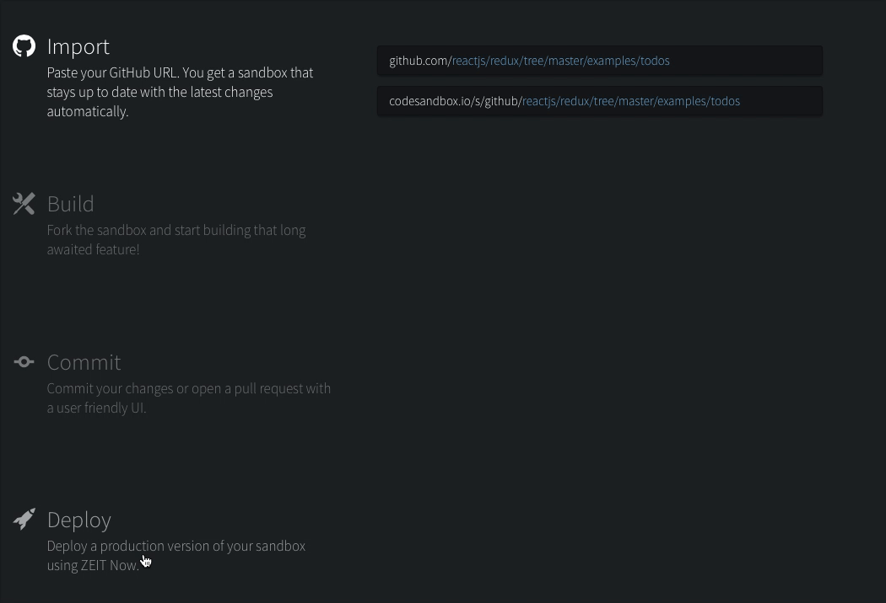
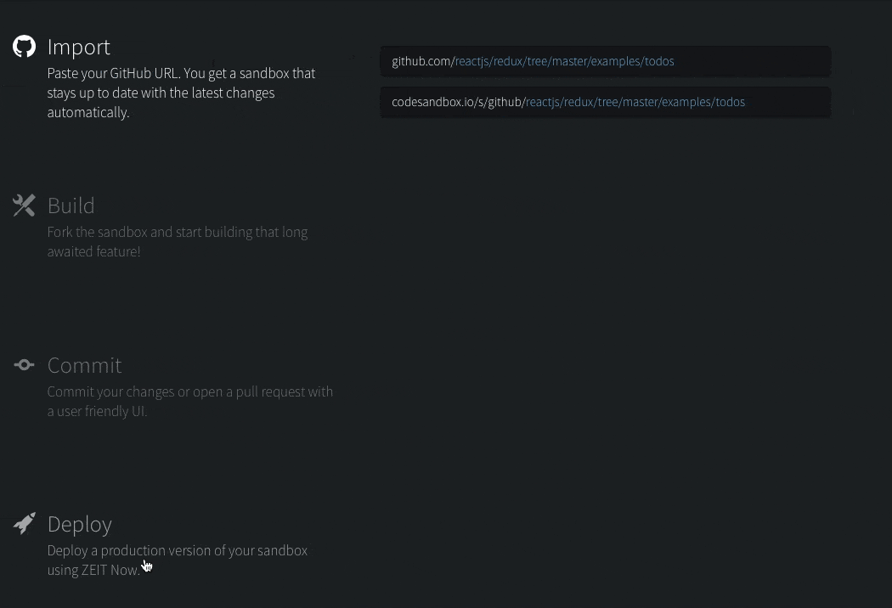
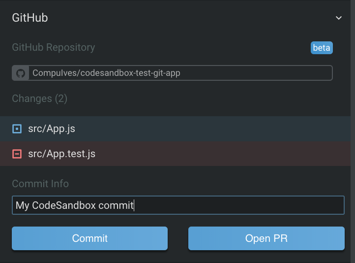
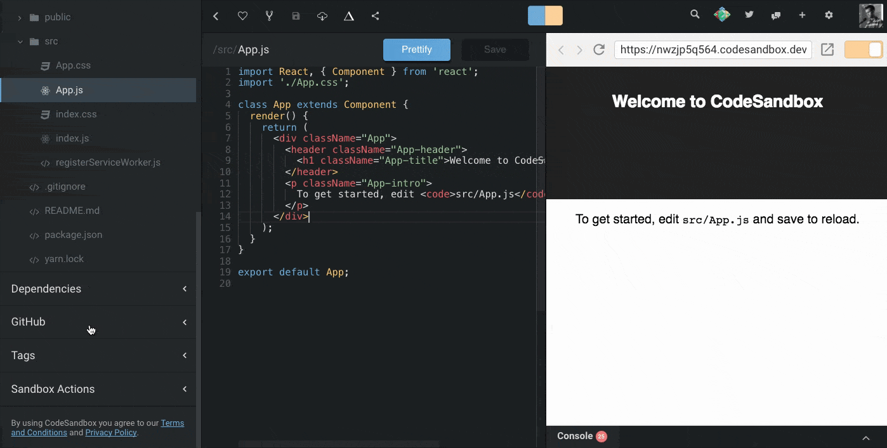
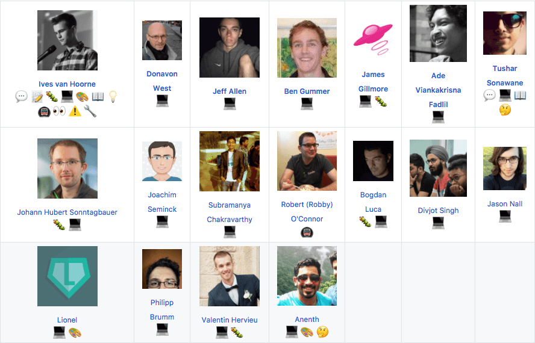

It has been 7 months since
[we announced CodeSandbox](/post/codesandbox-an-online-react-editor), and one
year since I made the
[first commit](https://github.com/codesandbox/codesandbox-client/commit/c5f43786fe6a4e54c3b7729d8992dba5a4adeeaf).
Can you imagine? This certainly deserves a celebration, and we decided to do
that with a big update! I took the last 2 weeks off to work fulltime on
[CodeSandbox](https://codesandbox.io) and we were able to get a lot done.  
Let's dive in!

## New Homepage

Since the first release we've added many things to CodeSandbox. To give you an
idea: we released CodeSandbox without embeds! A lot has changed, we're not an
editor for [React](/framework/react) only anymore, and I think we moved past the
definition of a playground. All these changes, but the homepage didn't receive a
single update. This caused confusion, as people didn't know about the things we
built. It was time to do something about that. We've now designed and built the
homepage from scratch using [Gatsby](/framework/gatsby).
[You can see it here](https://codesandbox.io)! A very big thanks to
[Danny Ruchtie](https://twitter.com/druchtie) for helping us with the design.

There are more pages in the pipeline, like documentation and picked examples. We
also want to show a more personalized page for logged in users. The basis is
here now, so it'll be easier to expand to this in the future.

## GitHub Committing & Opening PRs

The most requested feature since day one is committing to
[GitHub](https://github.com). At the beginning we couldn't tackle that because
of the groundwork that needed to be built first. The groundwork has been built
and from now on you can commit, create repositories and open pull requests right
from within CodeSandbox! It truly feels incredible to commit changes directly
from your browser to GitHub.

#### Creating Repositories

This is a very simple process. You can now export any normal sandbox to GitHub
by just entering the name and clicking 'Create Repo' in the sidebar. This will
create a repository and then redirect you to the Git version of the sandbox.

#### Committing & Opening PRs

To commit to your repository you'll need to import it first. You can import any
GitHub repository by appending the GitHub URL to `codesandbox.io/s/github`. For
example, for my test repository the url would be:
[codesandbox.io/s/github/CompuIves/codesandbox-test-git-app](https://codesandbox.io/s/github/CompuIves/codesandbox-test-git-app).
The next step is to create a fork of this sandbox and make your changes, from
then on you can commit or open a PR, by clicking on the buttons in the sidebar.

We first try to make a commit, if this fails we try to make a merge commit. When
a merge commit fails as well we fall back to opening a Pull Request. Merge
conflict solving is next on our list to build inside CodeSandbox.

You can only commit to repositories you have write access to, you can open a PR
to any repository.

#### Other Changes

To properly support GitHub in CodeSandbox we had to make some changes. We now
import all files (like `.gitignore` and `package.json`) for git repositories. We
also implemented custom 'editors' for binary files, like images. This feels
great for me, because you now work on your project in CodeSandbox as if you are
working locally. There is no transforming happening anymore. The next feature
also helps with that.

## Static File Hosting

One of the biggest differences between the local development server and
CodeSandbox was the behaviour of `index.html` and the `public` folder.
CodeSandbox didn't host the files in the `public` folder, which was confusing
until now. From this update on we do host all files from the `public` (or
`static` for [Vue](/framework/vue)) directory. Many exciting possibilities arise
with this. You can, for example, add
[Web Workers](https://developer.mozilla.org/en-US/docs/Web/API/Web_Workers_API),
static images, mock API call responses now. You also get full control of
`index.html` from now on!

Here is an example sandbox:

https://codesandbox.io/s/wkzowlw747?fontsize=14&view=split

<!-- We download test.json from the public folder -->

## Future

This new update adds many advanced features, and also opened up many new things
to build. I'm looking forward to work on these points in the very near future
(along with the existing features that are planned).

#### UI Overhaul

The UI is getting a bit cluttered, and deserves some reorganization. I'm working
on a UI overhaul that I couldn't fit in this update, but certainly want to
deploy very soon. The new UI is inspired by
[VS Code](https://github.com/Microsoft/vscode) and will put all advanced
features like deployment and GitHub support in their own place.

#### Diff View

The [Git](https://github.com/git/git) integration is currently missing a diff
view for commits. This is very important and on the top of my list to tackle.
This change will go together with the UI Overhaul.

#### Configuration Source of Truth

Now that we import files like `package.json` we need to do some conflict
resolving between CodeSandbox configs and file configs. We want to make files
like `package.json` the
[source of truth](https://en.wikipedia.org/wiki/Single_source_of_truth) for eg.
dependencies, and show a UI to configure these files. This gives the user
flexibility and we still keep the UX very user friendly.

## Conclusion

The past 7 months were great, developing CodeSandbox has been fun from the start
to now. One thing we didn't expect is the amount of support we received when we
went open source. The open source community is truly amazing and all our
contributors deserve one extra big thanks.

If you like what we're doing, consider becoming a
[Patron](https://codesandbox.io/patron). The last 2 weeks were amazing, and I'd
love to work more fulltime on CodeSandbox. But this is only possible if I'm able
to afford my food 😃.
