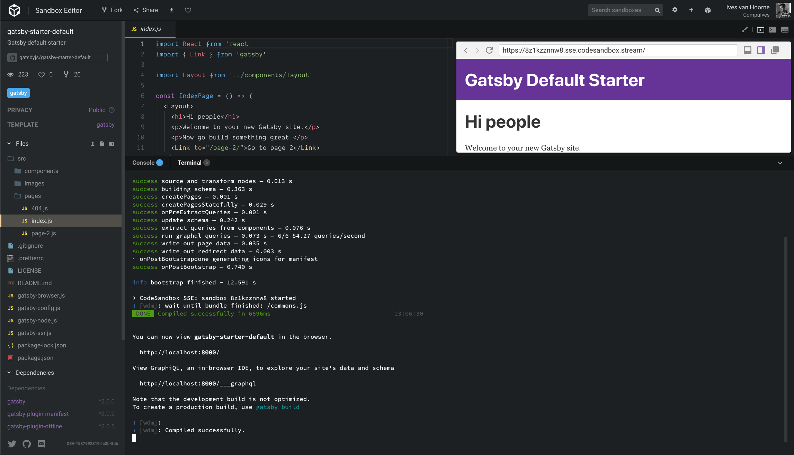
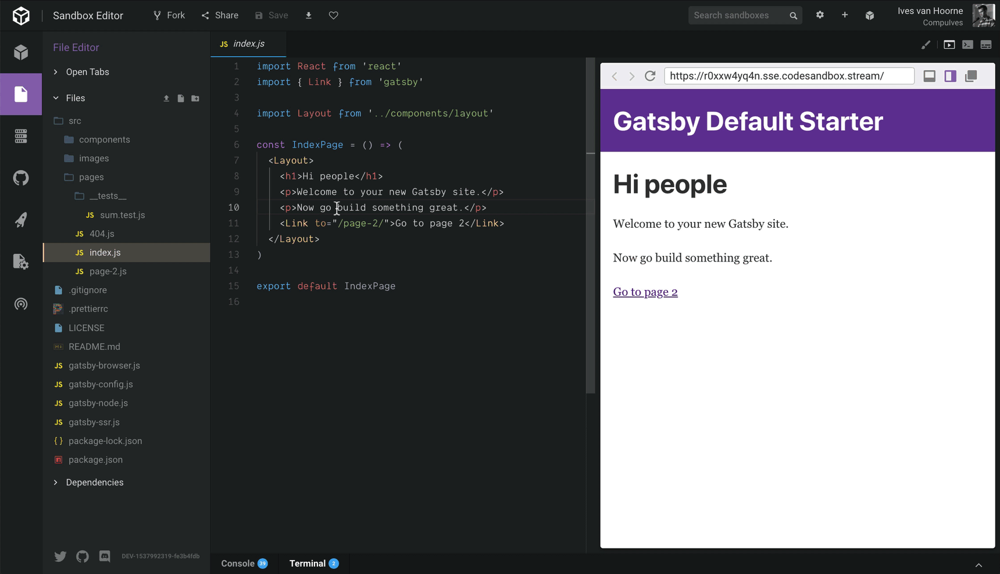
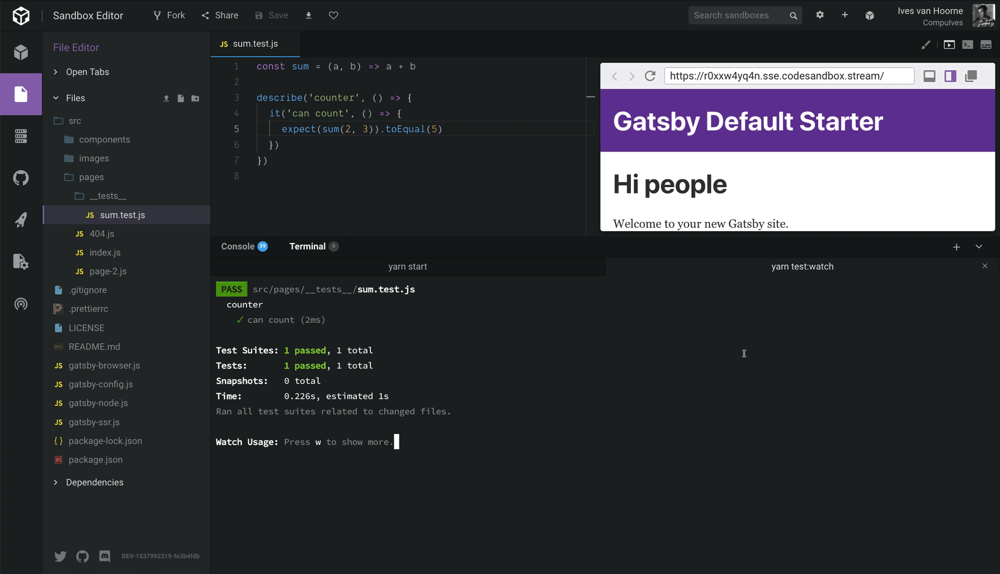
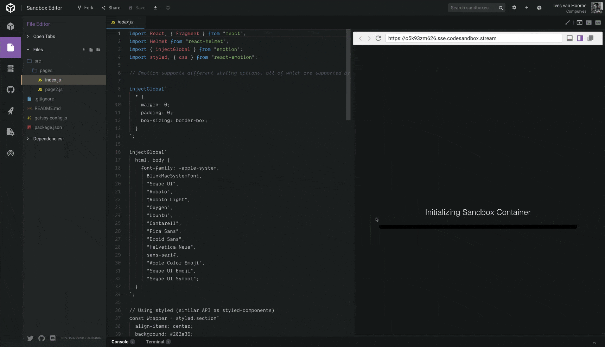

[CodeSandbox](https://codesandbox.io) is often used to create new websites or to
quickly edit existing websites. Until now this was only possible for projects
that follow the default template layout, and if you wanted to change something
like the [`webpack`](https://github.com/webpack/webpack) configuration you would
have to continue locally. Well, not anymore!

Today we're happy to announce **CodeSandbox Containers**. We execute your code
on a server, which allows you to work on **any JavaScript project that works
locally**.

Want to try a new [GraphQL](https://graphql.org) API server? That's possible!
Want to quickly add a new post to your [Gatsby](/framework/gatsby) blog? You can
do it from CodeSandbox with its [GitHub](https://github.com) integration.

Along with this update we'd like to announce new templates running on this
system. Everyone can now work with **[Next.js](https://github.com/zeit/next.js),
Gatsby, [Nuxt.js](/framework/nuxt),
[Apollo Server](https://github.com/apollographql/apollo-server),
[Node](/software/node) and [ReasonML](https://github.com/facebook/reason)**
right from within CodeSandbox! We give first-class support for these templates,
but you will still be able to run anything you want on CodeSandbox. You can
[create a new project here](https://codesandbox.io/s).

## Run Any Project

Until now we've executed all code in the browser. This has many advantages: it's
snappy, it works offline and there is almost no load for our servers. There is
also a counterpoint to this: you won't be able to run `node` directly.

With CodeSandbox Containers we execute your code on a server, which allows you
to literally run any project without checking if we support it. I will go
through all the main features added specific to CodeSandbox Containers.

#### See what happens on the dev server

We introduce a new view for the toolbar called 'Terminal'. This view will show
the output of `yarn start` when the sandbox starts.

#### Run any npm script

We also introduce a new panel in the side bar called 'Server Control Panel'.
This panel gives you the opportunity to run any script specified in
`package.json` in the terminal. With this you can quickly lint or run tests or
any other script.

This doesn't only work for [npm](https://npmjs.com) scripts. You can also open a
[bash shell](<https://en.wikipedia.org/wiki/Bash_(Unix_shell)>) to explore the
sandbox! Note that we do monitor the sandboxes, if we notice any harmful
behaviour we can block your account.

## Templates Galore!

We hope you are as excited as we are about this update. The best thing is that
you can use all our existing features with these new templates! For example, you
can **live collaborate with others on a Gatsby template** or **quickly create a
new post for your Next.js website using our GitHub integration**.

Go check out what templates we fully support here:
[https://codesandbox.io/s](https://codesandbox.io/s).

#### ReasonML

One template we added is ReasonML! We don't execute ReasonML on the server, but
in the browser. We are still testing Reason and could use all your help, so if
you find anything out of order don't hesitate to
[send us an issue](https://github.com/codesandbox/codesandbox-client/issues/new/choose)!

<!-- https://reason.codesandbox.io -->

https://codesandbox.io/s/reason?fontsize=14&view=split

## Beta and Thanks

We can only test CodeSandbox Containers fully when we have other people using
it. So we currently give the warning that **CodeSandbox Containers is in beta**.
Please don't use it for any project with files you don't want publicly exposed.
There's also the chance that the service might be down because of things that we
haven't foreseen yet, in which case you'll see a nice warning message. If you
notice this happening and want to know what's going on, you can find us
[here](https://spectrum.chat/codesandbox).

We will dedicate the coming months to squash every bug we can find, when we
think that CodeSandbox Containers is stable enough to remove the beta warning we
will announce this. In the near future we will also work on more documentation
about containers so that there can't be any confusion in the differences between
client and server sandboxes.

There is no way to sync the changes from the terminal back into the sandbox
itself yet. This is top on our priority list and we will get this in as soon as
possible!

We have a limit of 5 server sandboxes for free accounts currently, we have a
limit of 15 server sandboxes for [Patron](https://codesandbox.io/patron)
accounts. These limits will probably change.

### Thanks

We've been working on this functionality since February now and are extremely
happy that we can share this with everyone now.

There are some people that deserve a huge thanks for this endeavor.

We want to thank [**Bogdan Luca**](https://twitter.com/lucabogdan) for building
the _whole_ infrastructure for CodeSandbox Containers, this is an incredible
undertaking and he pulled it off.

We also want to thank [**Gatsby**](/framework/gatsby) for inspiring us to start
this and for being both our counselor and funder of this project.
[Kyle Matthews](https://twitter.com/kylemathews) and
[Sam Bhagwat](https://twitter.com/calcsam) were extremely supportive and helped
us think everything through while also relieving us of other worries.

I'd like to close with our new loading screen for containers. 😃

