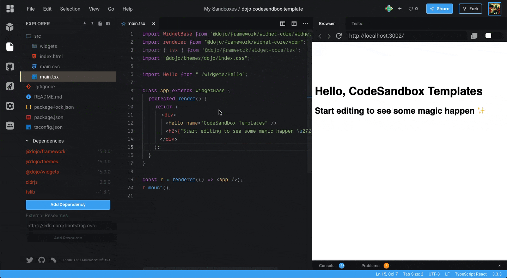
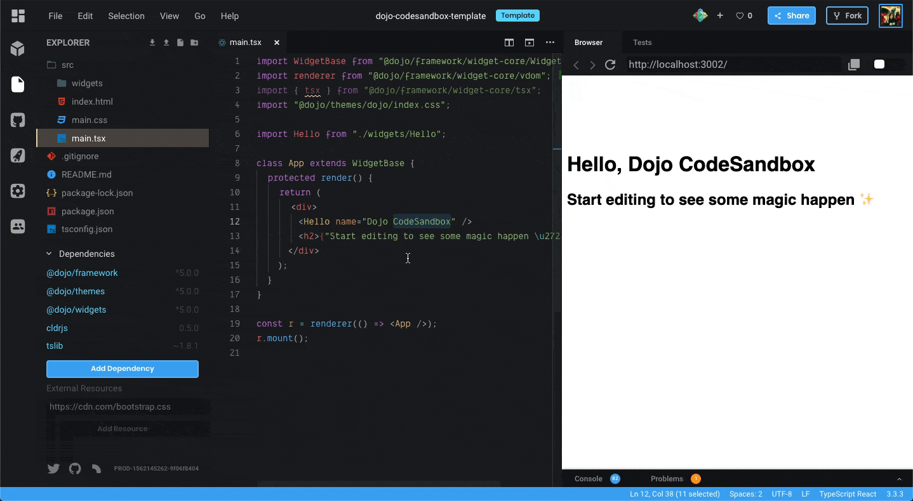
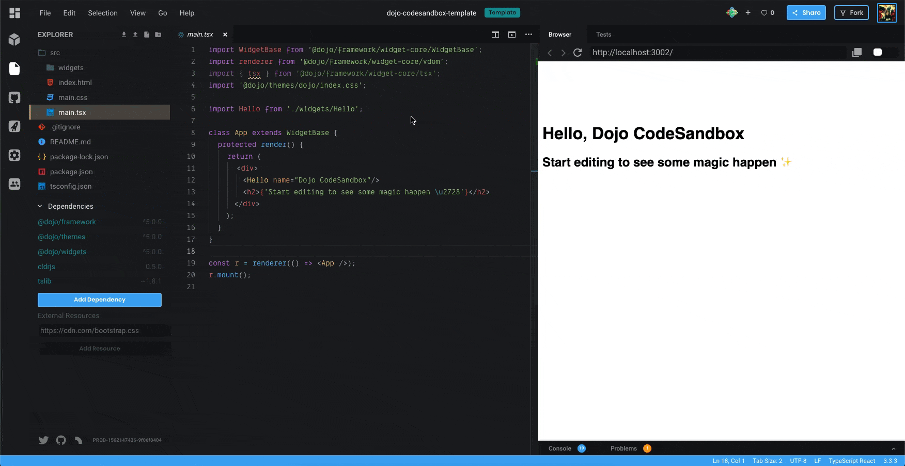
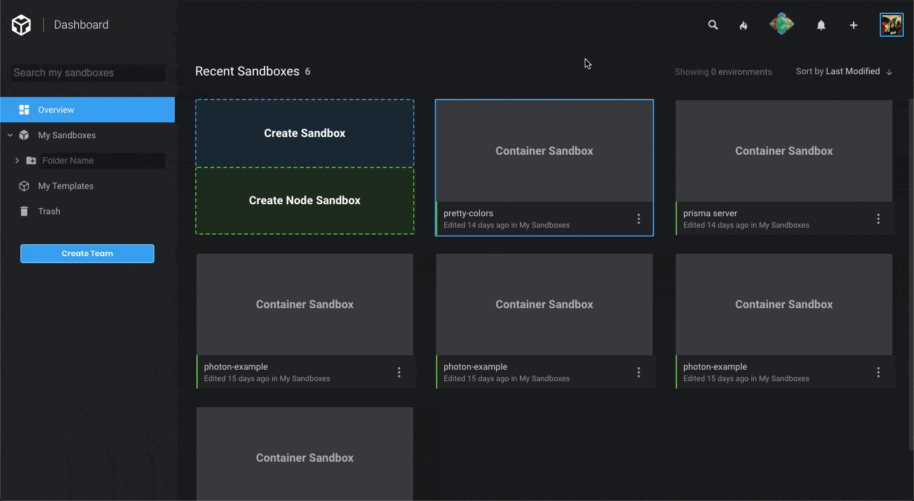
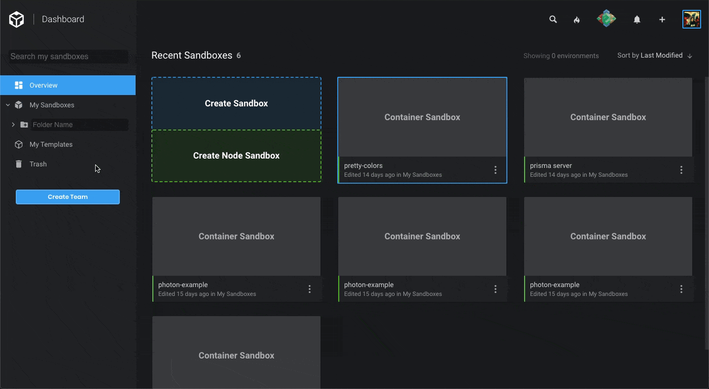

Today we're excited to launch a new feature that we believe will speed up your
prototyping workflow here in [CodeSandbox](https://codesandbox.io)! Say hello to
templates!

## What are Templates?

We've found that for many of our users, after having used one of our built-in
sandbox starters such as [React](/framework/react), [Vue](/framework/vue) or
[Gatsby](/framework/gatsby) for the first time to prototype an application, they
often want to create new projects using the same framework with a specific set
of dependencies, folder structure, and configuration set up just the way they
like it.

This is so common that we decided why not make it easy for users to create their
own custom templates which they can quickly bootstrap new projects with! Today's
release is a beta of our new templates system, which we're planning to improve
with a bunch of useful new features over time.

In this early beta release, you can quickly turn any existing sandbox into a
template with just one click. Let's take a look at how simple it is to get
started with templates!

## How to make your first Template

Creating a template from an existing sandbox is really easy! From an existing
sandbox, pull up the editor and open up _Project Info_ in the upper left corner.
If you've just opened one of our official templates, first fork it and make some
changes.

You'll notice there's a new _Make Template_ button. Click that and you'll see
that your newly created template has been frozen. This is to help prevent making
accidental changes to the template whenever you open it from the _Dashboard_ or
_Create New Sandbox_ modal. You can toggle this on and off in the _Project Info_
sidebar of the template to make edits to the template itself.

You can also click on the color in the sidebar to change the color you assign to
your template. This is to help distinguish it in your _Dashboard_ and in the
_Create New Sandbox_ modal.

You'll also notice that whenever you attempt to save changes to a frozen
sandbox, a new modal will pop up asking you whether you would like to unfreeze
it for editing or to fork it to create a new sandbox.

## Using Templates

So now that you've created your first template, how can you use it? Just like
the official templates, you can create a new sandbox from one of your templates
via the _Create New Sandbox_ modal.

In the _Overview_ tab, you'll see your most recently used templates up at the
top. Switching over to the My Templates tab, you can browse through all of your
custom templates. You'll also find all of your custom templates within the
Dashboard under the My Templates tab.

## Teams

As a team you can have your own templates as well! When you convert a sandbox
owned by your team to a template you will be able to see them under _Team
Templates_. _Team Templates_ are very useful for teams that want to have a
common starting point for their team.

## Templates Roadmap

We've got big plans to make templates even better and we'd love to hear your
thoughts as you try them out! So what can you expect to see from templates in
the future?

Templates are designed to save you time and effort making new sandboxes. But
wouldn't it be great if you could share a boilerplate app featuring your newly
developed React library pre-configured and good to go? Have you ever visited the
_Search_ page and tried to find the perfect sandbox to start a new project with?
Well we want to make that process a whole lot easier using templates!

In the future you'll be able to make your templates public, which will list them
on a new _Community Templates_ page where you'll be able to quickly search and
filter by keywords and dependencies. From there you'll be able to quickly view
the details of a template, including a live preview and a `README`, as well as
links to a template's [GitHub](https://github.com) repository and issues page.
You'll be able to watch other user's public templates, which will add them to
your Create New Sandbox modal, allowing you to take advantage of what the
community creates.

As we make the sandbox execution environment more configurable, we hope that
it'll be easy for framework maintainers to easily add and manage their own
official templates. By making templates completely open-source, we hope to make
it easier to issue updates and bug fixes.

There's a lot in the pipeline that we're eager to share with you! Thanks for
using CodeSandbox and we look forward to seeing all the awesome new things
you'll create!
