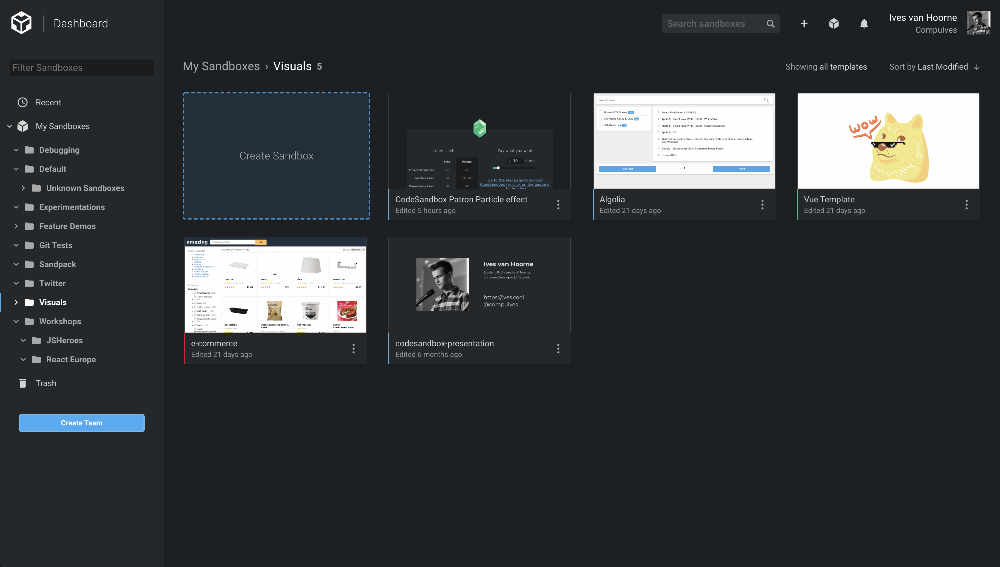
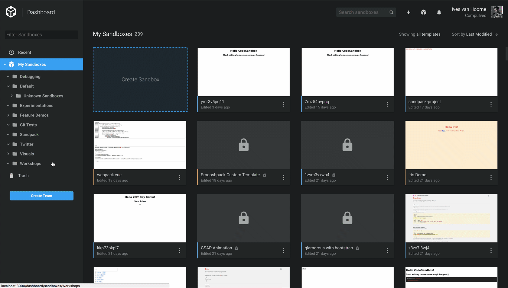
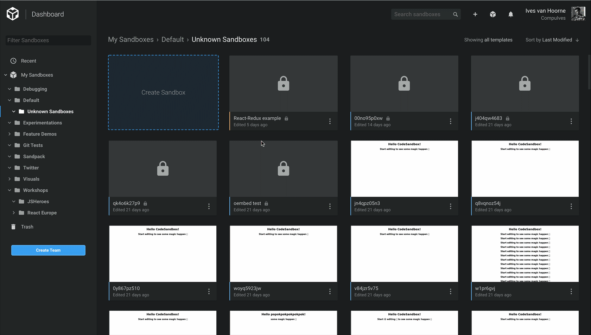
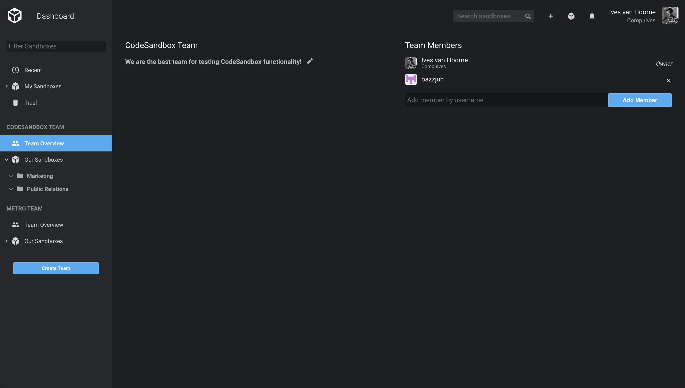
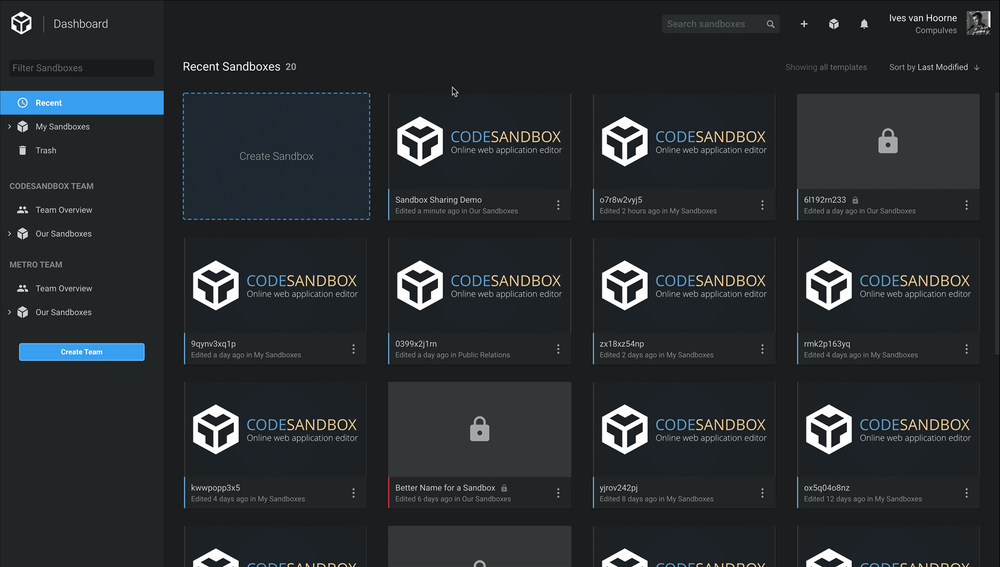
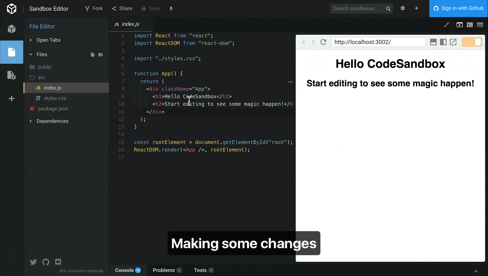

Starting new projects and sandboxes on [CodeSandbox](https://codesandbox.io) has
always been very easy, but managing and collaborating on the created projects
has been cumbersome.

We started to look into the management issues, and have come up with something
that makes it much easier to organize and edit your sandboxes in bulk. This will
be the building block for existing features and new features to come, including
one we want to announce today as well.

Today we're happy to announce **Dashboard** and **Teams**. Along with these two
new features we now make **CodeSandbox Live free for everyone!** Let's take a
look!

## [Dashboard](https://codesandbox.io/dashboard)

You now have a personal dashboard for organizing and finding your sandboxes.
This dashboard has specifically been designed with the idea of a file system in
mind.

#### Organize your sandboxes in directories

You can now organize your sandboxes by creating directories and putting them
into the directories. Now you can finally properly tag your sandboxes by how and
why you created them!

#### Modify multiple sandboxes directly

You probably have many quick test sandboxes that now only serve as clutter. With
the dashboard you can select multiple sandboxes and edit them at the same time,
including moving them to the trash.

#### Search, sort and filter through your sandboxes.

The last new feature to help you organize is the search bar! You can now search,
order your results and filter through your sandboxes, including your private
sandboxes and the sandboxes of your teams.

## Teams

CodeSandbox is used more and more to collaborate with others, this is great! We
want to make it even easier for people to get together and work together on a
sandbox, so we're happy to introduce 'Teams'!

You can create as many teams as you like with unlimited people. As a team you
have shared directories for your sandboxes, all the sandboxes in the team
directories are automatically shared between team members.

#### Live Collaboration

This is the best part: we automatically create a live session between team
members whenever they open a team sandbox simultaneously. This means that team
members can immediately live collaborate on shared sandboxes. They can also
share their live session with people outside of the team by sharing the Live
URL.

#### Team Pro

We're planning to release something called 'Team Pro' in the future. 'Team Pro
is a seat-based subscription that allows your team to create private sandboxes
within your team. We haven't released this yet, so you will now be able to do
this as a [patron](http://codesandbox.io/patron). If you're interested in this
functionality you can subscribe by joining this
[mailing list](https://airtable.com/shrlgLSJWiX8rYqyG).

## That's not everything

There are many more hidden features in this update. Here's a sneak peak of
what's included:

#### Free CodeSandbox Live

One nice addition to teams is that we now make CodeSandbox Live free for
everyone to use! We're hoping that everyone collaborates even more on
CodeSandbox with this change!

#### File Recovery

With this update you won't have to worry about crashing browsers or flaky
connections anymore. We now save your files in
[`localStorage`](https://developer.mozilla.org/en-US/docs/Web/API/Window/localStorage),
so whenever you leave CodeSandbox without saving we'll restore the session for
you when you come back!

#### Design Tweaks

We tweaked some of our theme colors and restyled the buttons. The design of the
editor should look a bit better now!

#### Disabled Back Gesture

Most macOS users noticed that when you slide back in the editor you will
navigate away from the editor. This is very frustrating. We catch and disable
this behaviour now.

## Thanks

With this update we refactored the code quite a bit and we introduced some new
libraries. I want to mention the introduced libraries and how they helped.

#### GraphQL and Apollo Client

We built the dashboard functionality fully with [GraphQL](https://graphql.org).
We have lots of nested data on the dashboard with many different variations of
structures (thanks to our ordering and filtering) and GraphQL handles that
wonderfully. [`apollo-client`](https://github.com/apollographql/apollo-client)
made it easier to manage all the different forms of this data and allowed us to
do the optimistic updates and caching more easily.

We also have mutations that often include multiple sandboxes and GraphQL was
able to handle that very well.

#### react-spring by [Paul Henschel](https://twitter.com/0xca0a)

[`react-spring`](https://github.com/react-spring/react-spring) has made it so
much more easy for me to do animations. With `react-spring` you can create
animations based on state, but in a performant way thanks to their native mode.
I converted all our animation logic to `react-spring` and it has been a blast so
far.

Our dashboard is animated with `react-spring`, from the context menu slide-down
to the sandbox dragging.

#### react-virtualized by [Brian Vaughn](https://twitter.com/brian_d_vaughn)

The dashboard works with many sandboxes, for my dashboard I had to show 400
sandboxes at the same time.
[`react-virtualized`](https://github.com/bvaughn/react-virtualized) makes sure
that you only render the items that are in view, making the dashboard much more
performant. `react-virtualized` also made it easier for me to organize the
sandboxes in a grid.

#### Contributors

We want to thank all our
[75(!) contributors](https://github.com/codesandbox/codesandbox-client/graphs/contributors)
to CodeSandbox. We're open source, so don't hesitate to check out
[our repo](https://github.com/codesandbox/codesandbox-client) and give a star!

## The Future

The dashboard is a perfect building block for the new features we're working on.
We have a lot more exciting announcements planned out for the coming month, so
stay tuned by following either [@codesandbox](https://twitter.com/codesandbox)
or [@CompuIves](https://twitter.com/CompuIves)!

Here's already a sneak peak on what's to come:

https://twitter.com/gatsbyjs/status/1006222610651230208
