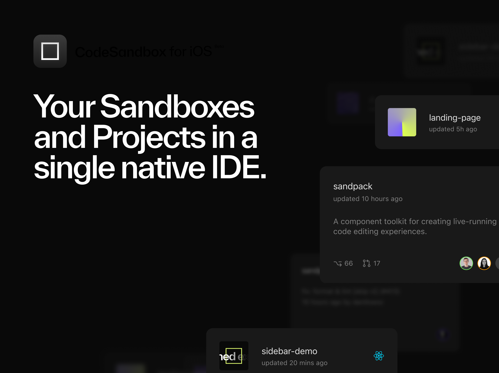

banner: ./images/banner.png
slug: introducing-codesandbox-ios
authors: ['Necoline Hubner']
photo: 
title: The iOS Release You Have Been Waiting For
description: CodeSandbox for iOS lets you take your projects and sandboxes with you wherever you go. Using an iPhone or iPad, you can now access our new cloud development platform in the comfort of a native iOS IDE..

date: 2022-05-04
---
[**CodeSandbox Projects**](https://codesandbox.io/post/announcing-codesandbox-projects) is now available on mobile. With CodeSandbox for iOS, you can take your projects with you wherever you go. Using an iPhone or iPad, you can now access our new cloud development platform in the comfort of a native iOS IDE.

When building **CodeSandbox Projects**, we set out to create a cloud development platform with the familiar speed and experience of CodeSandbox, yet also deeply integrated with your favorite tooling, and working on projects of any size. **Projects** is currently in [beta](https://projects.codesandbox.io/) and we are now ready to expand the experience to the mobile world.

## Take a look inside the iOS App

**CodeSandbox for iOS** combines the crisp and ergonomic feel of a native IDE with the power and efficiencies of cloud development.

On iOS, keep up with ongoing project work with:

**Smart Dashboards**

Our dashboards help you manage your workflow and stay connected with your entire team. In one view, you can get an overview of your project and keep track of all branches.

**IntelliSense**

Go beyond syntax highlighting and autocomplete, with smart completions based on variable types, function definitions, and imported modules.

**Live Previews**

Easily spin up a preview of your app in your browser or open tools like Swagger or Storybook to track changes as you make them. 

**Real-time Collaboration**

Enjoy both real-time and asynchronous collaboration with your team in the same file, with support for multiple clients.

**Git Workflow**

Full support for Git allows you to work on any existing project and work alongside any contributor, regardless of their developer environment.

Great ideas don’t always come to you while you are sitting at your desk. With this new mobile app, you can pick up where you left off on the web editor or on VS Code and keep the creativity flowing at your local cafe, on your commute, or while curled up on your couch with a cup of tea.

## Get started now

Right now, **CodeSandbox Projects** is in Beta. You can sign up to the waitlist [here](https://codesandbox.io/ios). You can also jump in and explore your Sandboxes [on the app](https://apps.apple.com/us/app/play-js/id1423330822) in the meantime. Once you are in, you can simply import your projects or add a template project, invite your team members and get coding. 

We look forward to welcoming you to this new piece of the Projects experience and hearing where your coding adventures take you.