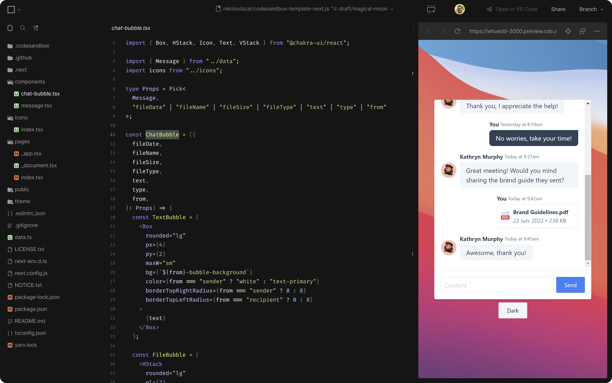

**In case you missed our recent [live stream](https://www.youtube.com/watch?v=XVJ7N4_bp28) with Chakra UI, here is a short recap of the highlights. Learn more about Chakra UI [here](https://chakra-ui.com/) and build faster right from [CodeSandbox](https://codesandbox.io/s/).**

Chakra UI has been gaining a lot of momentum in the community. One of the key benefits of Chakra is that it allows you to create apps quickly. And if you've used CodeSandbox, you probably know that one of our main goals is helping you code anything in record time.

That's why this chat between [Adewale Abati](https://twitter.com/Ace_KYD), Developer Advocate at CodeSandbox, and [Lazar Nikolov](https://twitter.com/NikolovLazar), core member at Chakra UI, was a perfect match for any developer wanting to learn how to build accessible apps quickly.

Check out the final repo for this project [here](https://codesandbox.io/p/github/nikolovlazar/codesandbox-template-next.js/draft/magical-moon) and keep reading for some more details about Chakra UI and CodeSandbox, as well as the full-length video tutorial.

## Why Chakra UI?

At its core, Chakra UI provides developers with a full-blown implementation for custom design systems. It brings accessibility and consistency to the development flow, which boosts productivity when building apps or websites.

> You can build your own design system within Chakra and then use all of the components that come with Chakra without thinking “how should I make the button right now?”. It's already there. It's already hooked. It's already configured by you how it should look like. So you get consistency throughout your whole app. — Lazar Nikolov

The key differentiator between Chakra and CSS frameworks is that Chakra doesn't only bring the design of the UI elements—you also get their functionality. This does mean that Chakra provides fewer UI components, but it excels at the functionality of its core components. As such, it's a great option especially if you want to create something more customizable like the chat window we created during this session (sneak peek below).

## Why CodeSandbox?

With CodeSandbox, you can start coding anything without worrying about the setup. When you [start from one of our templates](https://codesandbox.io/s/), we automatically configure your project with an editable preview and run any additional tasks that you set up.

By integrating your CodeSandbox project with GitHub using our [GitHub App](https://codesandbox.io/post/introducing-the-codesandbox-github-app), you also get several additional features that will save you hours every week reviewing PRs: a live dev environment for every PR, editable deployment previews, brancheable databases, and more. All of this running in our powerful [Micro VMs](https://codesandbox.io/post/how-we-clone-a-running-vm-in-2-seconds).

Plus, CodeSandbox allows you to code from anywhere. If you need to switch back and forth between different laptops, you can just open the URL of your project and keep coding, no need to set up anything! And if you want to code on the go, simply access your project from the [CodeSandbox iOS App](https://codesandbox.io/ios) and pick up where you left off.

> Once you fork a CodeSandbox template, we create a new repository for you on GitHub and you can start building your project instantly. Everything you need to do is already integrated into the workflow - creating a new branch, running your environment... - and you can share each of these links with anyone. — Adewale Abati

As you will see in the full video below, this makes it a breeze to build an interface using Chakra UI and iterate quickly right from CodeSandbox.

## Building a chat interface with Chakra UI and CodeSandbox

Getting started from a design that Lazar created on Figma, the goal of this session was clear: create a functional design for a vertical chat window.

Dive into the full video below to see how Lazar develops this UI using Chakra UI starting from the CodeSandbox Next.js template.

https://www.youtube.com/watch?v=XVJ7N4_bp28

## Build faster, iterate more

Developing this chat interface was a really fun project and an excellent way to learn more about Chakra UI and CodeSandbox.

We really appreciate all the amazing work Adewale Abati, and Lazar Nikolov put into this tutorial! And our huge thanks to everyone that joined our session.

You can check out the demo of the final result of this project [here](https://codesandbox.io/p/github/nikolovlazar/codesandbox-template-next.js/draft/magical-moon)—and remember that you can branch/fork it to keep experimenting with Chakra UI, right from CodeSandbox.