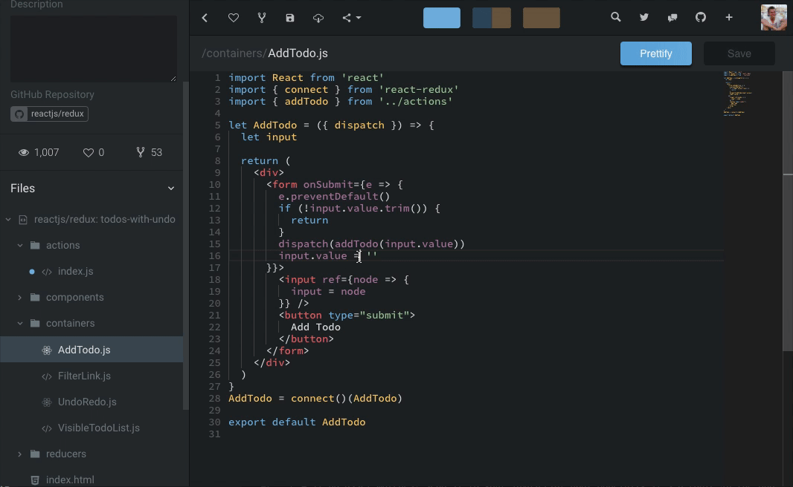
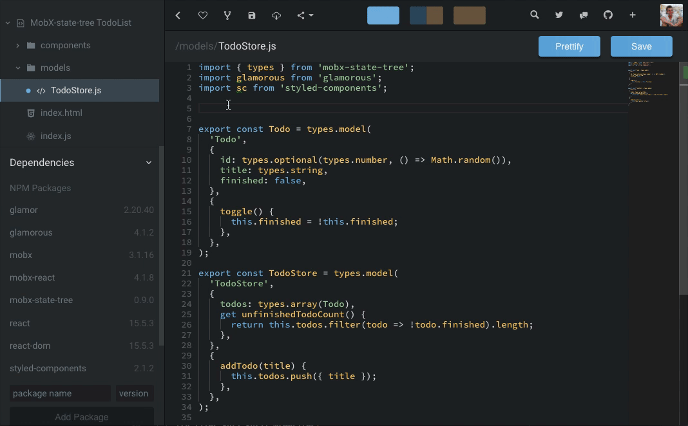
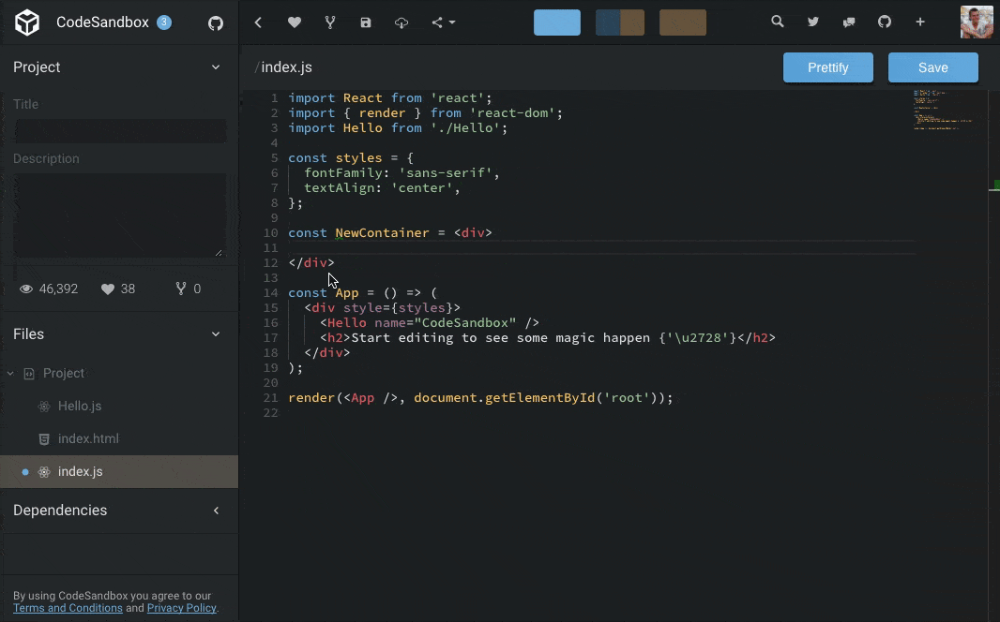
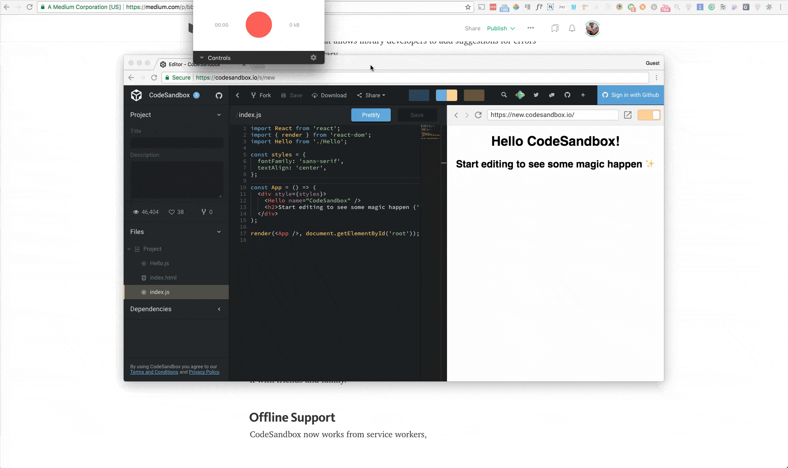
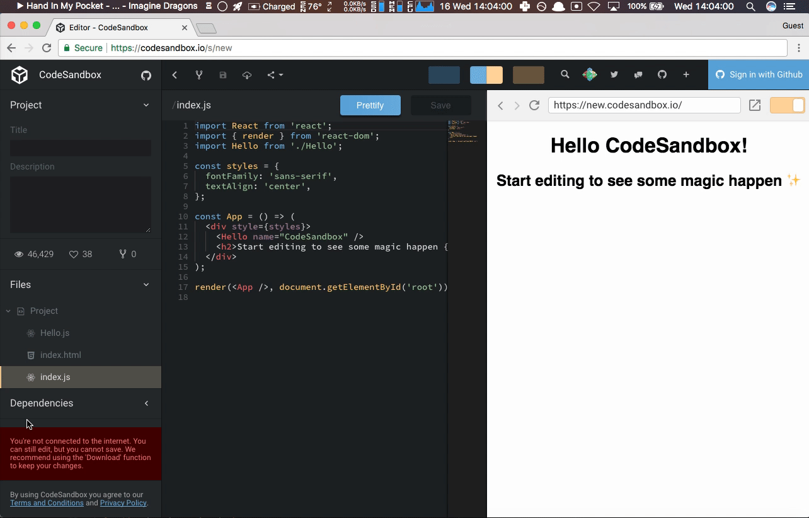

This is [CodeSandbox](https://codesandbox.io) 1.5! I don't know how to call all
updates anymore, so I decided to version CodeSandbox with arbitrary numbers.

This is a big update, I rewrote the editor, the preview screen and the packager.
All these changes made the deployment quite exciting, but it's online now. Let's
get started!

## Editor

The editor has been rewritten to use the
[`monaco-editor`](https://github.com/Microsoft/monaco-editor). This editor is an
extracted version of the [VS Code](https://github.com/Microsoft/vscode) editor,
and thus _really_ powerful.

#### Peek Definition, Go to Definition, Find all References

The really cool thing about `monaco-editor` is that you get the core editor
features (Go to Definition, Peek Definition, etc.) of vscode for free. The only
thing you need to do is wiring everything up correctly, I created a separate
build of the Monaco editor for better cross file integration in CodeSandbox.

#### Automatic Type Acquisition

Not only navigation gets easier, the `monaco-editor` has
[IntelliSense](https://code.visualstudio.com/docs/editor/intellisense) for
JavaScript and [TypeScript](https://github.com/Microsoft/TypeScript) built in!
That's **really** cool, and even better if you have the typings of dependencies.
That's why I added 'Automatic Type Acquisition', this means that for every
'installed' dependency we search and download the type definitions on
[https://unpkg.com](https://unpkg.com). This way you get autocomplete for
libraries.

#### ESLint, Prettier, Emmet.io

I ported almost all existing editor features over. This means that you have
[ESLint](https://github.com/eslint/eslint),
[Prettier](https://github.com/prettier/prettier) and
[Emmet.io](https://github.com/emmetio/emmet) built in in the editor!
Unfortunately I had to drop [Vim](https://github.com/vim/vim) Mode, you can
still enable this, but this will disable Monaco and enable
[CodeMirror](https://github.com/codemirror/CodeMirror).

I'm really happy with the new editor, and want to state that this could never
work without `monaco-editor`, TypeScript, unpkg, Emmet.io, ESLint and Prettier.
I want to explicitly thank these tools, the only thing I had to do is wire
everything up and patch some integrations.

## react-error-overlay

We have another tool that made CodeSandbox much better, namely
[`react-error-overlay`](https://github.com/facebook/create-react-app/tree/master/packages/react-error-overlay)
by [`create-react-app`](https://github.com/facebook/create-react-app)! Error
handling in CodeSandbox has been redone, and thanks to `react-error-overlay` we
now support async errors and deep linked errors + have a beautiful error
overlay. Furthermore I rewrote the error handling of the preview so errors now
show up in the _right_ file.

CodeSandbox not only shows errors, it also offers suggestions for known errors.
In the example above `DeepComponent.js` is importing `RawComponent`, notice that
there is no extension. This will throw an `Invalid Tag` error. We can easily
detect this and give the suggestion to rename the file. I'm thinking of writing
an API that allows library developers to add suggestions for errors for their
specific library.

https://codesandbox.io/s/241mz6qwmr?fontsize=14&view=split

<!-- Error overlay (suggestions and error navigation don't work here as you're not in the editor) -->

## External Frames

It's now possible to open sandboxes in an external url. You can use this to see
the preview in a separate window during development, or to share a fullscreen
version of your sandbox with friends. Note that this external frame is nowhere
near a production version, I'm working together with
[Vercel](https://vercel.com) to integrate 'Deploy to Vercel' so you can deploy a
production version automagically ✨.

The external sandbox also works offline. Which takes me to the next point...

## Offline Support

CodeSandbox is now backed by
[service workers](https://en.wikipedia.org/wiki/Progressive_web_applications#Service_workers).
This means that you can open the editor and the preview while offline and see
CodeSandbox instead of a
[dinosaur](https://blog.google/products/chrome/chrome-dino) 🙃. Note that
offline support is currently limited, you cannot save your sandboxes offline yet
(you can still download though). I need to make some required changes to the
server to be able to do this. You are able to edit sandboxes though! This
feature is really an improvement in speed, it will save network roundtrips for
e.g. dependencies.

## Dependency Packager Rewrite

The packager of the dependencies has been rewritten. It's now hosted as a
serverless solution, which means that it can scale (practically) indefinitely.
We also saw a nice improvement in speed, we saw improvements between 40%-700%(!)
in response time.

A new feature that comes with the new packager is that we support version ranges
instead besides absolute versions. You will be able to install `react@next` for
example, and it will update automatically as [React](/framework/react) updates.
This functionality will be deployed somewhere this week, I need to change some
server logic first.

After working with [Serverless](https://serverless.com), I have to say that I'm
_really_ impressed by how it works in practice. Our hosting costs went down from
~$50 per month to a projected cost of $0.03 per month + we are now faster, more
scalable and deployment is a breeze. I will write a post about this when I find
the time.

_NOTE: The packager has been rolled back for now, some package combinations
couldn't be loaded because of disk space limitations, it's solvable._

## Thanks

You can see a trend in these features, every feature makes heavy use of some
existing technology. It saved me _tons_ of time, and I want to specifically list
another thank you to the authors that made this possible.  
Thanks to:

- The [VS Code](https://github.com/Microsoft/vscode) team, for taking the effort
  to extract [`monaco-editor`](https://github.com/Microsoft/monaco-editor) and
  being open source. This is **really** valuable for the online editor movement.
- [https://unpkg.com](https://unpkg.com) for allowing us & making it easy to
  download typings automatically from npm.
- [ESLint](https://github.com/eslint/eslint),
  [Prettier](https://github.com/prettier/prettier) and
  [Emmet.io](https://github.com/emmetio/emmet) for not only making these
  valuable productivity boost tools, but also for keeping them compatible with
  the browser.
- Everyone behind
  [`create-react-app`](https://github.com/facebook/create-react-app), and
  specifically
  [`react-error-overlay`](https://github.com/facebook/create-react-app/tree/master/packages/react-error-overlay).
  Implementing this started as a joke, but turned out much easier than I
  expected and actually went through.
- [`sw-precache`](https://github.com/GoogleChrome/sw-precache), they made
  implementing offline support a breeze. Their config is superb.
- [Serverless](https://serverless.com) for their work in making serverless
  development and deployment easier & more accessible. They're doing a very
  important job and are doing it really well.
