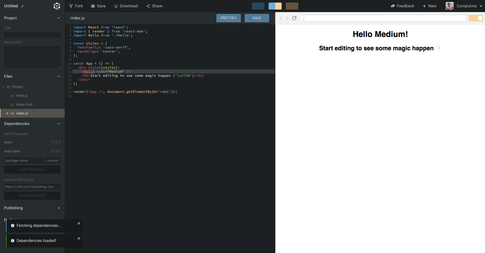
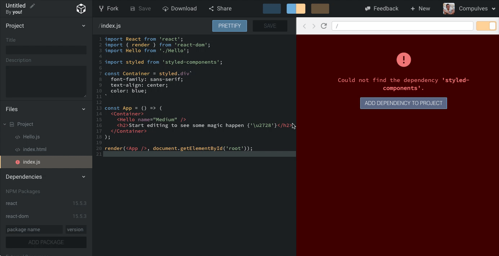
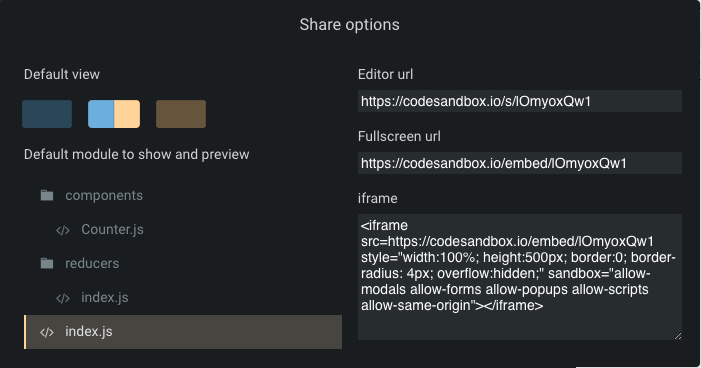
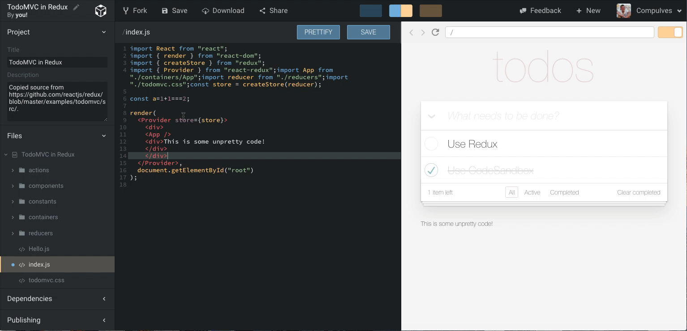

Already more than a week ago [Bas Buursma](https://twitter.com/bazzjuh) and I
released [CodeSandbox](https://codesandbox.io): an online code editor with a
focus on sharing projects in React. The response was beyond all my expectations:
already more than 1500 sandboxes have been created and more than 280 users
signed in via [GitHub](https://github.com)!

The idea of CodeSandbox started when I was on a trip to
[St. Ives](https://en.wikipedia.org/wiki/St_Ives,_Cornwall) (hah!). I was
working at that time on the conversion of [Catawiki](https://catawiki.com) to
[React](/framework/react). While I was gone I got a lot of questions from other
developers about React, but there was no easy way for me to answer them without
having access to an editor where I could access the libraries we have.

## What is CodeSandbox

Simply said: CodeSandbox is an online code editor. It automates things like
transpiling, bundling and dependency management for you so you can easily create
a new project in a single [click](https://codesandbox.io/s/new). After creating
something interesting you can show it to others by just sharing the url.
CodeSandbox features a live preview to show the result of the code while you're
typing. The editor works with all JavaScript projects, but it has some React
specific features, like the ability to download the project in a
[`create-react-app`](https://github.com/facebook/create-react-app) template.

## Features

We've been working on CodeSandbox for the past 4 months, so there are a lot of
things I built that I'd love to talk about. If you have any suggestions I'd also
love to hear them! I will feature (pun intended) the biggest features.

#### npm Dependencies Support

This is really important for us since it should be easy to try out a library in
a separate environment without too much hassle. We support
[npm](https://npmjs.com) dependencies by creating a dependency build on the fly
for the specific combination of dependencies.
[WebpackBin](https://github.com/cerebral/webpackbin) does the same thing and I'm
working at this moment with
[Christian Alfoni](https://twitter.com/christianalfoni) to build a service that
we both can use. It's also possible to add external resources, like CSS and
JavaScript files.

#### Downloading

If you want to take your project out of CodeSandbox you can easily do that by
clicking the 'Download' button in the header. You will get a zip file with the
`create-react-app` template to work with. The `package.json` and `index.html`
are generated for you.

#### Sharing

CodeSandbox is built around sharing, that's why this feature was a priority #1
from the start. It's possible to share a sandbox in two ways: the fullscreen and
the editor mode. You normally work in the editor view when working on a sandbox,
but you can share a fullscreen version of it. The fullscreen version is a small
version of CodeSandbox with just the editor and preview. You can specify what
file and what view to show with the sharing options in the header.

<!-- https://new.codesandbox.io -->

https://codesandbox.io/s/new?fontsize=14&view=split

#### Prettier, prettier-eslint, ESLint and Tern support

I've found these developer tools (especially
[Prettier](https://github.com/prettier/prettier)) a requirement for me to work
fast. You can enable or disable all of these in preferences. Prettify on save is
enabled by default (you can still turn it off) because this ensures the same
style between sandboxes and makes it easier to read the code of other sandboxes.
[ESLint](https://github.com/eslint/eslint) follows the rules of the
[airbnb config](https://github.com/airbnb/javascript/tree/master/packages/eslint-config-airbnb),
I want to make this a preference too in the future.

## The Roadmap

What we have now is the basis we need to build the initial plan. We built
CodeSandbox with the idea that it should not just be possible to fork work from
others. We want to exploit a feature of React that is extremely powerful:
**reusability**.

#### Publish sandbox as library

It should be possible to easily turn your sandbox into a library that others can
reuse in their projects. We never want people to lock in, so libraries created
on CodeSandbox can also be installed locally. We actually support this already,
but I decided to hide it before supporting some more community features that
make it easier to share.

#### Versioning

Libraries imply versioning, you should be able to commit versions and build
further on a library without worrying about breaking anything. You can 'branch'
by forking. We're still looking into options on how to start importing/exporting
to GitHub.

Better user support It's possible to sign in and view your sandboxes via the
menu in the header, but it's very limited at this moment. I'm building a profile
view where people can showcase their sandboxes, others can then comment and/or
favorite it. Sandboxes will get some more information, like how many
views/favorites it has had and what other sandboxes forked it.

#### Popular sandboxes

Impressive creations should stand out, it should be possible to feature
sandboxes with many views or favorites on the homepage.

#### Searching for sandboxes

Library support will get its potential with this feature. When you build a
sandbox you should be able to easily search for eg. 'Buttons' or 'Interactive
Piano' and see a visual list of other sandboxes to import. The creator of the
imported project will automatically be credited in the final project as
'contributor'.

---

CodeSandbox has been a great ride so far, the reactions have been incredible and
the support has been immense. If you have any suggestions/ideas about
CodeSandbox or the roadmap we'd love to hear them! You can access us by emailing
support@codesandbox.io or by direct messaging
[@CompuIves](https://twitter.com/CompuIves) on Twitter, we also watch the
comments here.

I'd like to end this article by sharing some cool sandboxes that already have
been created, we encourage you to share yours! 😉

- Redux Form by
  [Erik Rasmussen](https://twitter.com/erikras) — [https://codesandbox.io/s/mZRjw05yp](https://codesandbox.io/s/mZRjw05yp)
- Glamorous by
  [Kent C. Dodds](https://twitter.com/kentcdodds) — [https://codesandbox.io/s/o2yq9MkQk](https://codesandbox.io/s/o2yq9MkQk)
- RxJS tutorial by
  [Jan Tuitman](https://codesandbox.io/u/jantuitman) — [https://codesandbox.io/s/PNkNMk9Z2](https://codesandbox.io/s/PNkNMk9Z2)
- React Router V4 by
  [me](https://twitter.com/CompuIves) — [https://codesandbox.io/s/r0wXp0Njw](https://codesandbox.io/s/r0wXp0Njw)
