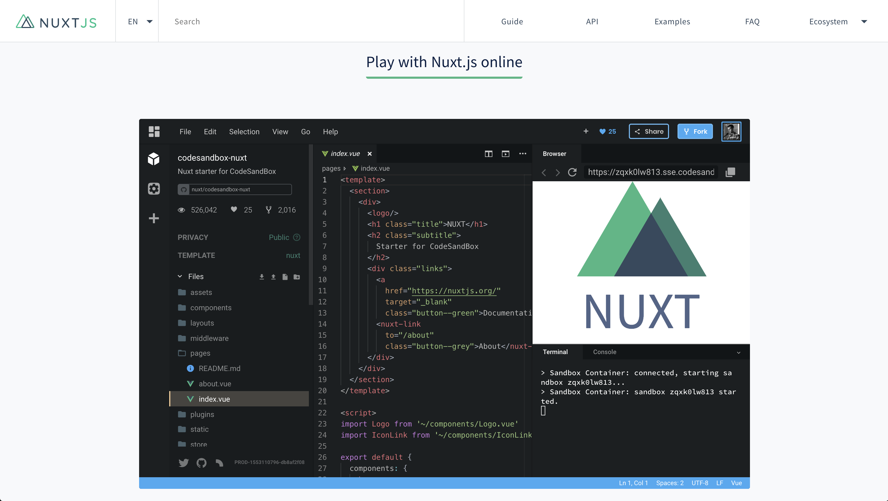
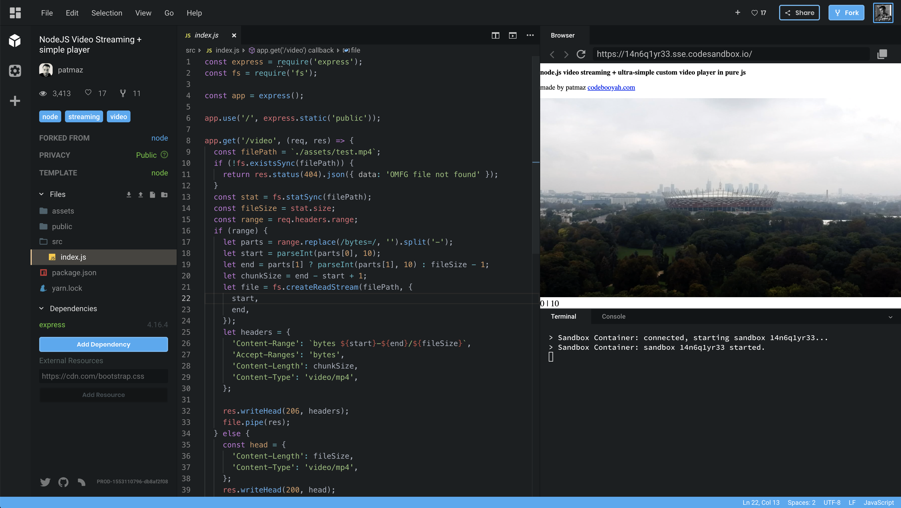
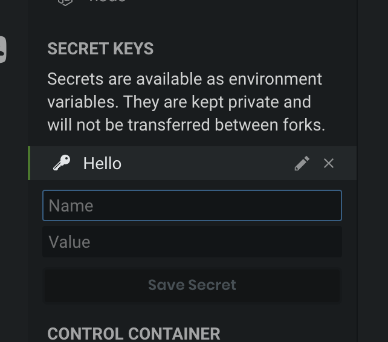

It's time for the second announcement of [CodeSandbox](https://codesandbox.io)!
In September we made the announcement of
[CodeSandbox Containers](/post/announcing-codesandbox-containers), with
containers we execute the code you write on a server instead of in the browser.
This allows you to run almost anything you want on CodeSandbox, just like a
local development environment.

When we announced this we gave the functionality the 'beta' tag, we wanted to
test it more before we would mark it as stable.

During this time, we flawlessly ran more than 23,000 container sandboxes, while
considering users' feedback, and iterating on the feature. It wasn't all
rainbows and unicorns 🌈🦄, though, we had a few (expected) glitches along the
way. So we worked hard on improving both the infrastructure and the
implementation, and we're quite confident to mark this feature as stable
beginning today!

## Some examples of Container Sandboxes

We saw many new kinds of projects on CodeSandbox as soon as we released
containers, we want to highlight some of the craziest and best ideas built on
CodeSandbox.

#### React Native Expo

[Phil Plückthun](https://twitter.com/_philpl) created
[a sandbox that runs Expo](https://codesandbox.io/s/wkjn0zlxpw)! This way you
can build [React Native](https://github.com/facebook/react-native) apps directly
on CodeSandbox.

#### Nuxt.js Examples

One of the best examples we can give you for the stability of containers is the
homepage for [Nuxt.js](/framework/nuxt) as they have been using it from almost
the start and have been integral in testing the resilience of our containers.
[This is their starter example](https://codesandbox.io/s/github/nuxt/codesandbox-nuxt/tree/master?fontsize=14).

#### Next.js, Gatsby, Apollo Documentation

Containers have also been used a lot by
[Next.js](https://github.com/zeit/next.js), [Gatsby](/framework/gatsby) and
[Apollo](https://www.apollographql.com) for their documentation and examples.
They have set up [GitHub](https://github.com) repositories that link to
sandboxes to showcase how their frameworks work. If you're interested in setting
this up for your framework, don't hesitate to shoot us an email to
support@codesandbox.io!

Here is a
[Gatsby](https://codesandbox.io/s/github/gatsbyjs/gatsby-starter-default/tree/master),
[Next.js](https://codesandbox.io/s/github/zeit/next.js/tree/master/examples/hello-world)
and [Apollo](https://codesandbox.io/s/apollo-server) example.

#### Node Streaming Example

Another cool example is the [Node](/software/node) video streaming demo,
showcased [here](https://codesandbox.io/s/14n6q1yr33). It shows how you can
stream videos using [`express`](https://github.com/expressjs/express).

The possibilities are endless!

## Updates

We've been doing many improvements since
[the initial release](/post/codesandbox-an-online-react-editor). Here are the
highlights of what we built and improved.

#### Infrastructure Changes

Last week we moved our sandbox containers over to a new infrastructure, which
resulted in a big speed improvement for our containers. We upgraded the storage
nodes to [NVMe](https://en.wikipedia.org/wiki/NVM_Express) drives, we are using
a new [Kubernetes](https://kubernetes.io) version (1.13.4) and added more
servers to run the sandboxes in. As a result, we also increased the time of
inactivity to
[hibernation](<https://en.wikipedia.org/wiki/Hibernation_(computing)>) to 60
minutes instead of 10 minutes.

A detailed post about infrastructure, architecture and software stack is coming
soon!

#### Raised limits

Up until now we you were able to create up to a maximum of 5 container sandboxes
as regular user, and you had a limit of 20 sandboxes as a
[patron](https://codesandbox.io/patron). Today, as we mark the service as
stable, we are increasing the maximum number of container sandboxes to 15 for
anyone and 30 for patrons. We may raise the limits based on usage in the future.

Another change we made is that from this moment on any sandbox that is in the
'Trash' folder does not count towards this sandbox limit. This also applies for
the 50 sandbox limit on client sandboxes.

#### Secrets Support

You can now add environment variables to a container. The variables will be
hidden for others and will not persist between forks. This is perfect for
showing demos/examples of APIs without exposing any secrets.

## Future plans

We have big plans for how our containers will work in the future, we want to
give anyone access to a [Docker](https://docker.com) instance with the click of
a button. We want to make some additional features and changes to make this
easier.

Some of our ideas are:

#### Importer Improvements

Right now we only detect official templates when you import a sandbox from
GitHub. If you want to import a node container you need to have a
`sandbox.config.json` mentioning that the template is `node`. We want to make
this more streamlined by doing some smart detecting. If, for example, we see you
are using [`webpack`](https://github.com/webpack/webpack) or `express` we will
automatically convert that into a container sandbox

#### Restart Container

Sometimes containers get stuck and that's not nice at all. One way we want to
mitigate this is by adding a 'Restart Container' button that will restart your
Docker container.

#### Convert Sandbox to Container Sandbox

We often saw that people started working on a browser sandbox, but then outgrew
its size after a while. Maybe because you want to access the
[terminal](https://en.wikipedia.org/wiki/Computer_terminal) or because you want
a helpful [command line](https://nl.wikipedia.org/wiki/Command-line-interface)
to help you generate the files.

This is a big pain-point for a lot of our users, particularly in
[Angular](/framework/angular), so we will make it possible to convert any
sandbox to a container sandbox in a click of a button. When you click the button
we will create a fork of the sandbox backed by a container, so you can install
and run whatever you run on your local machine.

#### Wake Up Containers with API Call

What if you could use your sandbox as a really simple API? That's our idea too!

One thing we plan to implement now that the containers are stable is a way for
the sandbox to wake up as a request is done so that you can get a proper API
response from a container sandbox at any time. This will make it much easier to
actually build APIs and bots using CodeSandbox!

#### Always-Running Sandboxes

Sometimes you create a server sandbox that you want to run forever, right now
this is not possible since we will hibernate this sandbox after a while. This is
also something we plan to add as a feature so that if you have a container
sandbox embedded in the documentation, this sandbox will never be stopped.

## Conclusion

This has been in the works for a while and it was a real strive for us to
complete and honestly could not be done without the amazing work that
[Bogdan Luca](https://twitter.com/lucabogdan) puts into making CodeSandbox
better and faster every day.

We hope you love this update as much as we do, and to anyone who has been with
us since the beginning of containers, thank you for making it better with your
feedback and suggestions!

We can't wait to see what you will build!
