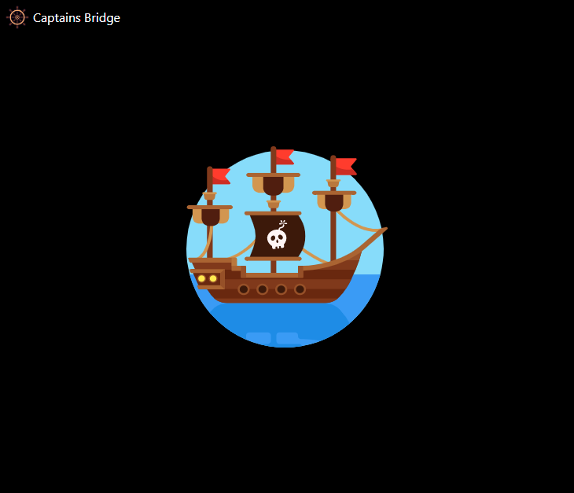
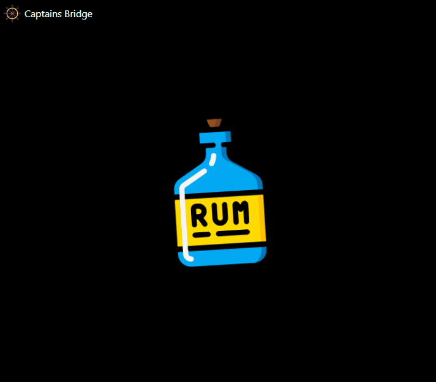
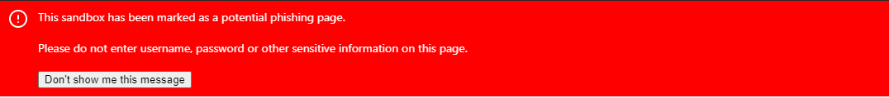
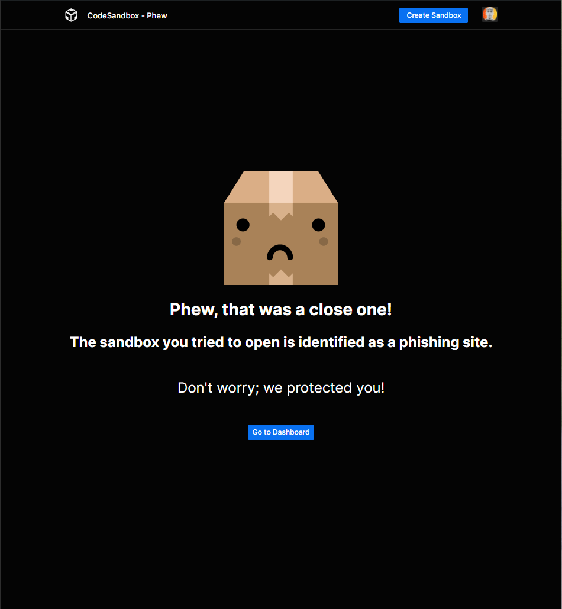

Fighting against scams and phishing sites is always a never-ending game. You won't wake up on a sunny summer day and realize they just disappeared.

They are constantly evolving and thinking about new techniques to create vulnerable sites, so we also need to answer them with new approaches. 

There is no "one ring to rule them all" - **or is it?** 👀

Here is our story about how our side evolved over the past year. But first, let's clear out some terms. 💡

## What is phishing? And why it's a big deal for us?

Phishing is a way that criminals get sensitive information (like usernames or passwords). It is a method of social engineering, mostly done via e-mail.

We (CodeSandbox) are providing an online collaborative IDE for anyone with internet access for free. You can create a web application in your browser, without paying for servers or anything - except your internet provider, sorry, we cannot pay for that. 🙂

As we are a collaborative platform, you can easily share your creations with anyone as we are generating a unique URL for each of your applications.

So in our case, phishing is a web application created in CodeSandbox that tries to fool you and get your credentials, such as Google / Facebook / Yahoo usernames and passwords. As these applications are easily shareable, you can imagine - CodeSandbox is a paradise for these criminals. They could quickly create a phishing application and share it via emails/social media/anywhere. Most users do not check the domain names first if they saw an email like: 

> *Oh, your Google account has been compromised, please click on this shiny - **totally secure** - button to protect it. If you don't do someone else - **not us!!** - will steal your data! *

> *Kind Regards,* 

> *Obviously Google's CEO*

## So, shall we begin?!

When I started working at CodeSandbox in the middle of 2020, phishing was one of the topics I automatically took ownership of. We used static code analysis to catch suspicious sandboxes, with patterns like:

- Domain names, dynamic domain name providers (DynDNS),
- Password/user HTML input elements,
- Popular company names (Google, Microsoft, Facebook),
- Or some specific JavaScript functions (eval, atob).

All patterns had a score value. If the total score was above a threshold, we sent the sandbox details to an Airtable database that we reviewed every day. Simple right? 👌

But it needs a **LOT** of manual work and had many weak points. The biggest was the sandboxes only scanned once, right after their creation. Nothing prevented from pasting some malicious code afterward. Most of the evil sandboxes were created through our [Define API](https://codesandbox.io/docs/importing#define-api) - which you can use to create sandboxes programmatically - so they probably never changed.

The first thing I would like to change is how we are scanning the sandboxes. 

We should check them whenever their content changed - it sounded like a good idea! 

***(psst, it's not)***

### 1st iteration: More scanning

Detecting every change and scanning all the code in a sandbox was like brute-forcing a password - it's kinda something, it works, but it's just a sticking plaster to a severe wound.

Implementing it was a minor success. This method increased the manual work by a ton! 👏👏👏 

Our review workflow looked like this:

- Copy sandbox ID from Airtable.
- Open it in a browser.
- Visually check the code and the running application if it's phishing.
- Mark accordingly in Airtable.
- Delete sandbox/owner in our database.
- *Boooooring!*

If you are a developer, you instantly would like to automate/semi-automate this part, right? 

That is what I exactly did! 😁

### 2nd iteration: Captain's Bridge

Wait... What?? Let me explain.

It was evident that we needed a UI for this tedious and time-consuming task. The scanner added around 100-200 sandboxes each day. That's a lot! If it only takes 2 minutes to review each, it's already 200-400 minutes/day. Bah.

So I quickly prototyped a small VueJs frontend with Koa as a backend to:

- Fetch sandboxes from Airtable's API.
- Show the embedded ([lightweight](https://codesandbox.io/docs/embedding#example-embeds)) version of the sandbox.
- Have three action buttons below the sandbox view (false positive, delete the sandbox, ban the user).
- Update Airtable and our DB accordingly which button I pressed.

The development took around an hour, and it worked like a charm. I could review all the sandboxes in minutes!

Oh, I almost forgot why it's called Captain's Bridge. As people name their children, developer name their PoC. I struggled to think of a good name, but our naming champion (Christian 🙏) stepped into the conversation and rescued me with Captain's Bridge...hic!

I instantly imagined an application with ships, pirates, and rum! It sounds like a lot of fun...hic!

And a super awesome loading indicator:

Perfect! 👌

It's not used only for the phishing sandboxes, but to simplify our internal processes, like:

- Reverting a deployment without all the time-consuming CI/CD processes.
- Copy any sandbox between different environments (production/staging/development).
- Etc...

That is where the name came from—**a central place for different simplified processes**.

### 3rd iteration: What's next?

Okay, now we are scanning our sandboxes continuously and reviewing the potentially harmful ones quicker. Lots of improvements with 1-2 hours of work!

We still need to solve other problems, like:

- We need to drop Airtable as a database - as we ran out of maximum records/base.
- Scan old sandboxes with the new patterns - we had around 10 million sandboxes at that time.
- Automatically delete sandboxes that are 100% sure phishing.
- Optimize the scanning functions - we are wasting a lot of CPU/memory resources!

Let's solve the easier ones first.

- I changed Airtable to a local MongoDB instance. We will store all the scan details there. 

- I created a small Nodejs script that iterates (with 8 threads) the 10 million sandboxes and sends their details to our scanner *(poor scanner)*.

- But before executing the script, I've extracted a list of patterns that are 100% sure used for phishing. Let's call them hard patterns. Most were domain names or obvious patterns in plain text or obfuscated format (phishers like to use obfuscated code with eval, atob, and unescape functions, or even with online tools).

The script ran over three weeks! Our database felt so much cleaner after!

All the 10 million sandboxes were scanned and found 40k potential phishing and deleted 240k sandboxes automatically. Huge! 😲

I was happy until I realized, if a new pattern pops up, I need to do the scan again and again. That's not good! It felt like a sticking plaster again.

I - kind of - solved 3 out of the four problems. But before optimizing the scanning functions, a more critical challenge knocked on the door (or landed in our email box, to be precise).

### 4th iteration: Notifying the victims

We started to receive regrettable emails from our users. Unfortunately, they - or in 99%, their parents - fell into the trap and typed in their credentials. Oh no!

The sandboxes were already flagged for review, but we are not working 24/7. I always started my days with a coffee and banning people, but that's not enough. Phishers never sleep. I do - mostly.

I need to figure out a solution to notify them if they open a flagged sandbox. We do not want to override some javascript functions, like prevent sending a POST request to a remote server or anything similar.

So I went with the most straightforward fix: placing a **HUGE, RED** banner on top of the flagged sandboxes. From the design and user experience point of view, it was awful (sorry, [Danny](https://twitter.com/DannyRuchtie)), but it worked pretty well!

We slowly stopped receiving these kinds of emails. Yeey!

But of course, we started to receive new ones, like, "Why my sandbox is flagged phishing, I did nothing wrong!?". They were way better to be received than the previous ones.

So the final thing I need to solve is the optimize the scanning functions. But how? Hmmm.

### 5th iteration: The Big Hmmm

There are several good ways to improve it. But most of them were too complicated and/or did not have a huge benefit, like incremental code scanning. I tried out several PoC's, but they felt like sticking plasters again and again. It took about one month until it came like a bolt from the blue.

> "What if we do the scan when the victim encounters a phishing sandbox instead of at code changes?"

The scan takes about 50-200ms, and if needed, we could improve that time (Hello Rust 👋). 

It could be done asynchronously - if you are not the Flash, there is no time to put your credentials on any webpage in that 50-200ms. We could even redirect the victim in case of an emergency!

Woah! Sounds like a good plan! But wait...It has a tiny problem.

We need to avoid scanning sandboxes every time someone opens them; it's unnecessary and inefficient, just like scanning all the code changes.

Luckily, we increment the sandbox version on every code change, so we know if something changed inside the sandbox. I only need to know if the patterns were changed. So I generate a hash of the patterns and save the hash and the version with the sandbox details. It means I - or exactly the scanner - always know when to scan - only do if one of two changes. Hmmm.

Let think a bit. Assume I add a new pattern. The next time someone opens a sandbox with that particular pattern in it, the viewer will instantly get the huge, ugly red banner or be redirected to our phew page (if it's a hard pattern, the sandbox is immediately deleted → user gets redirected).

I wish you never see this:

We do not even need to rescan all the old sandboxes every time I change the patterns! 💪 🤯

It works perfectly. We can dynamically change the patterns and all sandboxes that are opened were scanned with the new list! Cool! 😎

### Is this the end? (Please end it)

Unfortunately not. We are just acting on an ongoing phishing attack by adding new patterns; we will always be one step behind the attackers.

We thought a lot about how we could improve it. Every time the conclusion was that scanning the code, searching for patterns is not good. 

(But adding domain names to the hard list is kind of good because they probably pay for that domain, but they cannot use it in Codesandbox anymore, so they are transferring money to the Domain Name providers! 🤝💸)

Let's think a bit loudly - as loudly as I can in written form:

- They are creating websites that look exactly like the login pages of Microsoft, Amazon, Yahoo, etc.
- The site needs to look like exactly the real one, no matter how they write the underlying code, otherwise, no one will type in their credentials.
- They need to fool the victims!

Recognizing a login page is easy for the human eyes, but not easy for computers. Or is it? Hmmm. Yes, you thinking the same as I did!

### Final iteration: AI?

More precisely, Machine Learning algorithms, like Image Recognition and Image Classification.

We can build a model and feed it with screenshots of login pages to identify graphical patterns. Luckily, we are already generating screenshots of the sandboxes - to show your work on your dashboard or social media, so we have a good data source.

We "just" need to introduce these screenshots to the algorithms somehow, and voila - I wish it could be that straightforward.

It's an incredible challenge, right? For a developer like me, who never used an AI, it is. If it could effectively identify login pages, we could rely on it, of course on top of our current static code analysis.

(We already have a running alpha version of this method, but it needs many iterations to be usable in production.)

## Wrap up

Huh...That was a long story!

Wrestling with phishers is just a very tiny percentage of the overall work we are doing at CodeSandbox, but it's an important one! Hopefully, with the help of an AI, we could prevent attacks with a considerable volume. 

(We are also planning to have a publicly available endpoint that you can use to check screenshots against.)

I hope you enjoyed this blog post! Let us know if you would like to see similar posts like this about different topics!
