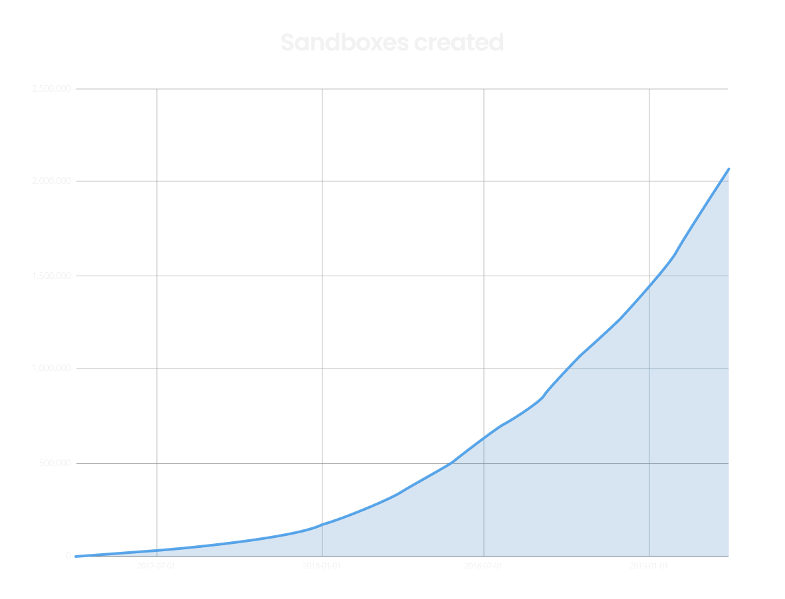
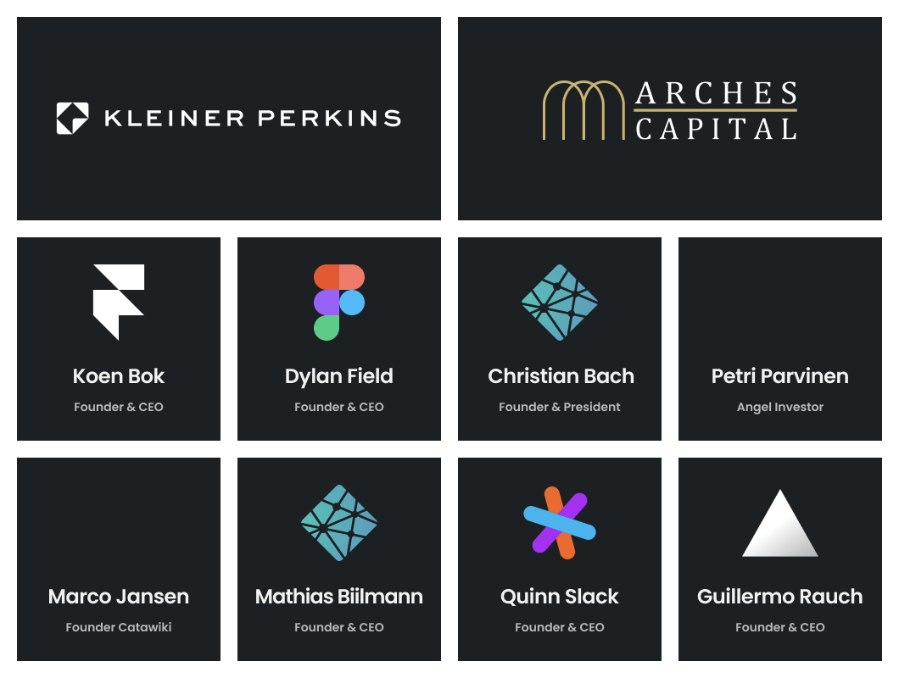

## Our Story

Two years ago we released [CodeSandbox](https://codesandbox.io) as the result of
a side project while I was studying at the university. At the time there was no
easy way to start or share modern JavaScript projects, and I needed this when
working at [Catawiki](https://catawiki.com).

Thus [CodeSandbox was born](/post/codesandbox-an-online-react-editor).
CodeSandbox is an online code editor that allows you to create a new web
application in a single click. We handle setting up the development environment,
the tooling and the provisioning for you. This way you can focus on creating the
application instead of all the tooling. You can always share your project by
just sharing the URL, and we have integrations with popular deployment targets
like [Vercel](https://vercel.com) and [Netlify](https://netlify.com) and source
control providers like [GitHub](https://github.com).

It turned out that I wasn't the only one who wanted to have something like this.
CodeSandbox quickly grew in usage, and with every new release, we got a new
surge of encouragement from the community. Now, two years later, over 2 million
projects have been created and we have over 1.2 million visitors per month!

We never could've imagined this kind of adoption and support from so many people
in such a short time: Thanks to everyone involved for being so supportive!

## The Round

We've always said that we are an online code editor, but we think we can be much
more than that. We want to become a platform that not only makes it easier and
faster for everyone to create applications, but it should be a place that people
go to to share, collaborate and learn as well. To make this possible we decided
to raise money from a group of likeminded people.

We raised money from an incredible group of people, many of whom have been
advising us for some time now. Like us, our investors believe that the process
of creating software can be more accessible, productive and effective by
recreating the tooling to do so. Instantly sharing our work should be easier now
than ever before.

We're proud to announce a seed round of \$2.4M, led by
[Kleiner Perkins](https://kleinerperkins.com). Kleiner Perkins has invested in
many companies that are improving the flow of developing applications, like
[Figma](https://figma.com) and Netlify. Among the investors are
[Arches Capital](https://arches.capital),
[Christian Bach](https://twitter.com/Chr_Bach) &
[Mathias Biilmann](https://twitter.com/biilmann) (Founders Netlify),
[Dylan Field](https://twitter.com/zoink) (Co-Founder Figma),
[Guillermo Rauch](https://twitter.com/rauchg) (Founder Vercel), Koen Bok
(Co-Founder [Framer](https://framer.com)),
[Marco Jansen](https://linkedin.com/in/marcojansen) (Co-Founder and former CTO
Catawiki), Petri Parvinen ([Angel Investor](http://arctum.fi)) and
[Quinn Slack](https://twitter.com/sqs) (Co-Founder
[Sourcegraph](https://sourcegraph.com)).

We're super excited to raise this round from such a smart group of people, we
can't wait to continue building!

## What does this mean for CodeSandbox and you?

We'll continue to ship features inspired by our core values:

1.  Lower the learning curve
2.  Encourage sharing and discovery
3.  Give the experience of a local editor

What will change is the capacity and speed we can deliver new product features
and give everyone a more useful experience on CodeSandbox. Our roadmap includes
making CodeSandbox more community friendly, supporting larger projects,
improving specific workflows (like the workflow of a library maintainer) and
extending integrations.

We really believe that we can make building applications easier, faster and more
collaborative, and we'll do everything with lowering the bar of entry in mind.

Not only are we looking for your feedback, this also means you can work with us.
So if you're interested in working on CodeSandbox please send us a message
[from here](https://codesandbox.io/jobs)!

## Thank You

There are so many people who have helped CodeSandbox to this point, and we're
incredibly grateful. We'd like to thank
[our 125(!) contributors](https://github.com/codesandbox/codesandbox-client#contributors),
everyone using CodeSandbox and everyone who has advised and helped us to this
point!

We can't wait to explore this new chapter with you!
