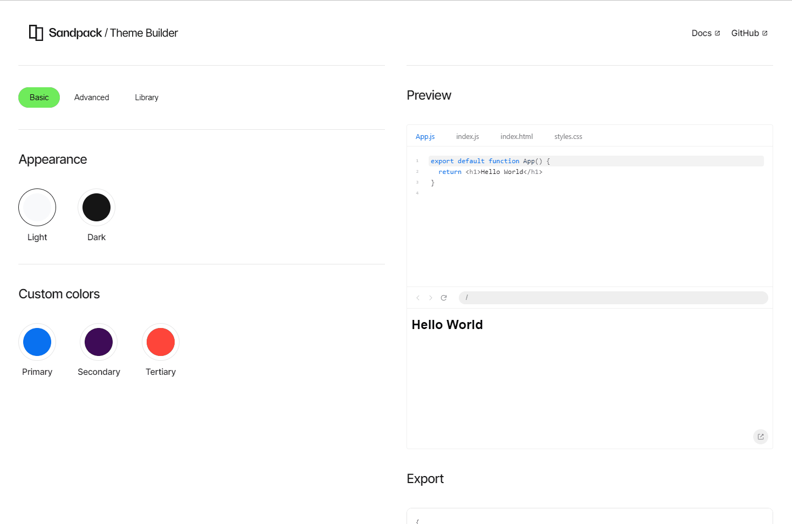
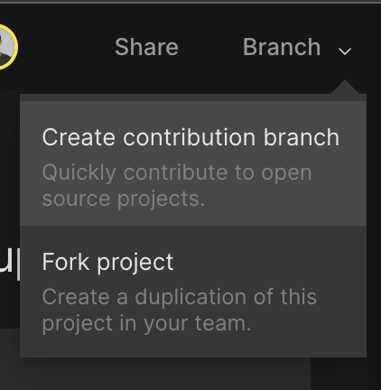

At CodeSandbox, we are excited for [Hacktoberfest](https://hacktoberfest.com/) and all the value that open
source contributions generate at this time of the year for exciting open source
projects, the maintainers and contributors.

We are thrilled to also share that we’ve added the `hacktoberfest` topic to
Sandpack and would love your contributions.

## Contributing Sandpack themes

Our key goal is empowering developers to include custom live coding experiences
on the web, regardless of your website layout or level of design or expertise.
To be able to do this, we have provided plenty of options under
[`@codesandbox/sandpack-themes`](https://sandpack.codesandbox.io/docs/getting-started/themes), and we want to offer even more options from the
community.

So, how can you contribute to new themes?

### **Sandpack Theme Builder**

Sandpack provides a tool to guide you in creating your custom theme. Start with
a dark or light theme, and then add your custom values like primary and
secondary colors.

Plus, if you want to give it an even more personal touch, you can go to the
Advanced tab and set colors for the syntax highlight and other cases.
[https://sandpack.codesandbox.io/theme](https://sandpack.codesandbox.io/theme)



### **Publish a theme**

At this point, you need to go to the Sandpack repository, fork it, and introduce
some changes in your pull request. The easiest way to do this is to use
CodeSandbox Projects:

1. Open the Sandpack repository on
   [CodeSandbox Projects](https://codesandbox.io/p/github/codesandbox/sandpack/main?file=%2FREADME.md).
2. Create a contribution branch, which will fork the repository for you:



3. Create a new file in
   the [codesandbox/sandpack/sandpack-themes/src](https://github.com/codesandbox/sandpack/tree/main/sandpack-themes/src) folder
   with the following name `[myAwesomeTheme].ts`
4. The content of this file must be an export for an object that contains the
   theme:

```js
import type { SandpackTheme } from "./types";

export const myAwesomeTheme: SandpackTheme = {
  colors: {
    ...
  },

  syntax: {
    ...
  },

  font: {
    ...
  },
};

```

1. Include your new theme into
   the [index.ts](https://github.com/codesandbox/sandpack/blob/main/sandpack-themes/src/index.ts)
   file, which exposes all themes.
2. Commit and send in your pull request. Done 🚀

We cannot wait to see the amazing themes from the community. And if you have any
questions or want to reach out to the team, feel free to contact us on
[Discord](https://discord.gg/C6vfhW3H6e) or on
[GitHub](https://github.com/codesandbox/sandpack/issues).

Happy contributing! 🎉
