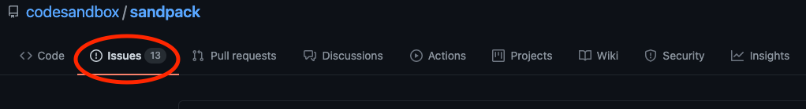
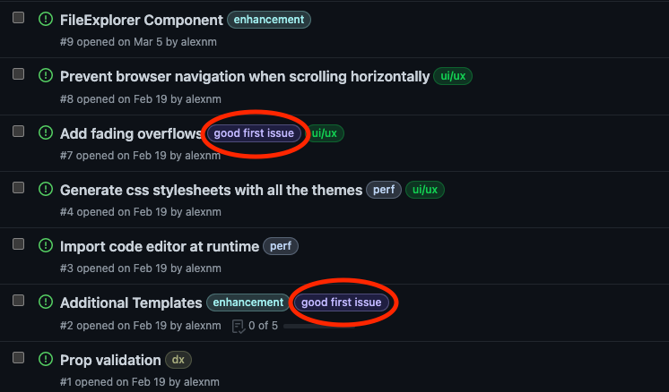
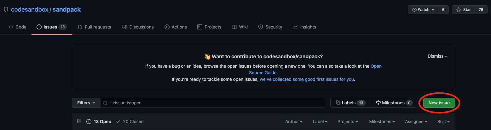
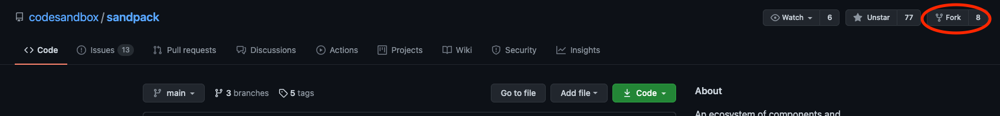
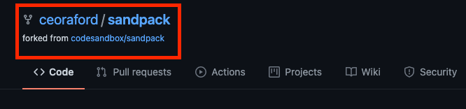
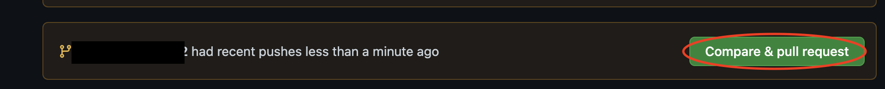
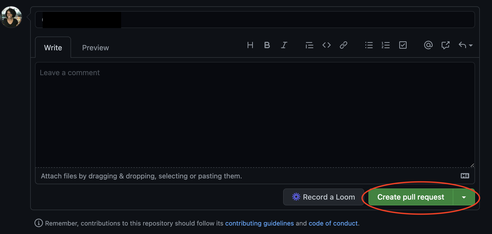

Open source software is a huge part of the tech industry. Over and over, we hear about the power of open source. In [episode 2 of The CodeSandbox Podcast](https://codesandbox.io/podcasts/codesandbox-podcast/elizabet-oliveira), guest Elizabet Oliveira discussed open source and how it has impacted her career. This article will focus on getting you up and running as an open source contributor. Let's start by discussing why you should be interested in getting involved with open source. 

## Why you should start contributing to open source projects

> I think, yes [open source has helped me in my career], because I think it's easier to have interviews... And also I ended up talking in react conf in Las Vegas. And after that, I started talking in other conferences. And so I think it opened a lot of doors.

We don't have an infinite amount of time and I'm sure there are tons of things on your to-do list. So you might be wondering why you should even be thinking about contributing to open source software. Is it really worth the time and effort?

There are many benefits of contributing to open source projects. Assess your career and development goals and you might be able to accomplish them by contributing to open source software. Here's a brief and non-exhaustive list of some of the benefits of getting involved with open source:

- Familiarize yourself with Git
- Gain experience
- Get attention from employers and recruiters
- Connect with other developers in the community

## Learn Git and GitHub Basics

Before you can go scouting for an open source project to work on, you should know the basics of Git and GitHub. You don't need to be an expert. But there are a few commands you should definitely know and understand:

- git init
- git clone
- git checkout -b
- git branch
- git add
- git commit -m
- git merge
- git push
- git pull

This article won't discuss what these commands do or how they work. This is a checklist for you to measure your understanding. If you are unfamiliar with any of these Git commands, check out this helpful [Git cheat sheet](https://www.git-tower.com/blog/git-cheat-sheet/). To make sure you understand when and how to use each command, I suggest you create your own project locally using Git and push your project to GitHub. This will help you to become familiar with how Git and GitHub work together. Once you feel comfortable, you can move on to the next step. 

## Find a project you feel comfortable working on

This step may seem intimidating at first. Sometimes, you see a project that can seem complex or beyond your skill level. Some projects on GitHub are very robust and extensive. Not to mention the sheer number of open source projects on GitHub. How can you find something to work on that interests you and fits your skill level?

There are a few ways to do this. You might have already found an open source product or project that you're interested in. If this is the case check for Issues with the **good first issue** or **first timers only** tag. These have been specifically marked for beginners or those with little open source experience. If you don't already have a project in mind, check [First Timers Only](https://www.firsttimersonly.com/) and the [Awesome for Beginners](https://github.com/MunGell/awesome-for-beginners) repository for more options. You can also ask other developers that you know or people in the community for suggestions.

Once you find a project, there's still more you need to do to make meaningful contributions to a project. You'll need to know how to communicate when getting involved with a project.

## Communication guidelines

First and foremost, make sure that you're being polite and kind when talking to anyone involved with the project. This rule goes for all online communication. It's important to remember that maintainers are busy people and may have multiple responsibilities to tackle at one time. So be patient with them and always communicate respectfully.  

Most projects will have communication guidelines specifically outlined for the project. These can usually the `README.md` or `CONTRIBUTING.md` file. Make sure to read through the whole document and when the time comes to actually contribute your code to the project, be sure that you're following the structure and guidelines that maintainers have specified.

Aside from reading and following the [CONTRIBUTING.md] guidelines, here are some general rules that you should try to adhere to when opening up issues, submitting pull requests (both of which will be covered soon), and any other communication between you and others involved in the project:

- When you open an issue, be sure to thoroughly describe the bug or problem you've run into. Include information that will help maintainers or others to reproduce the bug locally on their end.
- It's also good to provide a possible solution if you have one in mind. This streamlines communication and will help maintainers to quickly determine whether or not your possible contribution fits the direction of the project.
- Try including comments in your code. Other people working on the project likely aren't familiar with your coding style or how you think. Including explanatory comments in your code will make your logic clear and thus, others will be able to quickly understand how your code works.

When you have chosen the project you would like to work with and you've read the `CONTRIBUTING.md` and/or `README.md` thoroughly, you're ready to actually contribute your code to the project. 

## Contribute to Your First Project

With your open source project already chosen, there are a few ways you can decide on what you would like to add to the project. You can work on pre-existing issues which can be found under the "Issues" tab on GitHub. 



When going through existing issues, you can look for things marked with the **good first issue** or **first timers only** tag (as previously mentioned). 



If you find an issue that you're interested in, it may be useful to leave a comment on the issue outlining the solution you would like to implement. 

You can also create an issue based on a bug you've noticed or a feature you think needs to be improved. Do this by clicking the "New Issue" button. 



If you decide to open a new issue, be sure to provide relevant information that will allow maintainers to understand the bug you've run into and/or the feature you would like to add or improve and why. Remember the communication tips that were mentioned earlier. 

You can skip creating an issue and just submit a pull request. This will cut out some communication that goes with creating and submitting an issue. This means you can get right to work. But keep in mind that the project maintainer may decide to decline your pull request. So the work you've done may not be used in the end. If this is the route you'd like to go, you can move on to the following steps which will cover the process of submitting a pull request.

Of all the options, I recommend working on a pre-existing issue. Make sure that no matter what route you decide to take, follow the guidelines set out by maintainers in the `README.md` and `CONTRIBUTING.md` files.

### 1. Fork your project of choice

On GitHub, fork the repository you've chosen to work with. 



This will create a copy of the project that will be saved under your GitHub account.



### 2. Clone your fork

To clone the fork you've created, click the "Code" button and copy the URL that's provided.

In your terminal, change into the directory that you want to hold your forked project

```shell
cd <directory_name>
```

Now clone your forked repository using git clone and the URL you just copied

```shell
git clone <url>
```

Change into the folder that was just created. This will likely match the name of the project you forked. So if we're using the Sandpack repo as an example, that would be [sandpack]:

```shell
cd <project_name>
```

### 3. Create a branch locally

Before you start working, create a separate branch that will hold all the code that you add or edit.

```shell
git checkout -b <branch-name>
```

### 4. Make your changes

Now you can finally code! You may also be editing copy, fixing grammatical errors, or improving documentation. Whatever changes you're looking to make, you can finally do it at this step!

### 5. Commit and push your changes

Before you commit and push your changes, make sure to run and test your code. Once your sure that your code is functioning as desired, you can commit and push your changes to GitHub.

```shell
git add .
git commit -m 'commit message here'
git push -u origin head
```

### 6. Create a pull request

Go to the original project on GitHub and you should see a prompt encouraging you to open a new pull request from the branch you created. Click the "Compare and pull request" button. 



Once you do this you will be shown a text editor. Fill this in with all the relevant information needed to understand the work you've just done. When you do this, click the "Create pull request" button.



Once you create your pull request, you'll have to wait on maintainers to respond. If the work you've done is error free and fits the scope and direction of the project, maintainers might merge your work into the project. They may request that you make changes to the work you've done. They might also decide to reject your pull request. If this happens, don't be discouraged. Maintainers will probably have a good reason for doing this and it's likely that will let you know. You can decide to work on another issue in the same project or you can find a new project to work with.

## Conclusion

Open source can seem intimidating. But once you dive into it, you'll see how rewarding it can be and you'll quickly reap the benefits. Here's a quick summary of the steps you need to take when you contribute to open source: 

1. Thoroughly read through the `README.md` and `CONTRIBUTING.md`
2. Fork the project repository
3. Clone the project locally
4. Create a feature branch for your work
5. Once you finish make changes, commit and push your work
6. Open a PR

Once you've done this, you'll officially become an open source contributor! If you'd like to prepare yourself more before getting started or if you want to learn more about open source, here are some resources I found very useful. 

### Additional Resources

- [Open Source Guide - How to Contribute to Open Source](https://opensource.guide/how-to-contribute/)
- [How to Contribute to Your First Open Source Project by Katherine Peterson](https://blog.katherinempeterson.com/how-to-contribute-to-your-first-open-source-project)
- [An Open Source Etiquette Guidebook by Sarah Drasner and Kent C. Dodds](https://css-tricks.com/open-source-etiquette-guidebook/)
- [Hacktoberfest Etiquette for Contributors by Christina Gorton](https://dev.to/devteam/hacktoberfest-etiquette-for-contributors-ec6)