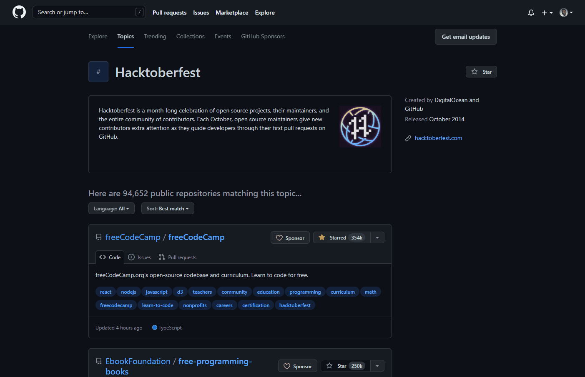
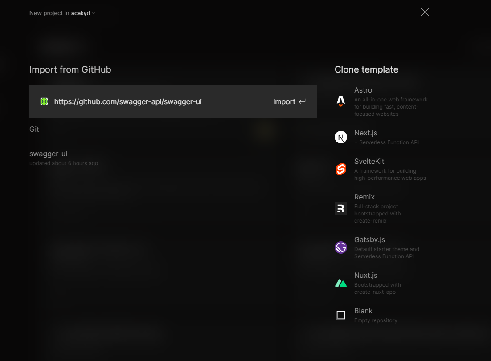
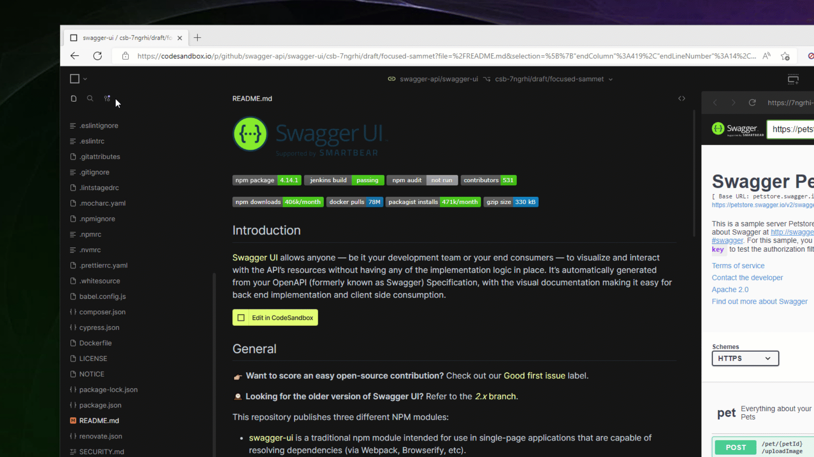

### Introduction

Open source projects are built by developers all around the world and made freely available to anyone to use, study, modify and even contribute to. They are often hosted on [GitHub](https://github.com) under a specified license.

A lot of the tools we use (especially as developers) are open source. From the libraries we use for development, to tools that we use daily. Getting involved with open source is a great opportunity to be a part of something big, perfect your craft and collaborate with developers from anywhere in the world.

### What is Hacktoberfest?

[Hacktoberfest](https://hacktoberfest.com) is a month-long celebration of open source software that aims to make it easier for people to be a part of the open source community. Open source maintainers create first-timer issues that users can fix, and new contributors get a very supportive community available to aid them.

**Hacktoberfest isn’t all about just code. Everyone is welcome - from writing, designs, testing or even mentorship.**

### What Hacktoberfest isn’t

With the culture of Hacktoberfest focused on making it easier for newbies to break into open source, it is important to note that spamming - sending irrelevant PRs or adding commits that add no value across repositories - is highly discouraged and defeats the purpose of this month-long event.

### What do you need to do to participate?

To be a part of this year’s Hacktoberfest, you need to:

- Register at [hacktoberfest.com](http://hacktoberfest.com) anytime between September 26th and October 31st.
- Find participating projects that are hosted on either GitHub or GitLab that you would like to contribute to. These projects would have the “hacktoberfest” label or topic added to them.
- Send in your contributions by creating a pull request to the repository.
- Your pull requests must be merged for them to count towards your total for the month.
- Please note that spammy or low-quality pull requests are **NOT** going to count.
- Be among the first 40000 participants to get 4 requests accepted between October 1st and 31st to receive one of two prizes: A tree planted in your name or the Hacktoberfest 2022 t-shirt.
- Continue contributing and adding value to more open source projects around the world. 🚀

## Getting started

CodeSandbox makes it extremely easy to get started making your contributions today. With CodeSandbox, you won’t have to worry about setting up your local environment to run the project before you’re able to make a contribution - either as a coder or a non-coder.

**Find a project**

I always recommend finding projects that you already use as a great start to break into open source. For Hacktoberfest, it’s required that the projects have the hacktoberfest label on them. 

A good way to start is by visiting the [Hacktoberfest topic](https://github.com/topics/hacktoberfest) on GitHub, where you’ll find all the projects you can contribute to.



**Import to CodeSandbox**

Different projects have different setup requirements. Depending on the complexity of the project, it might take you a few minutes to set everything up in your local environment — but, if you’re a beginner, this might become a roadblock. Fortunately, there’s a way to skip this setup entirely and get straight to working on the codebase: importing the project to CodeSandbox. 

By doing this, you will save the setup time and complexity and be able to focus on the changes you want to make.

Let’s see this in action! ✨

For this tutorial, we will be importing the Swagger UI repository.

1. Go to the **[Projects Dashboard](https://codesandbox.io/p/dashboard)**.
2. From the left sidebar, click on the **Team** (personal or another) you want to import your project into. New teams can be created through the [Dashboard](https://codesandbox.io/dashboard).
3. Click on the **`New Project`** button.
4. Enter a valid **GitHub URL** or choose a repository from the pre-loaded repository list.
    - For example, [`https://github.com/swagger-api/swagger-ui`](https://github.com/swagger-api/swagger-ui).



You can also open up any open source repository through CodeSandbox simply by adding the repository’s GitHub URL to the end of the CodeSandbox URL, using the format below:

```markdown
codesandbox.io/p/github/[org]/[reponame]
```

In our case, this would be visiting [codesandbox.io/p/github/swagger-api/swagger-ui](http://codesandbox.io/p/github/swagger-api/swagger-ui) directly. 

**Make your contribution**

By default, when you open up a project, you can’t contribute directly to the main branch. You can either create a contribution branch or fork the project. 

Creating a contribution branch is the fastest and easiest way to contribute; this creates a disposable branch for you to make your edits and send a PR. Forking a project is also an option, as it creates a duplicate of the project in your own account and allows you to work from there — but for contributing, we recommend that you choose the contribution branch option.


Once this is done, you can focus on making your valuable contributions to the project before moving on to send a PR. As you make your changes, you will be able to see a handy preview of the project, because CodeSandbox is running a development server so you can immediately see the result of your changes.

**Send in your pull request with a preview link**

Once you’re happy with your changes, it’s really easy to commit them and open a pull request, as you can see below.



With CodeSandbox, every branch has a unique preview link that you can include in your pull requests. This makes it extremely easy for open source maintainers to view your contributions, provide feedback or make changes where necessary before merging. 

If the open source repository already has the CodeSandbox GitHub app installed on their repository, this happens automatically. Otherwise, you can include the link to your branch in the body of the pull request.

### Conclusion

Hacktoberfest is an exciting time of the month for open source enthusiasts all over the world. The activities go beyond the pull requests but also mentorships and conversations happening across the web. You can stay up to date with all we have in store for you this period on our Twitter account [@codesandbox](https://twitter.com/codesandbox). Happy contributing! 🎉