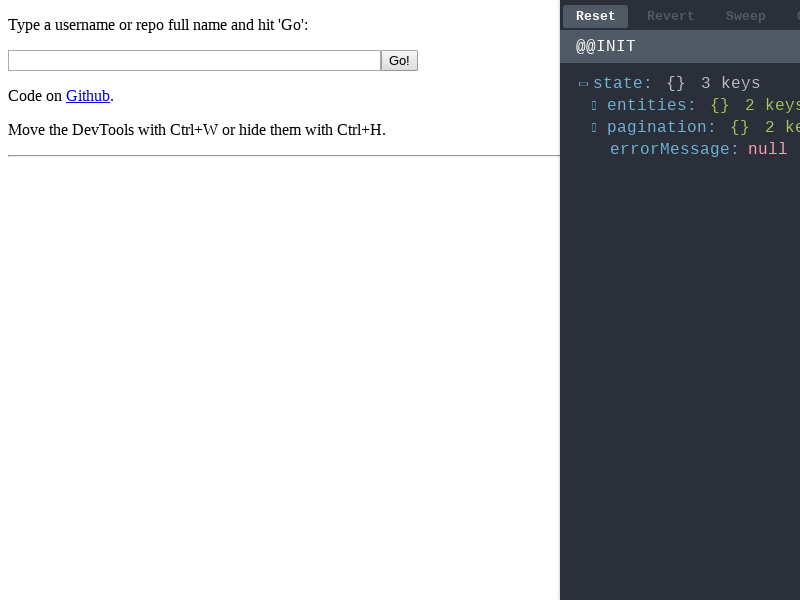
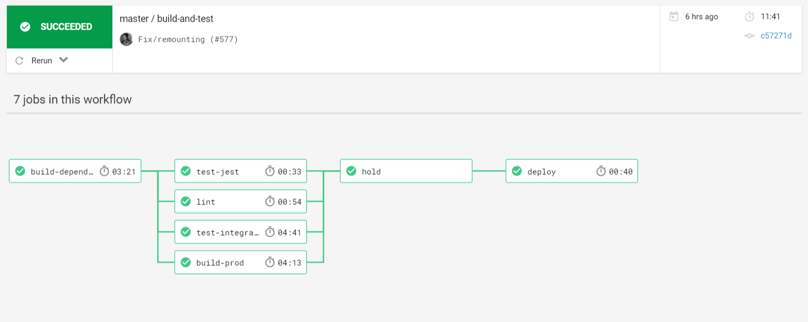
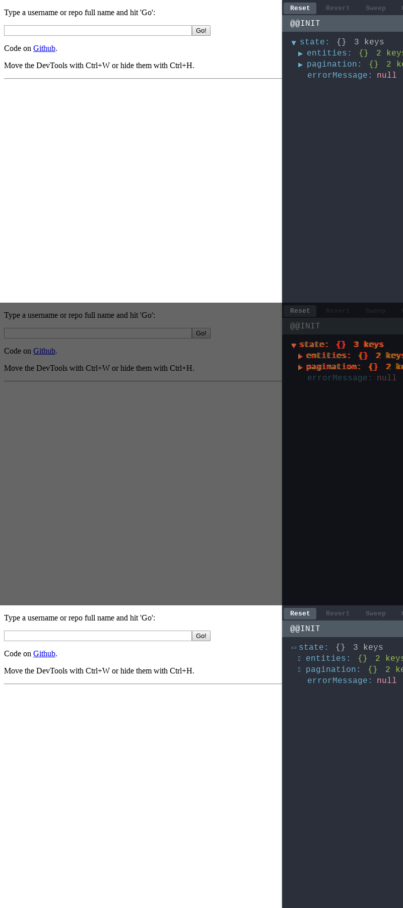

Last year a tool called '[Puppeteer](https://github.com/GoogleChrome/puppeteer)'
was released by the [Chrome Developers](https://twitter.com/ChromiumDev) team.
This tool is a headless [Chrome](https://google.com/chrome), which means that
with it you can interact with and visit websites programmatically. This is a
powerful concept that has many uses.

[CodeSandbox](https://codesandbox.io) uses Puppeteer extensively nowadays. I
want to explain in 2 posts how we use Puppeteer. In this post I will explain why
and how we use Puppeteer for our test suite. In the next post I will cover how
we use Puppeteer and
[serverless](https://martinfowler.com/articles/serverless.html) functions to
generate previews and metadata for sandboxes (projects).

## But Why?

In CodeSandbox we do all bundling of the sandbox code in the browser,
[I've built a custom bundler](/post/creating-a-parallel-offline-extensible-browser-based-bundler-for-codesandbox)
to do this. We still make changes and add features to this bundler, so it's
crucial that we extensively test if the changes affect existing sandboxes built
by users.

#### Before

I've always kept a list of 'test' sandboxes and would load every sandbox
manually to see if they still worked. As you can probably expect, this proved to
be very time consuming as the list kept growing beyond 20 sandboxes and we
started getting more contributions. Puppeteer to the rescue!

#### Solution

Puppeteer has a really nifty function called
[`screenshot`](https://github.com/GoogleChrome/puppeteer/blob/master/docs/api.md#pagescreenshotoptions)
(you can try it [here](https://try-puppeteer.appspot.com)). The function does
exactly what it describes: it takes a screenshot of the current webpage and
returns the `Buffer` of the screenshot. For CodeSandbox we can use this as a
snapshot tool: after every commit we take a screenshot of all test sandboxes and
compare them with the previously stored screenshots. If there's a difference of
more than 1% we fail the test suite.

## Implementation

I decided to use [Jest](https://github.com/facebook/jest) for running all tests.
We start by setting up an array of sandboxes to test:

https://gist.github.com/CompuIves/26e641726c10e078c5074192d5728ff4

This is a list of sandbox ids, of which some have extra options like a more
tolerant threshold. We iterate this list to create test cases:

https://gist.github.com/CompuIves/7f671441e1d10497278e5cd53a5efd35

The biggest question was how to take a screenshot of a single sandbox. This
turned out to be quite simple, we already support opening a sandbox as a
separate page by going to `https://:id.codesandbox.io` (example:
[https://vue.codesandbox.io](https://vue.codesandbox.io)). So the only thing
left for me was adding this functionality to the development server, so we can
create screenshots with the new code. I ended up changing our `webpack` config
to have a 'test' mode, this mode will only build the sandbox bundler and host it
at `http://localhost:3001#:id` (example: `http://localhost:3001#vue`). Note that
we set the id as a hash, this way we don't interfere with the routing of the
sandbox.

After having this set up it was fairly straightforward to build the rest.
There's already a library for comparing screenshots called
[`jest-image-snapshot`](https://github.com/americanexpress/jest-image-snapshot).
This library exposes `toMatchImageSnapshot` on `expect`, which works almost
exactly the same as `toMatchSnapshot`.

The final implementation looks like this:

https://gist.github.com/CompuIves/3a6195dafc1aa0cc16266528d1991f81

You can see in the code that we expose a function called `window.__puppeteer__`.
The bundler calls `window.__puppeteer__` when it's finished, this function is
exposed by puppeteer so we can exactly know when we can take the screenshot. The
generated screenshots are then saved in the [GitHub](https://github.com) repo.
You can find them
[here](https://github.com/codesandbox/codesandbox-client/blob/master/packages/app/integration-tests/tests/__image_snapshots__/).

We run these tests using [CircleCI](https://circleci.com), but we need to
generate the initial screenshots locally. To ensure that we generate similar
screenshots as CircleCI we generate screenshots using a docker container. We
have a simple script which we just run to generate new screenshots:

https://gist.github.com/CompuIves/5038c43cf0926a29e8fa279ba2e82255

I have set up a simple workflow for CircleCI to start the test server and
simultaneously run the tests. These tests are run in a docker container that has
Puppeteer preinstalled.

We save all diffs as artifacts, so we can easily compare the screenshots. You
can see a list of artifacts of a recent test run
[here](https://circleci.com/gh/codesandbox/codesandbox-client/4291#artifacts/containers/0).

## Conclusion

The implementation turned out to be quite simple, but it has saved me a lot of
time already. We now test a little over 20 sandboxes for every commit and PR. I
also noticed that I'm more inclined to add sandboxes to the test suite too,
which made the bundler more stable in general.

---

In the next post I will cover how we use Puppeteer with serverless functions to
generate metadata and oEmbed tags for sandboxes. You can follow my Twitter
[@CompuIves](https://twitter.com/CompuIves) or
[@codesandbox](https://twitter.com/codesandbox) to stay up to date!

If you're interested in the code; all code that was described here (and of
CodeSandbox) is open source on GitHub. You can find the main repository
[here](https://github.com/codesandbox/codesandbox-client).

I hope you found the post interesting, don't hesitate to respond with more ideas
and uses for Puppeteer!
