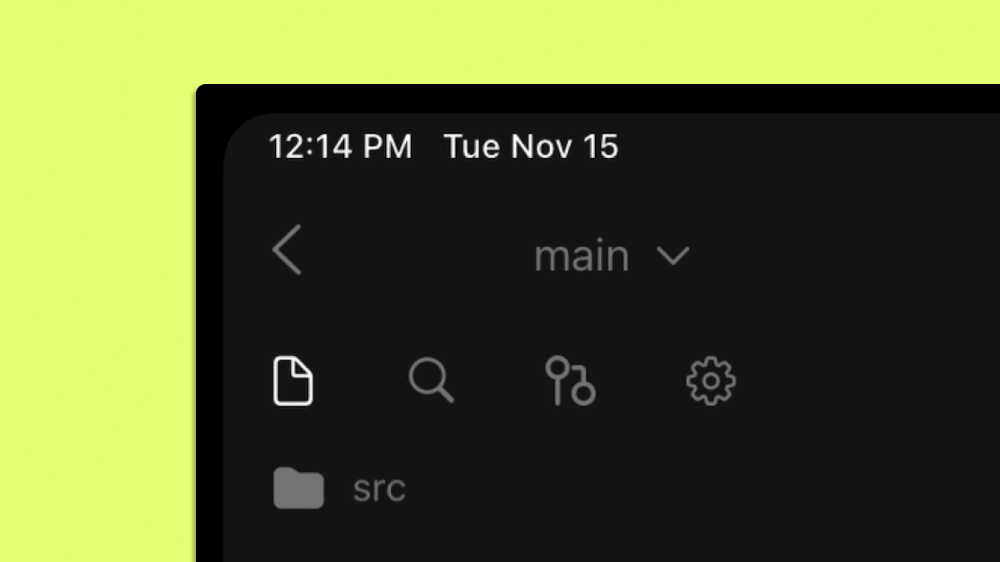
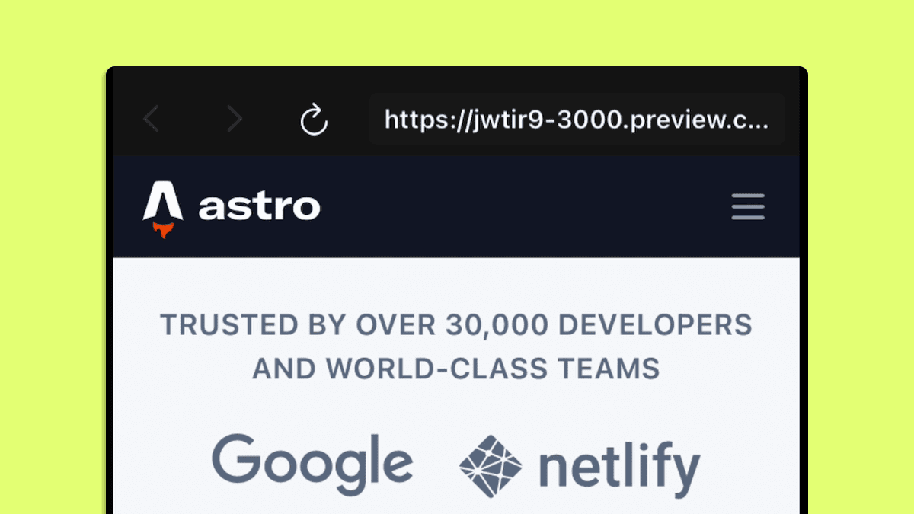
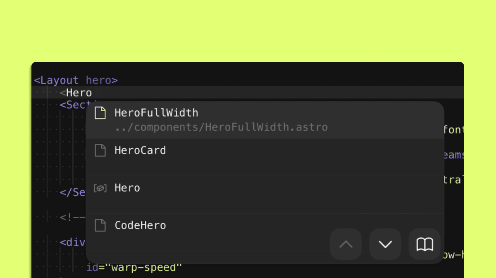
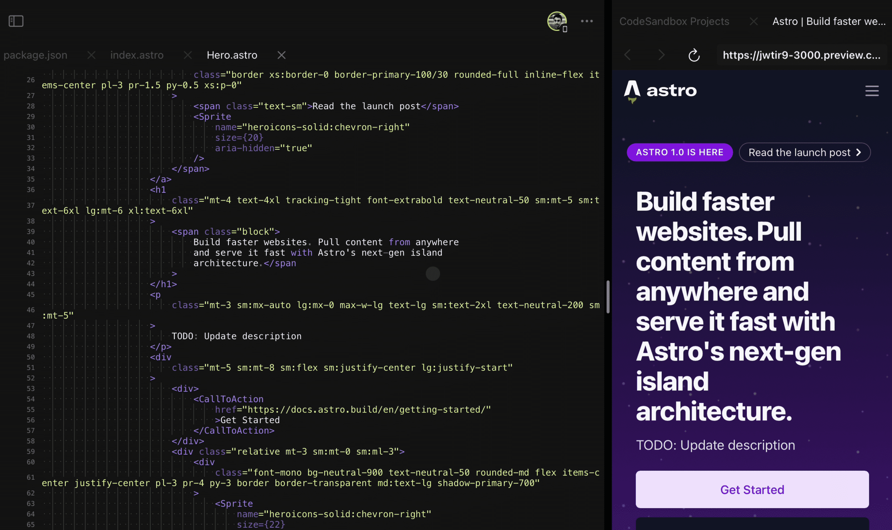
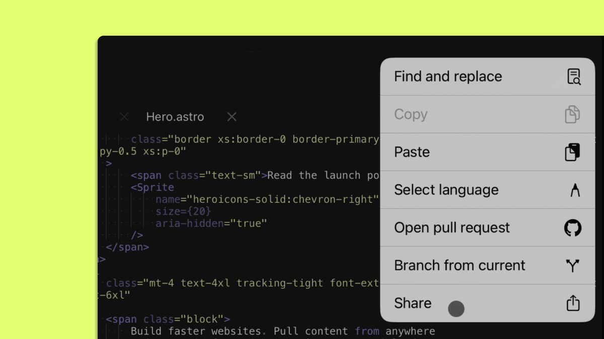
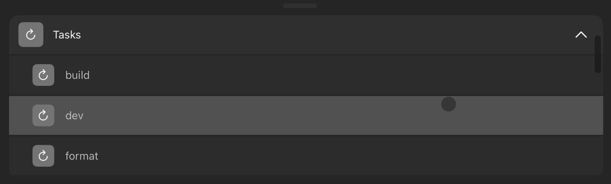

In the last few years, mobile devices like the iPad have become really powerful. With a long-lasting battery, a great screen, top-notch performance and 5G connectivity, the iPad provides an excellent alternative to laptops for those wanting to get work done while on the go.

Naturally, one question came up—is it possible to have a coding experience on a mobile device that resembles that of a laptop?

The most widely used IDEs, such as VS Code, have no official iOS support. So over the years, a series of iPad IDEs have tried to fill this ever-growing need. However, most of them came with a lot of quirks and required making too many compromises, failing to become a viable choice for daily use.

Enter [CodeSandbox for iOS](https://apps.apple.com/us/app/codesandbox/id1423330822) — a full-featured, native IDE for iPad and iPhone that was built to provide an optimal coding experience.

In this blog post, we will present an overview of the app and show it in action as we fix a bug on an example app and open a pull request. You can also see the whole flow [in this video](https://www.youtube.com/watch?v=3nSzXmVDHqU).

## **A full-featured iPad IDE powered by the cloud**

CodeSandbox for iOS is a native IDE for iPad and iPhone that provides all the tools you need to develop, test and collaborate on your web projects or small prototypes.

As we will see in the next section, it is built around the concept of simplicity, incorporating all the tools you know and love from mainstream IDEs, such as IntelliSense, syntax highlighting, terminals, and git integration.

But CodeSandbox for iOS goes above and beyond to make your life as a developer easier by running your projects on the cloud. This means that you never have to worry about storage space or the specs of your iPhone or iPad—everything runs on powerful microVMs that spin up almost instantly and are always ready.

Plus, CodeSandbox for iOS is the only collaborative iPad IDE, allowing you to share any project with a URL and collaborate (live or asynchronously) with friends or colleagues, with no setup required.

https://twitter.com/mxfellner/status/1575893482254008320

Let’s look at the developer experience of coding using the app. Don’t forget to install the free app and follow along!

## **Setting up a project**

One of the highlights of CodeSandbox for iOS is how easy it is to get started. In a nutshell, there are two main options: importing a GitHub repository or creating a sandbox.

Importing from GitHub is great for working on branches and reviewing pull requests. Thanks to the [seamless GitHub integration](https://codesandbox.io/post/introducing-the-codesandbox-github-app), you can use this for your daily work and completely replace your laptop.

One key advantage of doing this on CodeSandbox for iOS is that you won’t have to configure anything—every branch and PR runs on the cloud, so all the dependencies of your repo are installed for you, which means you can focus 100% on coding.

<video autoplay loop muted playsinline controls width="100%">
  <source src="./videos/ipad-ide-import-repo.mp4" type="video/mp4">
</video>

Sandboxes are great to play around with code. They ship with everything you need to quickly prototype an idea and share it to get feedback.

CodeSandbox provides templates for all sorts of web technologies and packages (such as React, Next.js, Vue.js, Next.js, Remix, Angular, Astro, Gatsby, Svelte, and many more). So you can just choose a technology to create a sandbox and build on top of it to learn, experiment, and create a cool demo.

<video autoplay loop muted playsinline  controls  width="100%">
  <source src="./videos/ipad-ide-sandboxes.mp4" type="video/mp4">
</video>

Whether you’re working with Repositories or Sandboxes, it just takes a few taps to get started.

> **Tip**: Once you install app, you will get universal links support, so you can open any repo or sandbox in the app when you’re browsing them using Mobile Safari.

For this tutorial, let’s focus on the experience of working on a GitHub repository.

## **Working with branches and git**
In this example, we imported [this GitHub repo](https://codesandbox.io/p/github/nakiostudio/astro.build/draft/skeletal-zeh), which is a fork of [Astro Starter Kit: Minimal](https://github.com/withastro/astro.build).

Right after importing, we get to the editor. On the left, you’ll see the file tree, search and git controls. There’s also a dock at the bottom, which is where you’ll find some useful DevTools like access to previews, tasks, tests and the terminal.

All this navigation becomes very intuitive thanks to the command palette. Open it with `⌘ + K`. This shows us some suggested actions such as file search, opening previews or changing branches.

> **Tip**: If you don’t have a physical keyboard, you can bring up the command palette by double tapping with two fingers anywhere on the screen.

To make it easier to work on our code, let’s open a preview. It’s as simple as typing “preview”, tapping to accept “Open Preview”, and then tapping on the available preview—in this case, `dev: 3000`.

The preview will appear on the right side of your screen and you can drag it to resize as needed. In our example, by taking a quick look at our preview, we can see that my website is missing the hero component. Let’s fix that.

The first step is to create a new branch. Again using the command palette, simply type “branch” and choose “Branch from main”. CodeSandbox will immediately run this branch on an entirely new cloud instance that is created in seconds.

Then, we just need to open the preview for the current branch, and we’re ready to start bug fixing.

So, let’s search for `src/pages/index.astro` on the command palette and open that file.

We just have to scroll a bit to get to the section we’re looking for—the layout for our hero, which appears to be missing the `Hero` component.

As you start typing, the built-in IntelliSense automatically displays autocomplete suggestions with matching components.

Let’s take the suggestion. The preview updates immediately and we see that the hero component is now showing up as expected.

However, there seems to be a problem with the copy of the `Hero` component, which I can find by navigating to `src/components/Hero.astro`.

This seems like a question for someone from the Marketing team. But, instead of going back and forth with screenshots and Slack messages, what if I can bring that colleague to make this change directly on my code?

## **Collaborating with others from any device**
One of the truly unique aspects of CodeSandbox for iOS is that it is fully collaborative, with an experience that’s similar to what you might find on tools like Figma.

Everything you need is a link to your branch, which you can get by tapping on the ellipsis on the top right, choosing “Share” and copying the URL. In my case, I’ve shared it with Filipe, a colleague from the Marketing team.

Because CodeSandbox provides seamless collaboration between any device, Filipe can open my PR on the editor of his choice: the CodeSandbox web editor, CodeSandbox for iOS or even VS Code, using the [CodeSandbox VS Code extension](https://marketplace.visualstudio.com/items?itemName=CodeSandbox-io.codesandbox-projects).

I will see Filipe’s avatar pop up when he joins and, by tapping on it, I will follow him around the code and see the fix being made in real-time.

<video autoplay loop muted playsinline  controls  width="100%">
  <source src="./videos/ipad-ide-collaboration.mp4" type="video/mp4">
</video>

Because the collaboration happens in real-time, I can see the updated preview and everything looks good!

Instead of taking 10 minutes and a dozen Slack messages, we fixed this in 30 seconds 🥳

## **Using DevTools: terminals, tests, tasks and more**
As we mentioned earlier, the bottom dock of the editor shows a series of DevTools that you may find very useful. Click on the `+` sign to expand it and you will see the three default options:

- Previews
- Tasks
- Terminals

Previews show you every preview you have started, allowing you to easily switch between multiple previews of your app.

[Tasks](https://codesandbox.io/docs/learn/repositories/task) are one of the most powerful CodeSandbox features, essentially allowing you to run any command with a tap. In our example, CodeSandbox automatically detects some tasks of the Astro repo such as `build`, `dev`, `format`, `format:eslint` and `format:prettier`. You can easily add new tasks for tests, database servers and more—take a look at our [tutorial](https://codesandbox.io/docs/learn/repositories/task).

Finally, you can create terminals and run commands for anything else you might need.

> **Tip**: You can use a terminal to [install Docker](https://codesandbox.io/docs/tutorial/getting-started-with-docker) and run servers, databases and much more, right from the CodeSandbox iOS app!

## **Opening a pull request**
Now that we’re happy with the fix to our website’s hero component, let’s go ahead and commit these changes. 

Simply reveal the panel from the left side of your screen to bring up the sidebar and go to the git tab. This is where you can write the commit message, create a commit, and then tap to open a PR.

This brings you directly to GitHub with everything pre-filled. You only need one final tap to open the PR, and it’s done!

<video autoplay loop muted playsinline  controls  width="100%">
  <source src="./videos/ipad-ide-pull-request.mp4" type="video/mp4">
</video>

## **Supercharging your workflow**
As we saw in this post, CodeSandbox for iOS goes beyond providing the core functionality you expect from an IDE, by running your code in the cloud and accelerating how you code, review and ship.

Here are some tips on how you can get the most out of this experience:

- Set up the [CodeSandbox GitHub App](https://codesandbox.io/post/introducing-the-codesandbox-github-app) on your GitHub repo to get automatic deployment previews for every PR that you can open on the app with a tap.
- [Create a team](https://codesandbox.io/docs/learn/teams/team-overview) to organize your work and improve collaborations with everyone on your team.
- Share a standalone [preview](https://codesandbox.io/docs/learn/repositories/preview) of your branch at any time to get feedback on your code and iterate faster.

We are constantly working on making this experience even better. So, if you have any feature requests or experience any issues, please provide some feedback—simply tap “Submit feedback” at the bottom of the app’s dashboard.