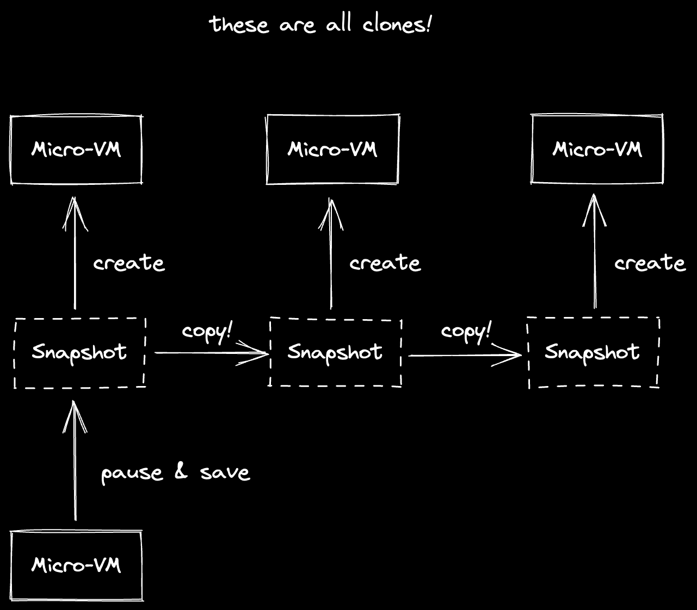
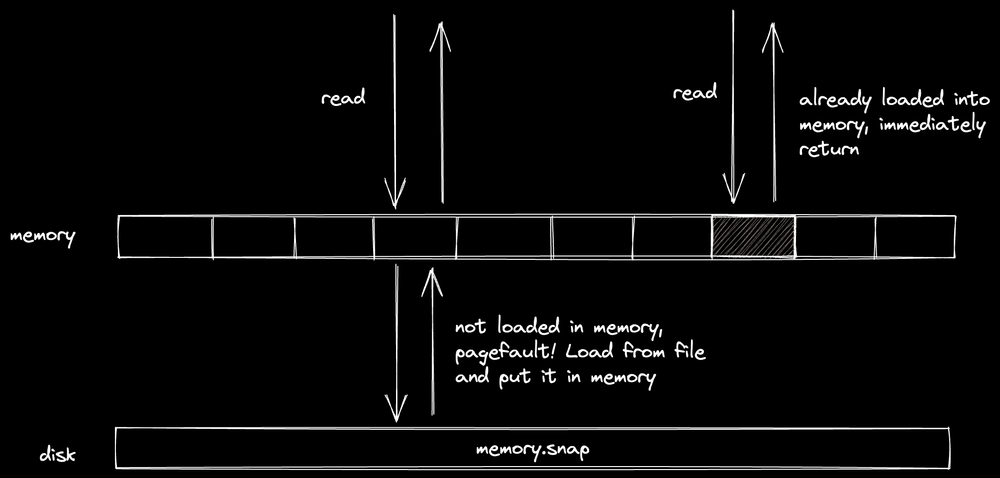
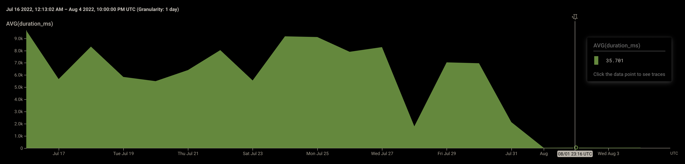
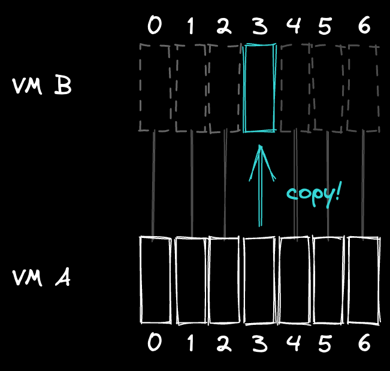
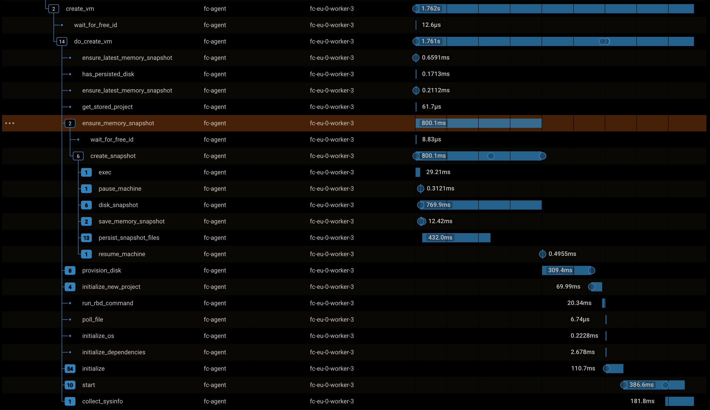

**At CodeSandbox we run your development project and turn it into a link you can
share with anyone. People visiting this link can not only see your running code,
they can click “fork” and get an exact copy of that environment within 2 seconds
so they can easily contribute back. Give it a try with
[this example](https://codesandbox.io/p/github/codesandbox/codesandbox-template-vite-react/main),
or import your GitHub repo [here](https://codesandbox.io/p/dashboard)!**

**So how can we spin up a cloned environment in 2 seconds? That's exactly what
I'll be talking about here!**

## The challenge: spinning up a development environment in two seconds

We've been running sandboxes for a long time now, and the core premise has
always been the same: instead of showing static code, it should be running. Not
only that, you should be able to press fork and play with it whenever you want
to.

In the past, we've enabled this experience by running all your code in your
browser. Whenever you would look at a sandbox, you would execute the code. This
was fast, because we had full control over how the code was bundled. Forks were
fast:

<video style="border-radius:4px"  autoplay loop muted width="100%">
  <source src="./images/V1fork.mp4" type="video/mp4">
</video>

However, there was a catch to this approach: we were limited to the code that we
could run in the browser. If you wanted to run a big project that requires
Docker, it wouldn't work.

So for the past few years, we've been asking ourselves: how can we enable this
experience for bigger projects?

## Firecracker to the rescue

Virtual machines are often seen as slow, expensive, bloated and outdated. And I
used to think the same, but a lot has changed over the past few years. VMs power
most of the cloud (yes, even serverless functions!), so many great minds have
been working on making VMs faster and lightweight. And well... they've really
outdone themselves.

[Firecracker](https://firecracker-microvm.github.io/) is one of the most
exciting recent developments in this field. Amazon created Firecracker to power
AWS Lambda and AWS Fargate, and nowadays it's used by companies like
[Fly.io](http://fly.io/) and CodeSandbox. It's written in Rust, and the code is
very readable. If you're interested in how it works, you should definitely check
[their repo](https://github.com/firecracker-microvm/firecracker)!

Firecracker spawns a MicroVM instead of a VM. MicroVMs are more lightweight:
instead of waiting for 5 seconds for a “normal” VM to boot, you will get a
running MicroVM within 300 milliseconds, ready to run your code.

This is great for us, but it only solves part of the problem. Even though we can
quickly start a virtual machine, we still need to clone your repository, install
the dependencies and run the dev server. Together, this can take over a minute
for an average project, which would probably mean tens of minutes for bigger
projects.

If you would have to wait a minute every time you click “fork” on CodeSandbox,
it would be a disaster. Ideally, you should just continue where the old virtual
machine left off. And that's why I started to look into memory snapshotting.

## The dark art of memory snapshotting

Firecracker doesn't only spawn VMs, it also resumes VMs. So, what does that
actually mean?

Because we run a virtual machine, we control everything in the environment. We
control how many vCPU cores are available, how much memory is available, what
devices are attached. But most importantly, we control the execution of the
code.

This means that we can pause the VM at any point in time. This does not only
pause your code, it pauses the full machine, full-stop down to the kernel.

While a virtual machine is paused, we can safely read the full state of the VM,
and save it to disk. Firecracker exposes a `create_snapshot` function that
yields two files:

- `snapshot.snap` — the configuration of the machine. CPU template & count,
  disks attached, network devices attached, etc.
- `memory.snap` — the memory of the VM while it was paused (if the VM has 4GB
  memory, this file will be 4GB).

These two files, together with the disk, contain everything we need to start a
MicroVM, and it will just continue from when the snapshot was taken!

This is incredibly exciting, because the use cases are endless! Here's one
example: many cloud IDE services will “hibernate” your VM after ~30 minutes of
inactivity. In practice, this means that they will stop your VM to save hosting
costs. When you come back, you will have to wait for your development servers to
initialise again because it's a full VM boot.

Not with Firecracker. When we hibernate a VM, we pause it and save its memory to
disk. When you come back, we resume the VM from that memory snapshot, and for
you it will look as if the VM was never stopped at all!

Also, resuming is fast. Firecracker will only read the memory that the VM needs
to start (as the memory is `mmap`ed), which results in resume timings within
~200-300ms.

Here's a timing comparison for starting our own editor (a Next.js project) with
different types of caching:

| Type of cache available   | Time to running preview |
| ------------------------- | ----------------------- |
| No caches (fresh start)   | 132.2s                  |
| Preinstalled node_modules | 48.4s                   |
| Preinstalled build cache  | 22.2s                   |
| Memory snapshots          | 0.6s                    |

> There's a catch to it as well. Saving a memory snapshot actually takes a
> while, which I'll cover in this post.

I'm stoked about this. It gives the feeling that the VM is always running, even
though it's not taking resources. We use this a lot: every branch on CodeSandbox
is a new development environment. You don't have to remember to roll back
migrations or install dependencies when switching branches, because it's a fresh
environment for every branch. We can enable this thanks to memory snapshotting.

We also use this to host some internal tooling cheaply. When a webhook request
comes in, we wake the microservice, let it respond, and after 5 minutes it
automatically hibernates again. Admittedly, it doesn't give “production”
response times, because there's always 300ms added on top for waking, but for
our backoffice microservices that's fine.

## The darker art of cloning memory snapshots

The first important piece of the puzzle is there. We can save a memory snapshot
and resume the virtual machine from it any time we want. This already makes
loading existing projects faster—but how can we actually clone them?

Well, we were already able to serialise the virtual machine state to files… so
what prevents us from copying them? There are some caveats to this, but we'll
get there.

Let's say we copy the existing state files and start a couple of new VMs from
these.

This actually works! The clones will continue exactly where the last VM left
off. You can start a server with an internal in-memory counter, up it a couple
of times, press fork, and it will continue counting where it left off in the new
VM.

<video style="border-radius:4px" autoplay loop muted width="100%">
  <source src="./images/MemoryCounter.mp4" type="video/mp4">
</video>

You can play with it
[here](https://codesandbox.io/p/github/codesandbox/node-counter-demo/main). And
this is the running server of that VM, kind of like a view count:

<iframe style="width:100%;height:200px;border:0;border-radius:4px;margin-bottom:2rem;" src="https://13gise-8080.preview.csb.app/"></iframe>

However, the challenge lies in speed. Memory snapshot files are big, spanning
multiple GBs. Saving a memory snapshot takes 1 second per gigabyte (so an 8GB VM
takes 8 seconds to snapshot), and copying a memory snapshot takes the same time.

So if you're looking at a sandbox and press fork, we would have to:

1. Pause the VM **(~16ms)**
2. Save the snapshot **(~4s)**
3. Copy the memory files + disk **(~6s)**
4. Start a new VM from those files **(~300ms)**

Together, you would have to wait ~10s, which is faster than waiting for all dev
servers to start, but it's still too slow if you want to quickly test some
changes.

Just the fact that this works is incredible — cloning VMs is actually a
possibility! However, we need to seriously cut down on serialisation time.

## Saving snapshots faster

When we call `create_snapshot` on the Firecracker VM, it takes about 1 second
per gigabyte to write the memory snapshot file. Meaning that if you have a VM
with 12GB of memory, it would take 12 seconds to create the snapshot. Sadly, if
you're looking at a sandbox, and you press fork, you would have to wait at least
12 seconds before you could open the new sandbox.

We need to find a way to make the creation of a snapshot faster, down to less
than a second, but how?

In this case, we're restricted by I/O. Most time is spent on writing the memory
file. Even if we throw many NVMe drives at the problem, it still will take more
than a couple seconds to write the memory snapshot. We need to find a way where
we don't have to write so many bytes to disk.

We've tried plenty of approaches. We tried incremental snapshotting, sparse
snapshotting, compression. In the end, we found a solution that reduced our
timings tenfold—but to explain it, we first need to understand how Firecracker
saves a snapshot.

When Firecracker loads a memory snapshot for a VM, it does not read the whole
file into memory. If it would read the whole file, it would take much longer to
resume a VM from hibernation.

Instead, Firecracker uses
[`mmap`](https://man7.org/linux/man-pages/man2/mmap.2.html). `mmap` is a Linux
syscall that creates a “mapping” of a given file to memory. This means that the
file is not loaded directly into memory, but there is a reservation in memory
saying “this part of the memory corresponds to this file on disk”.

Whenever we try to read from this memory region, the kernel will first check if
the memory is already loaded. If that's not the case, it will “page fault”.
During a page fault, the kernel will read the corresponding data from the
backing file (our memory snapshot), load that into memory, and return it.

The most impressive thing about this is that by using `mmap`, we will only load
parts of the file into memory that are actually read. This allows VMs to resume
quickly, because a resume only requires 300-400MB of memory.

> It's pretty interesting to see how much memory most VMs actually read after a
> resume. It turns out that most VMs load less than 1GB into memory. Inside the
> VM it will actually say that 3-4GB is used, but most of that memory is still
> stored on disk, not actually stored in memory.

So what happens if you write to memory? Does it get synced back to the memory
file? By default, no. Normally, the changes are kept in memory, and are not
synced to the backing file. The changes are only synced back when we call
`create_snapshot`, which often results in saves that are 1-2GB in size. This
takes too long to write.

However, there is a flag we can pass. If we pass `MAP_SHARED` to the `mmap`
call, it actually will sync back changes to the backing file! The kernel does
this lazily: whenever it has a bit of time on its hands, it will flush the
changes back to the file.

This is perfect for us, because we can move most of the I/O work of saving the
snapshot upfront. When we actually want to save the snapshot, we'll only have to
sync back a little amount!

This seriously reduced our snapshot timings. Here's a graph of the average time
it takes to save a memory snapshot, before and after the deployment of this
change:

With this change, we went from ~8-12s of saving snapshots to **~30-100ms**!

## Getting the clone time down to milliseconds

We can now quickly save a snapshot, but what about cloning? When cloning a
memory snapshot, we still need to copy everything byte-for-byte to the new file,
which takes again ~8-12s.

But… do we really have to clone everything byte-for-byte? When we clone a
VM, >90% of the data will be reused, since it resumes from the same point. So is
there a way that we can reuse the data?

The answer is in using
[copy-on-write](https://en.wikipedia.org/wiki/Copy-on-write) (CoW).
Copy-on-write, like the name implies, will only copy data when we start writing
to it. Our previous `mmap` example also uses copy-on-write if `MAP_SHARED` is
not passed.

By using copy-on-write, we do not copy the data for a clone. Instead, we tell
the new VM to use the same data as the old VM. Whenever the new VM needs to make
a change to its data, it will copy the data from the old VM and apply the change
to that data.

Here's an example. Let's say VM B is created from VM A. VM B will directly use
all the data from VM A. When VM B wants to make a change to block 3, it will
copy block 3 from VM A, and only then apply the change. Whenever it reads from
block 3 after this, it will read from its own block 3.

With copy-on-write, the copies are lazy. We only copy data when we need to
mutate it, and this is a perfect fit for our forking model!

> As a side-note, copy-on-write has been used for a long time already in many
> places. Some well-known examples of CoW being used are Git (every change is a
> new object), modern filesystems (`btrfs`/ `zfs`) and Unix itself (two examples
> are `fork` and `mmap`).

This technique does not only make our copies instant, it also saves a lot of
disk space. If someone is looking at a sandbox, makes a fork, and only changes a
single file, we will only have to save that changed file for the whole fork!

We use this technique both for our disks (by creating disk CoW snapshots) and
for our memory snapshots. It reduced our copy times from several seconds to
~50ms.

## But… can it clone Minecraft?

By applying copy-on-write and shared `mmap`ing of the memory file, we can clone
a VM extremely fast. Looking back at the steps, the new timings are:

1. Pause the VM **(~16ms)**
2. Save snapshot **(~100ms)**
3. Copy the memory files + disk **(~800ms)**
4. Start new VM from those files **(~400ms)**

Which gives us clone timings that are well below two seconds! Here's a fork of
Vite (you can try for yourself
[here](http://codesandbox.io/p/github/codesandbox/codesandbox-template-vite-react/main?file=%2FREADME.md)):

<video style="border-radius:4px"  autoplay loop muted width="100%">
  <source src="./images/V2Fork.mp4" type="video/mp4">
</video>

The total timings can be seen below. Note that there is more happening than the
clone itself, but the total time is still below 2 seconds:

And since we use copy-on-write, it doesn't matter if you're running a big
GraphQL service with 20 microservices, or a single node server. We can
consistently resume and clone VMs within 2 seconds. No need to wait for a
development server to boot.

Here's an example where I go to our own repo (running our editor backed by
Next.js), fork the `main` branch (which copies the VM), and make a change:

<video style="border-radius:4px"  controls muted width="100%">
  <source src="./images/FullFlow.mp4" type="video/mp4">
</video>

We also have
[a Linear integration](https://twitter.com/CompuIves/status/1554800977798381571)
that integrates with this.

We have tested this flow a lot with different development environments. I
thought it would be very interesting if we can try cloning more than only
development environments.

So… What if we run a Minecraft server, change something in the world, and then
clone it to a new Minecraft server we can connect to? Why not?

To do this, I've created a VM that runs two Docker containers:

1. A Minecraft Server
2. A [Tailscale](https://tailscale.com/) VPN I can use to connect to the
   Minecraft server directly from my PC

Let's see!

https://youtu.be/9VEiaP8tORQ

In this video, I've created a structure in a Minecraft server. Then cloned that
Minecraft server, connected to it, and verified that the structure was there.
Then I destroyed the structure, went back to the old server, and verified that
the structure was still there.

Of course, there's no actual benefit to doing this, but it shows that we can
clone a VM on any kind of workload!

## The unwritten details

There are still details that I'd love to write about. Some things we haven't
discussed yet:

- Overprovisioning on memory using `mmap` and page cache
- The economics of running MicroVMs when we have hibernation & overprovisioning
- How we built an orchestrator with snapshotting/cloning in mind, and how it
  works
- How to handle network and IP duplicates on cloned VMs
- Turning a Dockerfile into a rootfs for the MicroVM (quickly)

There are also still improvements we can do to improve the speed of cloning. We
still do many API calls sequentially, and the speed of our filesystem (`xfs`)
can be improved. Currently files inside `xfs` get fragmented quickly, due to
many random writes.

Over the upcoming months we'll write more about this. If you have any questions
or suggestions related to this, don't hesitate to
[send me a message on Twitter](https://twitter.com/CompuIves).

## Conclusion

Now that we can clone running VMs quickly, we can enable new workflows where you
don't have to wait for development servers to spin up. Together with the GitHub
App, you will have a development environment for every PR so you can quickly
review (or run end-to-end tests).

I want to give a huge thanks to the:

- **Firecracker Team**: for supporting us on our queries and thinking with us
  about possible solutions when it comes to running Firecracker and cloning a
  VM.
- **Fly.io Team**: by sharing their learnings with us directly and through their
  [amazing blog](https://fly.io/blog/). Also big thanks for sharing the source
  of their `init` used in the VMs as reference.

If you haven't tried CodeSandbox yet and don't want to wait for dev servers to
start anymore, [import/create a repo](https://codesandbox.io/p/dashboard). It's
free too (we’re working on a post explaining how we can enable this).

If you want to learn more about CodeSandbox Projects, you can visit
[projects.codesandbox.io](https://projects.codesandbox.io)!

We'll be on [@codesandbox](https://twitter.com/codesandbox/) on Twitter when we
create a new technical post!
