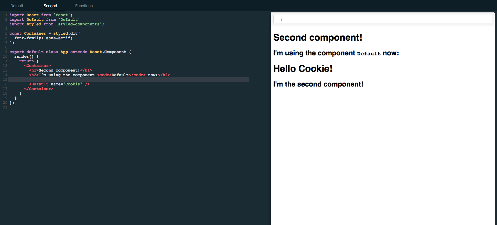
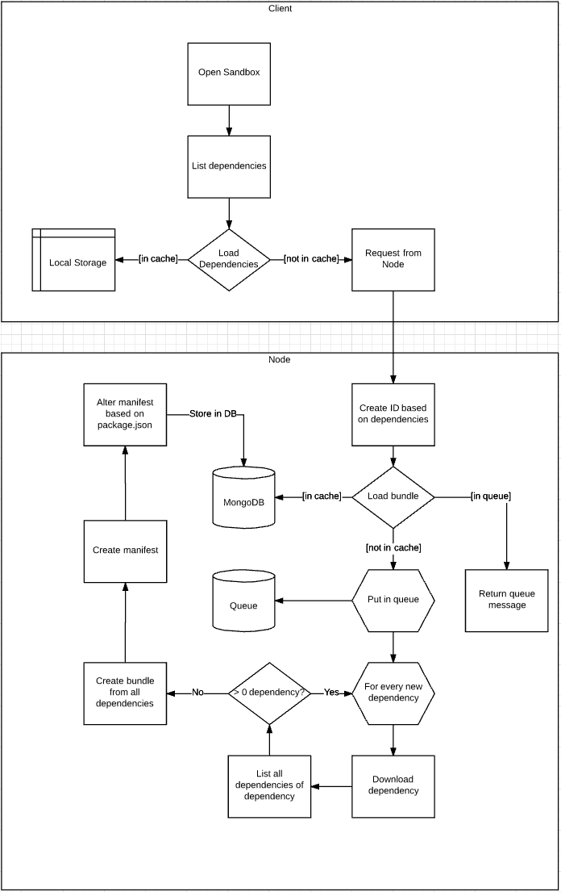
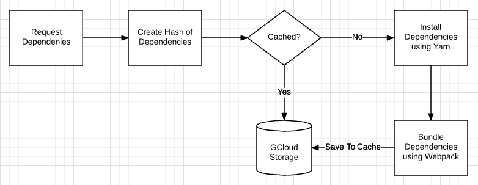
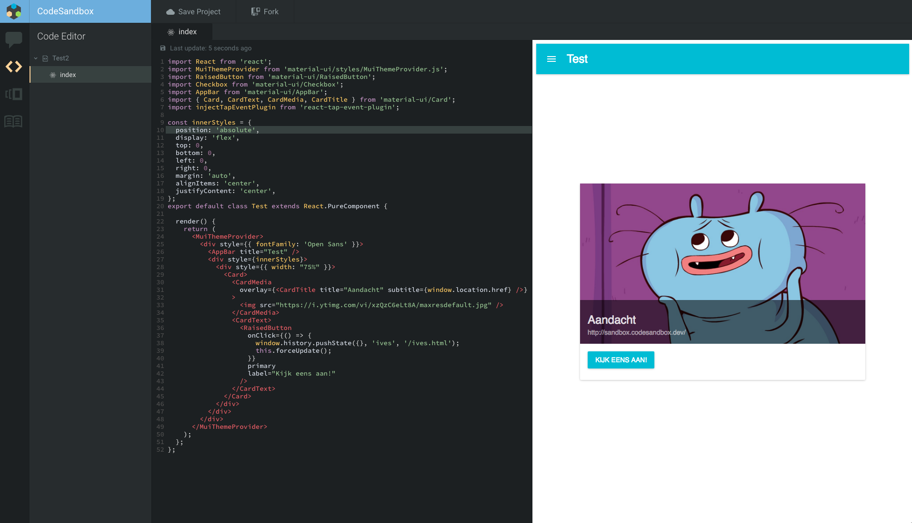
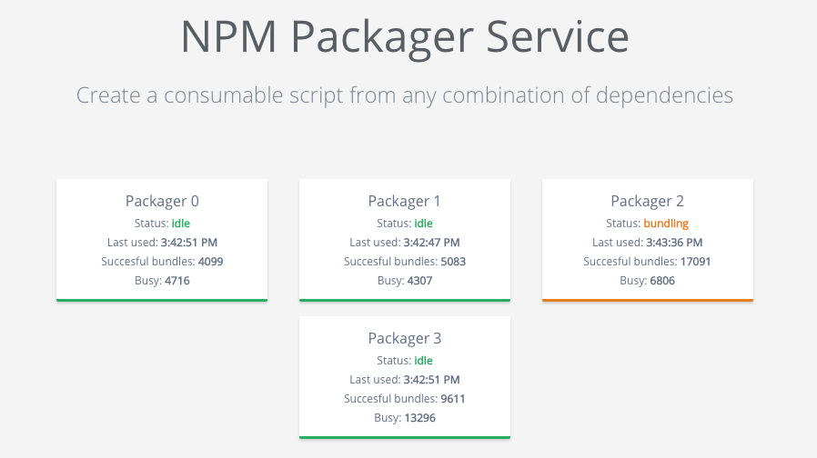
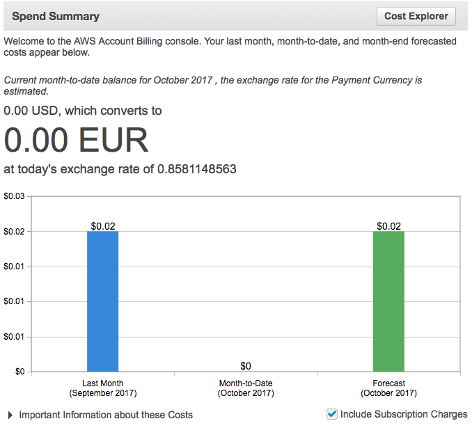
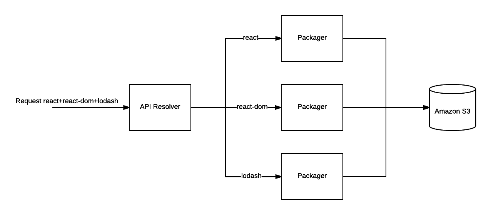
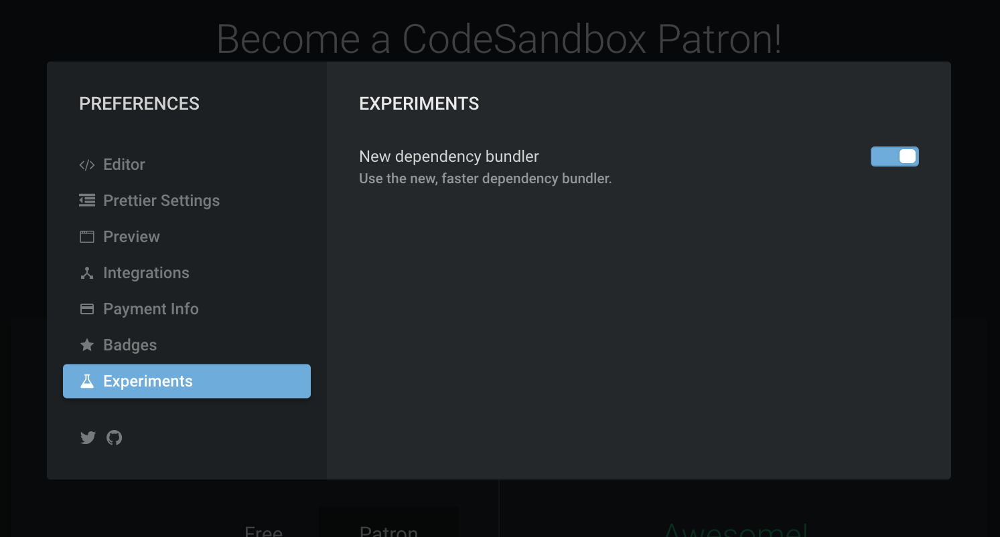

I always left [npm](https://npmjs.com) dependency support out of scope during
initial development of [CodeSandbox](https://codesandbox.io). I thought it would
be impossible to install an arbitrary, random amount of packages in the browser,
even thinking about it caused my brain to block.

Nowadays npm support is one of the most defining features of CodeSandbox, so
somehow we succeeded in making it work. It took a lot of iterations to make it
work in any scenario, we did multiple rewrites and even now we can still improve
the logic. I'll explain how npm support started, what we have now and what we
still can do to improve it.

## 'First' Version

I really didn't know how to approach this, so I started with a very simple
version of npm support:



This version of npm support was very simple. It wasn't even really npm support,
I just installed the dependencies locally and stubbed every dependency call with
an already installed dependency. This, of course, is absolutely not scalable to
400,000 packages with different versions.

Even though this version was not very usable, it was encouraging to see that I
was able to at least make two dependencies work in a sandbox environment.

## webpack Version

I was quite satisfied with the first version, and I thought it would be
sufficient for an [MVP](https://en.wikipedia.org/wiki/Minimum_viable_product)
(the first release of CodeSandbox). I didn't think it would be even possible to
install any dependency without performing magic. That was until I stumbled upon
[https://esnextb.in](https://github.com/voronianski/esnextbin). They already
supported any dependency from npm, you could just define them in `package.json`
and it magically worked!

This was a big learning moment for me. I never dared to give proper npm support
a thought, because I thought 'it would be impossible'. Only after seeing living
proof of its 'possibleness' I started putting more thought into it. I should've
explored the possibilities first before dismissing the idea.

So! I started thinking on how to approach this. And boy did I overcomplicate it.
My first version didn't fit in my head, so I had to draw a diagram:



There was one advantage of this overcomplicated approach: the actual
implementation was much easier than expected!

I learned that [`webpack`](https://github.com/webpack/webpack)'s
[DllPlugin](https://webpack.js.org/plugins/dll-plugin) was able to bundle
dependencies and spit out a JS bundle with a manifest. This manifest looked like
this:

```json
{
  "name": "dll_bundle",
  "content": {
    "./node_modules/fbjs/lib/emptyFunction.js": 0,
    "./node_modules/fbjs/lib/invariant.js": 1,
    "./node_modules/fbjs/lib/warning.js": 2,
    "./node_modules/react": 3,
    "./node_modules/fbjs/lib/emptyObject.js": 4,
    "./node_modules/object-assign/index.js": 5,
    "./node_modules/prop-types/checkPropTypes.js": 6,
    "./node_modules/prop-types/lib/ReactPropTypesSecret.js": 7,
    "./node_modules/react/cjs/react.development.js": 8
  }
}
```

Every path is mapped to a module id. If I would require
[React](/framework/react) I would only have to call `dll_bundle(3)` and I would
get React! This was perfect for our use case, so I started typing away and came
up with this actual system:



For every request to the packager I would create a new directory in
`/tmp/:hash`, would run `yarn add ${dependencyList}` and let `webpack` bundle
afterwards. I'd save the new bundle on
[gcloud](https://cloud.google.com/sdk/gcloud) as a way of caching. Much simpler
than the diagram, mostly because I replaced installing dependencies with
[yarn](https://yarnpkg.com) and bundling with `webpack`.

When you load a sandbox, we would first make sure that we'd have the manifest
and the bundle before evaluation. During evaluation we would call
`dll_bundle(:id)` for every dependency. This worked very well, and I got my
first version with proper npm dependency live!



Now there was still a big limitation with this system. It didn't support files
that were not in the dependency graph of `webpack`. This means that for example
`require('react-icons/lib/fa/fa-beer')` wouldn't work, because it was never
required by the entry point of the dependency in the first place.

I did release CodeSandbox with this version though, and got in contact with the
author of [WebpackBin](https://github.com/cerebral/webpackbin)
[Christian Alfoni](https://twitter.com/christianalfoni). We used a very similar
system to support npm dependencies and we were having the same limitations. So
we decided to combine forces and build the **ultimate** packager!

## webpack with entries

The "ultimate" packager retained the same functionality as our previous
packager, except [Christian](https://twitter.com/christianalfoni) created an
algorithm that would add files to the bundle depending on their importance. This
means that we manually added entry points, to make sure that `webpack` would
bundle those files too. After a lot of tweaking of this system we got it working
for any(?) combination. So you were able to require
[`react-icons`](https://github.com/react-icons/react-icons), and CSS files as
well 🎉.

https://twitter.com/CompuIves/status/855865667739951106

The new system also got an architectural upgrade: we have one
[DLL](https://en.wikipedia.org/wiki/Dynamic-link_library) service that serves as
load balancer and cache. Then we have multiple packagers that do the bundling,
these packagers can be dynamically added.



We wanted to make the packager service available for everyone. That's why we
built [a website](http://webpack-dll-prod.herokuapp.com/) that would explain how
the service works and how you can make use of it. This turned out to be a great
success, we were even mentioned in the
[CodePen blog](https://blog.codepen.io/2017/08/11/using-resources-npm-codepen)!

There were still some limitations and disadvantages to this 'ultimate' packager.
The costs grew exponentially as we became more popular, and we were caching by
package _combination_. Which means that we had to rebundle your whole package
combination if you added a dependency.

## Going Serverless

I always wanted to try this cool technology called
'[serverless](https://martinfowler.com/articles/serverless.html)'. With
serverless you can define a function that will execute on request, the function
will spin up, handle the request and then kill itself after some time. This
means that you have very high scalability: if you get 1000 simultaneous requests
you can just spin up 1000 servers instantly. It also means that you only pay for
the time the servers actually run.

Serverless sounds perfect for our service: it doesn't run fulltime and we need
high concurrency in case there are multiple requests at the same time. So I
started playing eagerly with an aptly named framework called
[Serverless](https://serverless.com).

Converting our service went smoothly (thanks Serverless!), I had a working
version within 2 days. I created three serverless functions:

1. A metadata resolver: this service would resolve versions and peerDependencies
   and request the packager function.
2. A packager: this service would do the actual installing & bundling of the
   dependencies
3. An uglifier: responsible for asynchronously uglifying the resulting bundle.

I ran the new service alongside the old service, and it worked really well! We
had a projected cost of $0.18 per month (compared to $100) and our response time
improved between 40% and 700%.



After several days I started noticing a limitation though: a lambda function
only has 500MB of maximum disk space, this means that some combinations of
dependencies weren't able to install. This was a deal breaker and I had to get
back to the drawing board.

#### Serverless Revisited

A couple months went by and
[I released a new bundler for CodeSandbox](/post/creating-a-parallel-offline-extensible-browser-based-bundler-for-codesandbox).
This bundler is very powerful, and allows us to easily support more libraries
like [Vue](/framework/vue) and [Preact](/framework/preact). By supporting these
libraries we got some interesting requests. For example: if you want to use a
[React](/framework/react) library in Preact, you'd need to alias
`require('react')` to `require('preact-compat')`. For Vue, you may want to
resolve `@/components/App.vue` to your sandbox files. Our packager doesn't do
this for dependencies, but our bundler does.

That's when I started thinking that we could maybe let the browser bundler do
the actual packaging. If we would just send the relevant files to the browser
we'd let the bundler do the actual bundling of the dependencies. This should be
faster, because we're not evaluating the whole bundle, just parts of it.

There is a great advantage to this approach: we will be able to install and
cache dependencies independently. We can just merge the dependency files on the
client. This means that if you request a new dependency on top of your existing
dependencies, we'd only need to gather files for the new dependency! This will
solve the 500MB limit from [AWS Lambda](https://aws.amazon.com/lambda), since
we're only installing one dependency. We can also drop `webpack` from the
packager, since the packager now has the sole responsibility of figuring out
which files are relevant and sending them.



> _Note: We could also drop the packager and request every file dynamically from
> [unpkg.com](https://unpkg.com). This is probably even faster than my new
> approach. I decided to still keep the packager (at least for the editor),
> because I want to provide offline support. That's only possible if you have
> all possible relevant files with you._

#### How it works in practice

When we request a combination of dependencies, we first check if this
combination already is stored on [S3](https://aws.amazon.com/s3). If it's not on
S3 we request the combination from the API service; this service requests all
packagers independently for every dependency. As soon as we get the
[200 OK](https://developer.mozilla.org/nl/docs/Web/HTTP/Status/200) back, we
request S3 again.

The packager installs the dependencies using yarn and finds all relevant files
by traversing the [AST](https://en.wikipedia.org/wiki/Abstract_syntax_tree) of
all files in the directory of the entry point. It searches for require
statements and adds them to the file list. This happens recursively, so we get a
dependency graph. An example output (of `react@latest`) is this:

```json
{
  "aliases": {
    "asap": "asap/browser-asap.js",
    "asap/asap": "asap/browser-asap.js",
    "asap/asap.js": "asap/browser-asap.js",
    "asap/raw": "asap/browser-raw.js",
    "asap/raw.js": "asap/browser-raw.js",
    "asap/test/domain.js": "asap/test/browser-domain.js",
    "core-js": "core-js/index.js",
    "encoding": "encoding/lib/encoding.js",
    "fbjs": "fbjs/index.js",
    "iconv-lite": "iconv-lite/lib/index.js",
    "iconv-lite/extend-node": false,
    "iconv-lite/streams": false,
    "is-stream": "is-stream/index.js",
    "isomorphic-fetch": "isomorphic-fetch/fetch-npm-browserify.js",
    "js-tokens": "js-tokens/index.js",
    "loose-envify": "loose-envify/index.js",
    "node-fetch": "node-fetch/index.js",
    "object-assign": "object-assign/index.js",
    "promise": "promise/index.js",
    "prop-types": "prop-types/index.js",
    "react": "react/index.js",
    "setimmediate": "setimmediate/setImmediate.js",
    "ua-parser-js": "ua-parser-js/src/ua-parser.js",
    "whatwg-fetch": "whatwg-fetch/fetch.js"
  },
  "contents": {
    "fbjs/lib/emptyFunction.js": {
      "content": "/* code */",
      "requires": []
    },
    "fbjs/lib/emptyObject.js": {
      "content": "/* code */",
      "requires": []
    },
    "fbjs/lib/invariant.js": {
      "content": "/* code */",
      "requires": []
    },
    "fbjs/lib/warning.js": {
      "content": "/* code */",
      "requires": ["./emptyFunction"]
    },
    "object-assign/index.js": {
      "content": "/* code */",
      "requires": []
    },
    "prop-types/checkPropTypes.js": {
      "content": "/* code */",
      "requires": [
        "fbjs/lib/invariant",
        "fbjs/lib/warning",
        "./lib/ReactPropTypesSecret"
      ]
    },
    "prop-types/lib/ReactPropTypesSecret.js": {
      "content": "/* code */",
      "requires": []
    },
    "react/index.js": {
      "content": "/* code */",
      "requires": ["./cjs/react.development.js"]
    },
    "react/package.json": {
      "content": "/* code */",
      "requires": []
    },
    "react/cjs/react.development.js": {
      "content": "/* code */",
      "requires": [
        "object-assign",
        "fbjs/lib/warning",
        "fbjs/lib/emptyObject",
        "fbjs/lib/invariant",
        "fbjs/lib/emptyFunction",
        "prop-types/checkPropTypes"
      ]
    }
  },
  "dependency": {
    "name": "react",
    "version": "16.0.0"
  },
  "dependencyDependencies": {
    "asap": "2.0.6",
    "core-js": "1.2.7",
    "encoding": "0.1.12",
    "fbjs": "0.8.16",
    "iconv-lite": "0.4.19",
    "is-stream": "1.1.0",
    "isomorphic-fetch": "2.2.1",
    "js-tokens": "3.0.2",
    "loose-envify": "1.3.1",
    "node-fetch": "1.7.3",
    "object-assign": "4.1.1",
    "promise": "7.3.1",
    "prop-types": "15.6.0",
    "setimmediate": "1.0.5",
    "ua-parser-js": "0.7.14",
    "whatwg-fetch": "2.0.3"
  }
}
```

## Advantages

#### Save in cost

I've deployed the new packager two days ago, we paid a whopping \$0.02 for those
two days! And this was for building up the cache. This is a huge saving compared
to \$100 a month.

#### Higher performance

You can now get a new combination of dependencies within 3 seconds, for any
combination. With the old system this sometimes would take a minute. If the
combination is cached you'll get it within 50ms on a fast connection. We cache
the dependencies using [Amazon Cloudfront](https://aws.amazon.com/cloudfront)
all over the world. Our sandbox also runs faster, because we now only parse and
execute the relevant JS files for your sandbox.

#### More flexibility

Our bundler now handles the dependencies as if it were local files. This means
that our error stack traces are now much clearer, we can now include any file
from dependencies (like `.scss`, `.vue`, etc.) and we can easily support things
like aliases. It works just as if the dependencies are installed locally.

## Release

Two days ago I started using the new packager alongside the old packager, to
build up cache. It already cached 2,000 different combinations and 1400
different dependencies. I want to test the new version extensively before
actually moving over. You can try it today by enabling it in your preferences!



> _Also, if you're interested in the source, you can find it
> [here](https://github.com/codesandbox/dependency-packager)._

#### Go Serverless!

I am very impressed by serverless, it makes server scalability and management
incredibly easy. The only thing that always held me back from serverless is the
very complicated setup, but the people at
[serverless.com](https://serverless.com) made this child's play. I'm very
grateful for their work, I do think that serverless is the future for many
different application forms.

## Future

We can still improve the system in a lot of ways, I'm eager to explore
dynamically requesting requires in embeds and preserving offline. It's a hard
balance to keep, but it should be possible. We can also start caching
dependencies independently in the browser, depending on what the browser allows.
In that case you sometimes don't even need to download new dependencies when
visiting a new sandbox with different dependency combination. I'm also going to
explore dependency resolution more, there is a chance of conflicting versions
with the new system which I want to solve before going full on.

Nevertheless I'm very happy with the new version, onwards to working on new
things for CodeSandbox!

_If you're interested in CodeSandbox, we're 90% open source! The most activity
is [here](https://github.com/codesandbox/codesandbox-client)._
