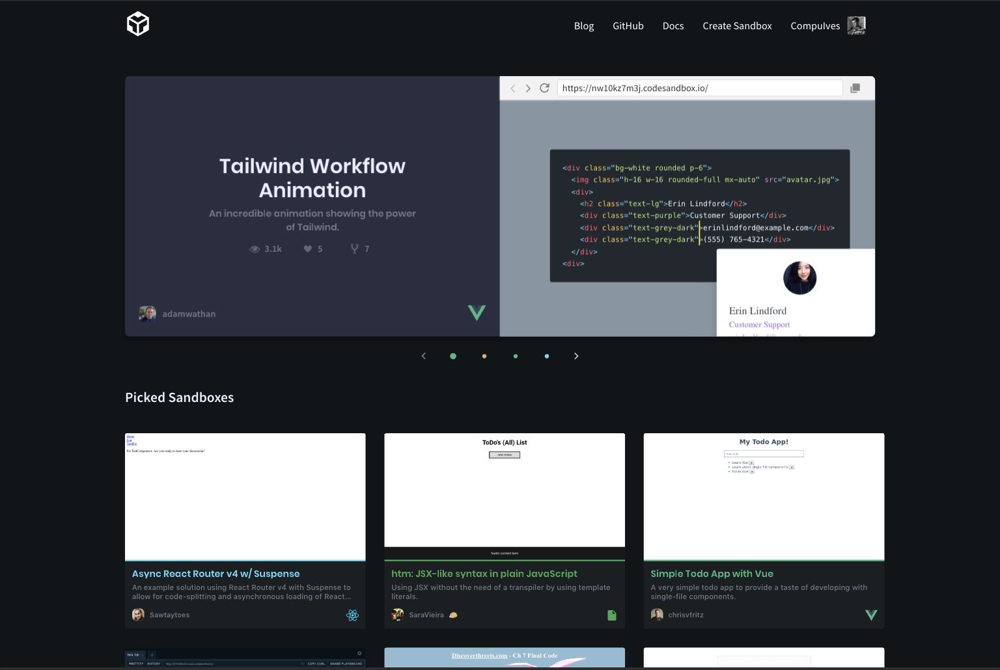
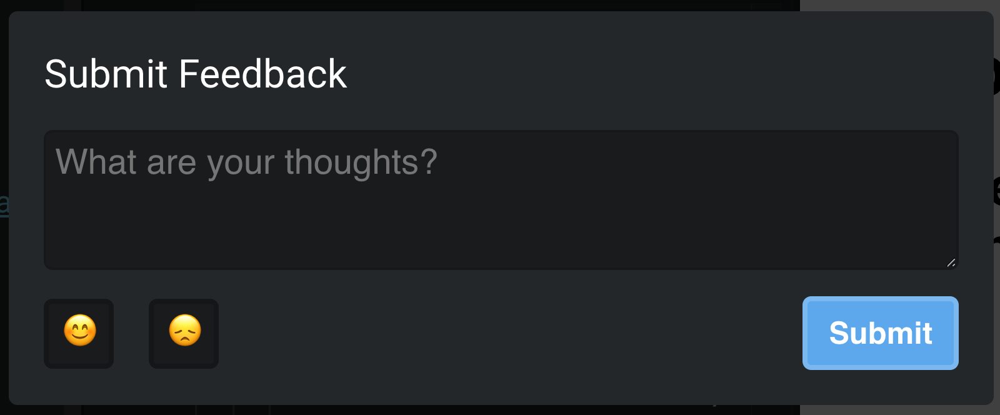

It's time for a new update to [CodeSandbox](https://codesandbox.io)! This time
we focused on the most important part of CodeSandbox: the community. Without a
community, CodeSandbox would not be the platform it would be today, and it
definitely deserves some more love.

We did three things to make it easier for everyone to find and share sandboxes.
Let's get to it!

## Explore Page

CodeSandbox always strove to make itself the best way to create experiments and
to prototype apps, but until now there was no way to see the experiments unless
you found the perfect [Twitter](https://twitter.com) thread. While working on
CodeSandbox we found so many hidden gems, and we feel like we should bring them
more to light.

That's why we're happy to announce the
[explore page](https://codesandbox.io/explore)! A page with hand-picked
sandboxes which we deem either interesting, beautiful or both! We have invited a
group of curators who can pick sandboxes that go on the explore page. We
constantly pick new sandboxes for the explore page.

Please send us all your cool sandboxes by tweeting with a mention to
[@codesandbox](https://twitter.com/codesandbox), so we can feature you on the
explore page!

_We created a documentation entry with answers to some questions about the
explore page [here](https://codesandbox.io/docs/explore)._

## Move to Spectrum

We've always been using [Discord](https://discordapp.com) for communication with
the community. As the popularity of CodeSandbox grew we started to notice that
it was hard for everyone to keep up with all the chatter. Furthermore, we
received many duplicate questions that were answered before.

We've seen so many amazing things happen at [Spectrum](https://spectrum.chat)
that we made the decision to move our community there. Spectrum solves all the
issues that we had by giving a thread based conversation model, another big plus
is that everything is searchable from search engines!

This will make it easier to ask questions and to share your ideas and work! If
you want to be a part of it
[you can join it here](https://spectrum.chat/codesandbox).

## Submit Feedback

The 'Submit Feedback' button is back! If you have any ideas for a new feature,
or you just want to let us know your thoughts, you can do that now from the user
menu. We'll stay on top of all the feedback.

## The future of the community in CodeSandbox

That's where all of you enter and get to join this discussion to help us better
shape the community we are trying to create. Join our
[Spectrum](https://spectrum.chat/codesandbox) and tell us your ideas. We all
have valuable ideas that can make CodeSandbox better and better every day.

Let us know for what you use it and what is missing and we can all build this
community together and make it better!

## Thank you

Thanks to everyone working on this update. A special thanks to
[Sara Vieira](https://twitter.com/NikkitaFTW) for putting an incredible amount
of effort in this update, she did an incredible job in making this happen.

Also thanks to you! Without your sandboxes we wouldn't have anything to put on
the explore page to begin with!
