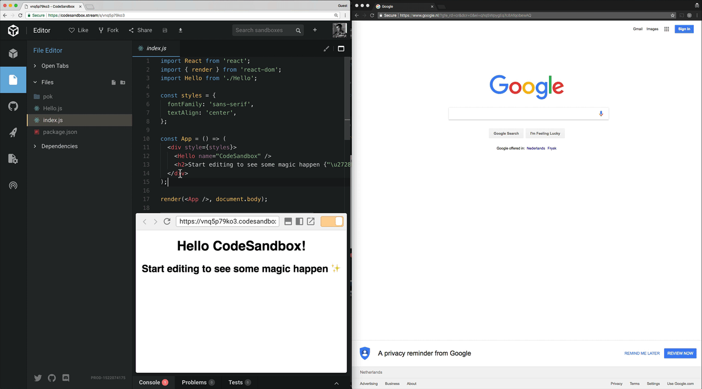
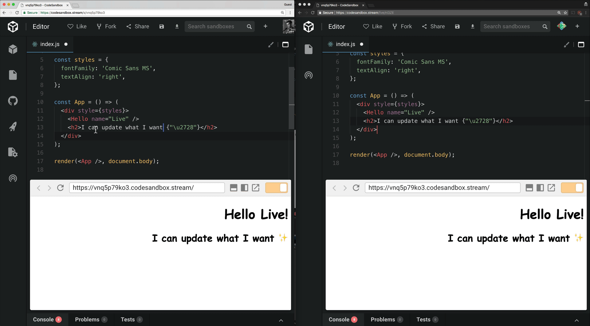

I started [CodeSandbox](https://codesandbox.io) with the ambition to make
sharing and collaboration of web applications easier and more accessible.
Nowadays it's being used for documentation, job interviews, prototyping,
troubleshooting, bug reports, workshops, and probably much more.

Today we want to announce a feature that improves all existing use cases, but
moreover will improve collaboration even more and allow for new ways to use
CodeSandbox. It's called CodeSandbox Live (original name!).

You can see an introduction video to CodeSandbox Live here:

https://youtu.be/DnnJ0sLn28s

## Collaborate in real time

From now on you can open up your sandbox for real time collaboration. By
clicking on the 'Go Live' button you will get a URL that you can share with
others. They can then join your session and seamlessly collaborate live on the
same sandbox with you. They will be able to create files, delete files, move
files, write code, the whole shebang. You will see their cursors, selections and
which file they're looking at, while still keeping your own editor features like
[IntelliSense](https://code.visualstudio.com/docs/editor/intellisense).

Everyone can simultaneously change code in the same document, or choose to edit
other files. We dynamically update selections, cursors and code based on the
input of others, using
[Operational Transforms](https://en.wikipedia.org/wiki/Operational_transformation)
to resolve any potential conflicts.

## Choose who can edit

CodeSandbox Live has two modes: '_Open Mode_' and '_Classroom Mode_'. The
default mode is 'Open Mode', which allows everyone to edit. 'Classroom Mode'
lets you select who can edit. This is especially useful for lectures and
workshops where 30 students can look at the same sandbox. You will only see the
cursors and selections of the people who can edit, the 'editors'.

## Fork at any time

If someone wants to continue with their own version of the sandbox they can
simply do that by pressing 'Fork' at any time. They can later join the session
again if they want to.

## It's in beta

It turns out that these kind of features are pretty hard to test by yourself or
with some friends 😅. I tested this for a pretty long time without finding bugs,
but we probably missed something. That's why we want to mark this as a beta for
the time being. If you find any issues you can
[open up an issue on our GitHub repository](https://github.com/codesandbox/codesandbox-client/issues/new/choose).
To test the load we've marked this feature as Patron-only: a live room can only
be created if you are a [Patron](https://codesandbox.io/patron), everyone can
still join created rooms.

## Test Sessions

There is no limit on how many users can connect to one live session, but we
haven't tested bigger crowds yet. In the coming weeks I will share live test
sessions and streams on [my Twitter](https://twitter.com/CompuIves), everyone is
encouraged to join them!

## How it works

I'm really happy with the implementation of this system. In the frontend we're
using parts of [ot.js](https://github.com/Operational-Transformation/ot.js). On
the backend we have our [Elixir](https://elixir-lang.org)
([Phoenix](https://github.com/phoenixframework/phoenix)) server that runs a
custom OT implementation together with [ot_ex](https://github.com/jclem/ot_ex).
Every live room is a separate Elixir process, and all state is stored in
[Redis](https://github.com/antirez/redis) to allow for temporary server
disconnection or rolling updates. I will **definitely** write a more detailed
post about this. There were some really interesting challenges, and _many_ race
conditions. It was one of the most fun features to build by far.

---

This feature has been a blast to build and test. I hope you'll have as much fun
using CodeSandbox Live as I had testing it! Let us know what you think on the
[CodeSandbox Twitter](https://twitter.com/codesandbox) or
[my Twitter](https://twitter.com/CompuIves).

## We're open source

If you're interested in the source of the frontend, you can find it
[here](https://github.com/codesandbox/codesandbox-client).

We've also recently opened an
[Open Collective](https://opencollective.com/codesandbox) for companies that
want to support our open source work.
