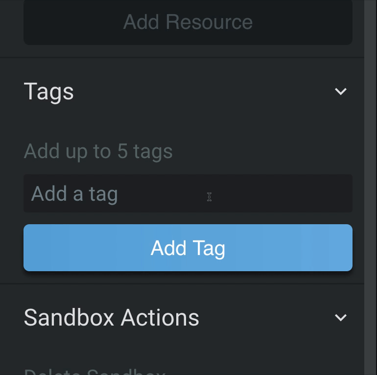
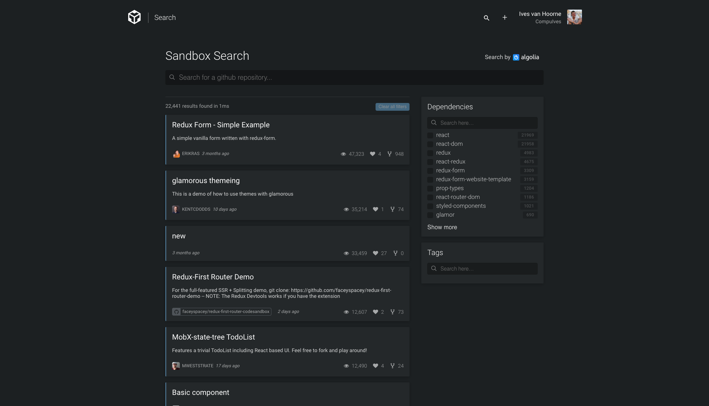
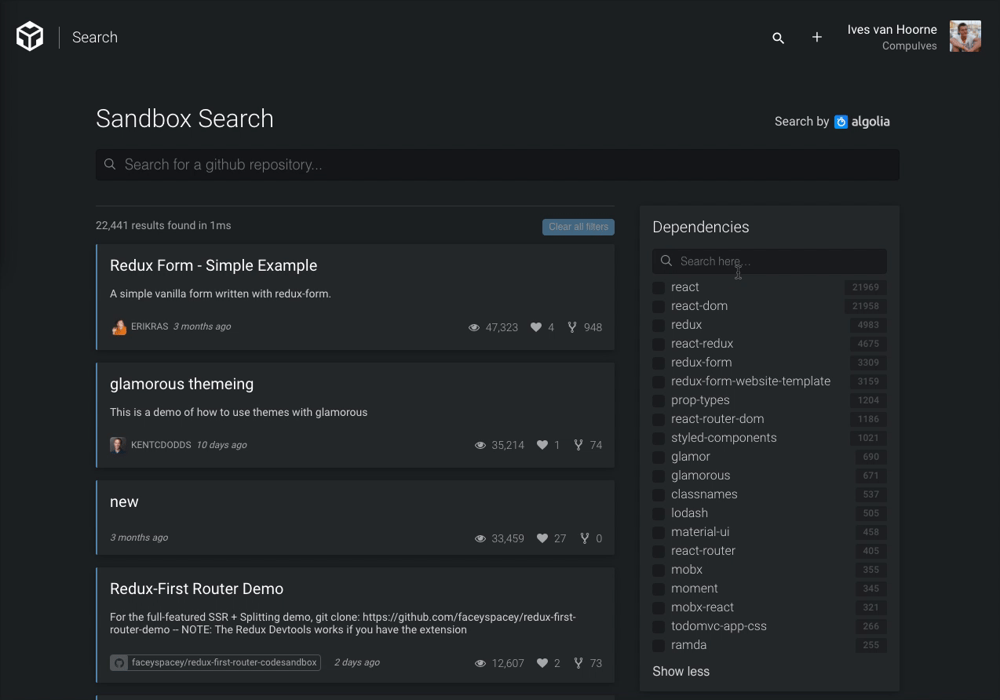
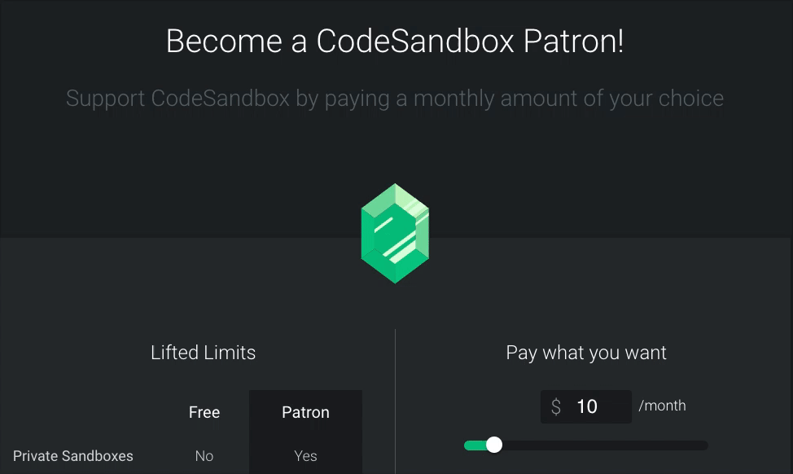
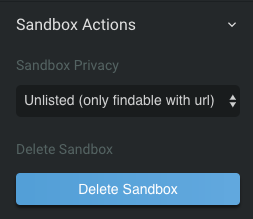
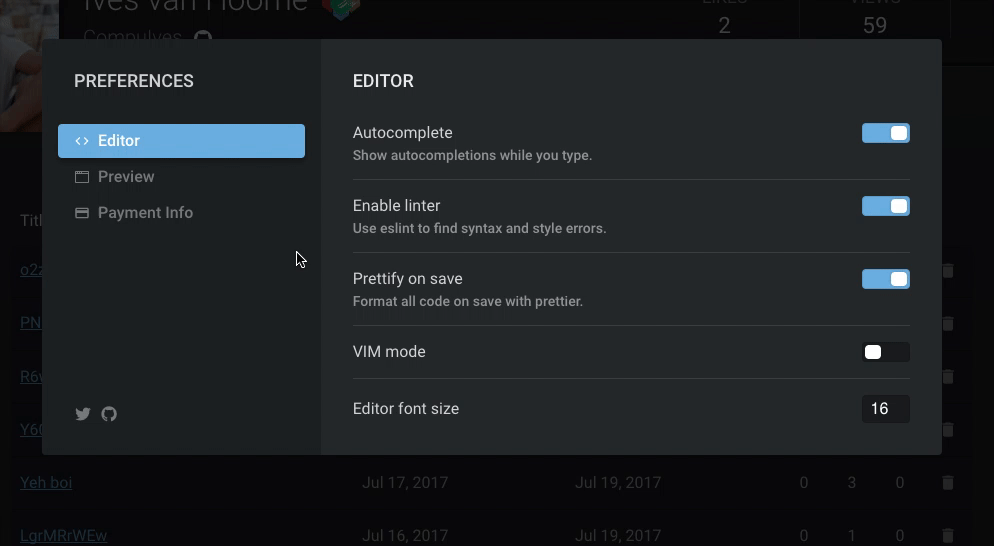
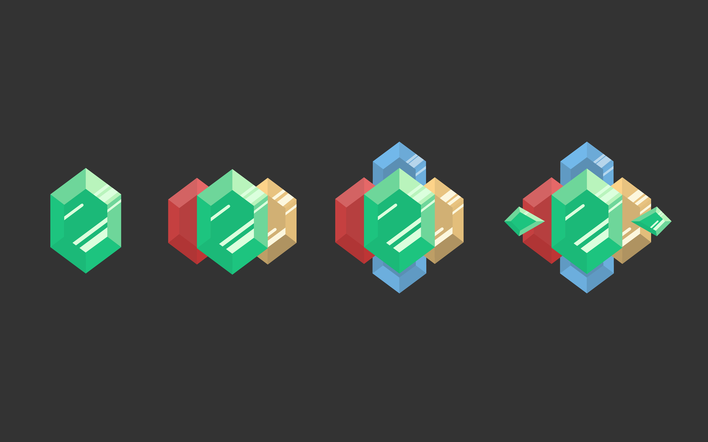
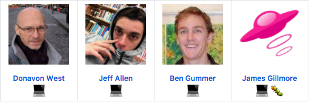

It has been only 3 weeks since [our](https://codesandbox.io) last article
'[The Future of CodeSandbox](/post/the-future-of-codesandbox)' has been
released. We haven't stopped working in the meantime and are proud to release
our biggest update yet today! I wanted to dedicate a separate post for this
update, since it wouldn't fit in a single tweet (or even two for that matter).
It's good to keep everyone posted regularly on all progress and that's why we're
starting a monthly post, explaining what big features have been built and what
we will build.

## What has been built

This update is much bigger than I initially planned. I first just wanted to
build search, but then I realized that people want private sandboxes if there's
search, so I built pricing, but then I realized that users need to be able to
update their payment info, so I built dedicated preferences. Without further
ado, let's look at the new features in detail!

#### Sandbox Tagging

It's now possible to tag sandboxes, so you're able to sort and group them based
on given tags. This is especially useful with the next feature.

#### [Search](https://codesandbox.io/search)

Yes! I'm really excited for this feature. We now have search powered by
[Algolia](https://algolia.com). It's insanely fast, I was never able to exceed
the 2ms in search time with 22,000 sandboxes. Integration was also much easier
than I expected, it took me two days to do the backend and the frontend.

Search is really useful when you're searching for examples or inspiration. Do
you need help with
[`react-router-dom`](https://github.com/ReactTraining/react-router/tree/master/packages/react-router-dom)
and
[`react-transition-group`](https://github.com/reactjs/react-transition-group)?
Well, now you can just filter on those dependencies and check the sandboxes out.

Not only is this useful for users, library authors now also have a higher
visibility when users are searching for libraries. Search is also where tags
shine, since you can also filter on tags.

The search isn't fully done yet, I also want to add 'Popular Sandboxes', 'Top of
this week' and 'Top of this month' to increase discoverability.

#### [CodeSandbox Patron](https://codesandbox.io/patron)

You can now support CodeSandbox by becoming a Patron! You get a badge based on
the amount you donate per month, which will be shown on your profile page. You
can hide the badge in your preferences. The income will go to server costs and
further expenses of CodeSandbox.

We don't want to split features between Patrons and free users, that's why
mostly limits are lifted when you are a Patron. As you can see you can pay what
you want, this goes from $5 to $∞. We handle all payments through
[Stripe](https://stripe.com), and we're also working on
[PayPal](https://paypal.com) integration. You can find the patron page
[here](https://codesandbox.io/patron).

#### Private Sandboxes

As a Patron you can make your sandboxes either private or unlisted. Unlisted
sandboxes are not indexed, thus others can only find them if they have the right
URL. Private sandboxes are only viewable by you. You can find the privacy
options under 'Sandbox Actions'.

You can view your private and unlisted sandboxes on your own profile, but when
others see your profile they can't see these sandboxes.

#### Dedicated Preferences

We now have a preferences modal with a fancy animation!

This opens up the possibility to have advanced preferences, like
[ESLint](https://github.com/eslint/eslint) config, custom
[Prettier](https://github.com/prettier/prettier) config and customized theming.
We will also include more preferences. The design of the preferences modal is
inspired by [Discord](https://discordapp.com) and Stripe.

#### Achievement Badges

We will gradually add achievement badges to CodeSandbox, as a sort of reward for
your support and usage. [Bas Buursma](https://twitter.com/bazzjuh) has put a lot
of effort in the design of the badges, and they turned out really beautiful!

Currently we have 4 badges, but we promised another one in the last post. In the
last post I wrote that we had a reward for all early birds of CodeSandbox,
that's why the first 2,000 users of CodeSandbox will receive an early bird
badge! This badge is still in the making.

Throughout the coming months we'll build more badges and a separate badges page.

#### Terms of Service

Hosting user created content is legally quite tricky. A Terms of Service and a
Privacy Policy were long due and we've put a lot of time in writing one. You can
read it [here](https://codesandbox.io/legal).

## What will come

Last month was very focused on discoverability of the sandboxes. The coming
month we will focus more on the editor and the preview functionality. I have 2
holidays in August (I'm lucky), so this could become a sprint of two months
instead of one.

#### Extension & Custom Renderer Support

I've laid some thinking groundworks on support for custom extensions and
renderers. The idea is that library authors can build devtools and custom
renderers integrated with CodeSandbox.

Imagine you have a state management library, then you should be able to open a
custom view like in
[mobx-state-tree-playground](https://mattiamanzati.github.io/mobx-state-tree-playground)
to inspect state and actions. Or imagine you have
[Jest](https://github.com/facebook/jest) tests, then it would be great if you
can visually see your tests running in a custom view. And it would also be great
if you can finally open a console view.

The idea is that you can write a custom extension for CodeSandbox, where you can
specify when the extension is activated, how modules are evaluated and what
should be rendered. You can then add the extension via a PR to the main
codebase.

#### Templates Support

We now have compatibility with
[`create-react-app`](https://github.com/facebook/create-react-app) templates,
and we want to extend this to other templates. This feature will be tightly
connected to the custom renderer support, because both projects will be put in a
complete rewrite of the sandbox. We're not planning to support ejecting in this
sprint, that work won't fit in one sprint.

#### The Internals of CodeSandbox

A couple days ago I sent out a tweet gauging the interest in a post about how
CodeSandbox is built:

https://twitter.com/CompuIves/status/885197233519570947

The response was really positive and better than I expected. I'm motivated to
start writing about the internals of CodeSandbox and how different parts work
together soon.

## Thanks

Remember, [we're](https://github.com/codesandbox/codesandbox-client)
[open](https://github.com/codesandbox/codesandbox-importers/tree/master/packages/cli)
[source](https://github.com/codesandbox/codesandbox-importers/tree/master/packages/git-extractor)
(partly)! I'd like to give a special thanks for our new contributors of the past
month. ❤️

Also a BIG thanks to everyone else helping out by talking about and using
CodeSandbox, we're really amazed by your positive response and support.

You can always contact us through [my Twitter](https://twitter.com/CompuIves) or
by emailing us at support@codesandbox.io. Don't hesitate to say hi 😃.
