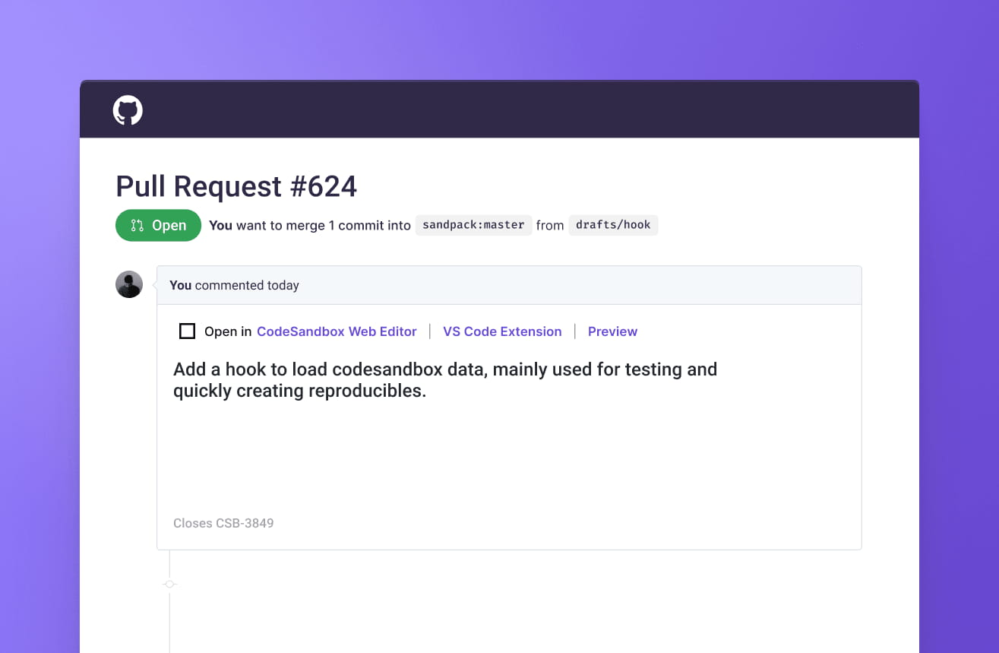
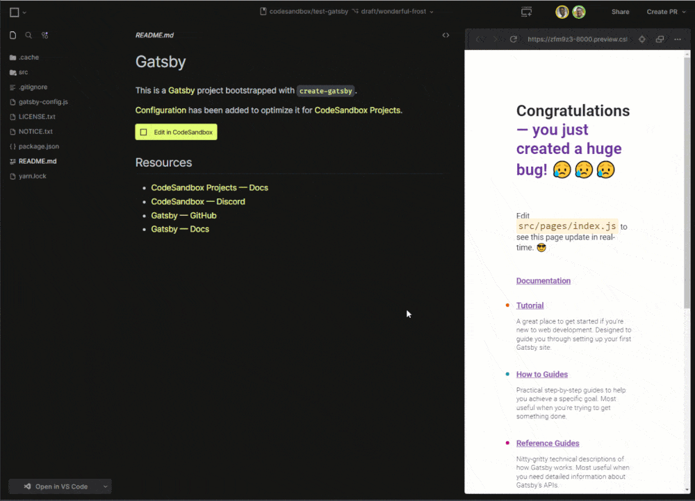

**Today, we are announcing the CodeSandbox GitHub App, which gives you a live development environment for every pull request you open, with support for Docker and databases.**

Remember the last time someone asked you to review a PR? You probably had to commit your current work, switch your whole context and spin everything up so you could review it. Then, do the opposite steps to keep on working on your own code.

Git is core to the day-to-day of any developer. So why can't a PR review happen on a standalone environment that you can just run alongside your own?

Spoiler alert: it can. And this is why today I'm excited to share the CodeSandbox GitHub App 🎉

In this post, we'll go through how you can use the GitHub App for editable deployment previews, brancheable databases and end-to-end tests.

## **CodeSandbox GitHub App**

One of the most valuable benefits of cloud development environments is that you can run an entire project behind a URL. Your code, tasks, tests, previews and everything else lives inside that environment, and everyone accessing it will get the exact same experience, with no setup needed.

Unlike other GitHub integrations out there, the [CodeSandbox GitHub App](https://codesandbox.io/docs/learn/integrations/github-app) runs every branch and PR in powerful [Micro VMs](https://codesandbox.io/post/how-we-clone-a-running-vm-in-2-seconds). This means you can run anything, no matter how complex the project, and add Docker, servers and databases.

## **A live dev environment for every PR**

By [installing our GitHub App](https://codesandbox.io/docs/learn/integrations/github-app#installing-the-github-app) in your repo, all your PRs will automatically run in one of our Micro VMs. Then, the app automatically places a comment in each PR with three links: one to open the code in the CodeSandbox web editor, another to open it on VS Code (connected to CodeSandbox), and finally another to open a preview.

Having this in place really speeds up the PR review process. The beauty of having PRs running behind a URL is that you don't have to switch your context or spin anything up in order to review the PR. You just click it, see the code, tests and a preview, go make any necessary changes, and merge it.

Because each PR is continuously running on a powerful CodeSandbox Micro VM, you can access it from any device, regardless of its specs, even for very complex projects. Are you on the go? Then open the environment in our [iOS app](https://codesandbox.io/ios)! Switching back and forth between laptops? It will run exactly the same in every one of them. The VM does all the heavy lifting, so you get top-notch performance no matter what.

Plus, because this environment is collaborative by default, anyone accessing it will get the exact same experience and can collaborate live regardless of the device or editor that they are using to access the code.

So, if you're accessing it from VS Code using our [extension](https://marketplace.visualstudio.com/items?itemName=CodeSandbox-io.codesandbox-projects) and someone else is accessing it from their iPad using the CodeSandbox iOS App, you can collaborate seamlessly, as if you were coding in the same local environment. This collaboration is really helpful to provide some context behind your code or just review it live with someone else.

When we pioneered this technology a few months ago, we made it available to early adopters to see the reaction it got, and we're thrilled by the response—it's helping developers save hours every week by making the PR review process much smoother. It's amazing to see the impact it has on open source maintainers and development teams.

I personally think that this quote from the team at Adverity says it all:

> I looked at a PR, made some changes together with Bartosz Wisniewski, previewed them live and pushed them. All without checking out anything locally. This probably saved me 1 hour right now. HUUGE win! — [Dominik Dorfmeister](https://twitter.com/TkDodo)

## **Empowering the whole team with editable deployment previews**
While git is ubiquitous among developers, it might not be accessible for other roles such as designers, managers and marketers. Yet, I have lost count of how many times I have asked colleagues from other teams for feedback on the design, structure or copy of my work. Plus, it's always important to give visibility to managers over the work being done.

And here's where the GitHub App PR previews truly shine.

CodeSandbox previews are instant thanks to [memory snapshotting](https://codesandbox.io/post/how-we-clone-a-running-vm-in-2-seconds). No need to wait for the build to finish—anyone wanting to see a preview of the code can just go to the PR and click the “Preview” URL. To empower anyone to contribute easily, we made these previews editable. So, anyone seeing a preview can make simple design or copy updates autonomously and commit these changes with a click. See this collaborative flow in action below:

Plus, our previews are not limited to static applications—we support backend servers, databases and pretty much anything you can run on Docker. This makes it very easy to set up deployment previews. It's as simple as using something like `docker-compose` to set up your development environment once, and have deployment previews automatically available from then on.

## **Brancheable databases**
As I mentioned earlier, because we run your code in a Micro VM, you can run literally anything, including databases. When you start a database in the `main` branch of your repository, every new PR will get an exact copy of that database from the `main` branch. This way you can easily test schema changes inside a PR without having to roll back or migrate in your own development environment.

Also, every PR will have all the seed data from the `main` branch, because it's an exact copy. So if you add some data to the database in the `main` branch, every PR will have that seed data available!

Here's how [Tellie](https://join.tell.ie/) is using this in their own workflow: 

> Brancheable databases let engineers at Tellie reuse high-fidelity test data across all of their branches. By simply using our application on CodeSandbox, the resulting data is immediately available to all engineers, with zero operational effort on our part. — Shree Chowkwale

## **End-to-end tests**
With our GitHub App, we also create a GitHub Deployment for every deployment preview of every pull request. You can take the URL of this deployment and run end-to-end tests against it. This way, you can run tests against the dev server that CodeSandbox is running for the PR.

You can even configure CodeSandbox to start a production server for every PR, connected to the database of the branch. That way, you can automatically run your tests against a unique database while using a production environment.

## **Supercharging git workflows**
At CodeSandbox, we're all about making development more accessible to everyone.

We're super thankful to the community for the valuable feedback and thrilled to launch our GitHub App after seeing the positive impact it had on its early adopters.

Not only are we saving developers precious time by improving the PR review flow, but we are also allowing colleagues from other teams to get visibility on the code and be able to make small changes directly on the codebase.

We use it all the time at CodeSandbox and the team can't live without it anymore!

If you'd like to try it out, you can install it on your own repo easily! Take a look at [our docs](https://codesandbox.io/docs/learn/integrations/github-app#installing-the-github-app) or see our [video tutorial](https://www.youtube.com/watch?v=9_R85W-Te8E).