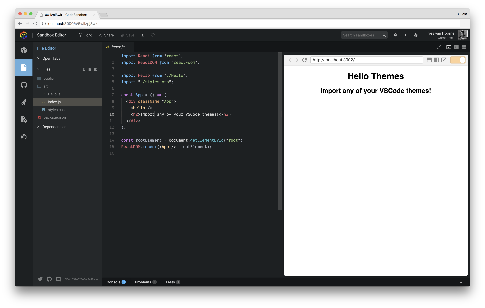
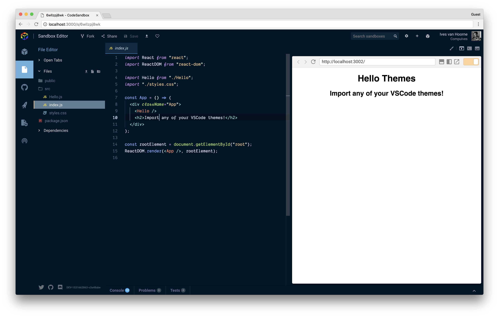
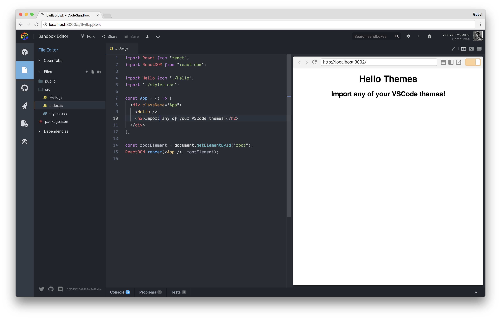
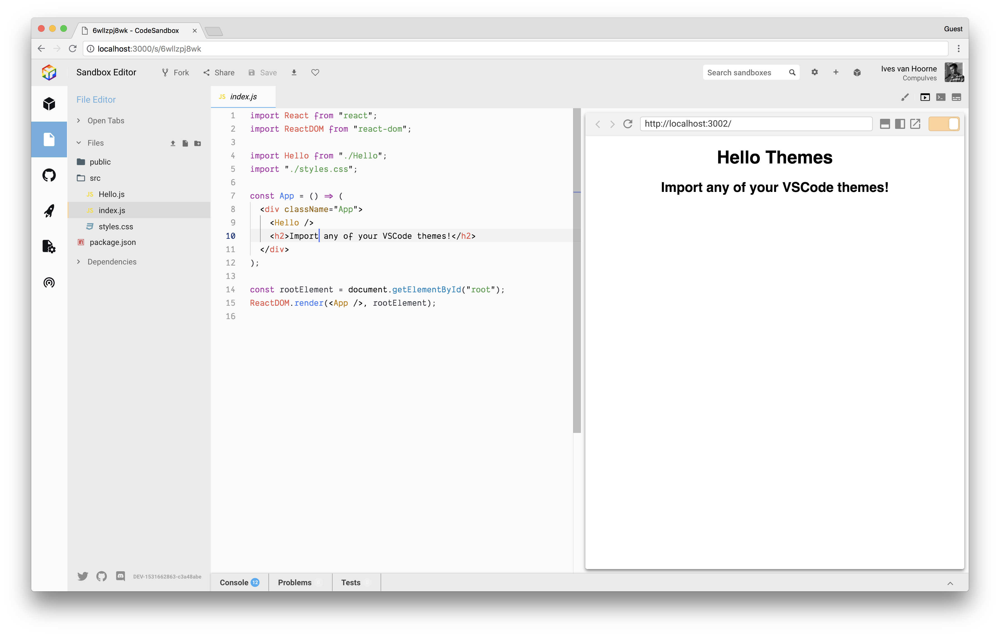
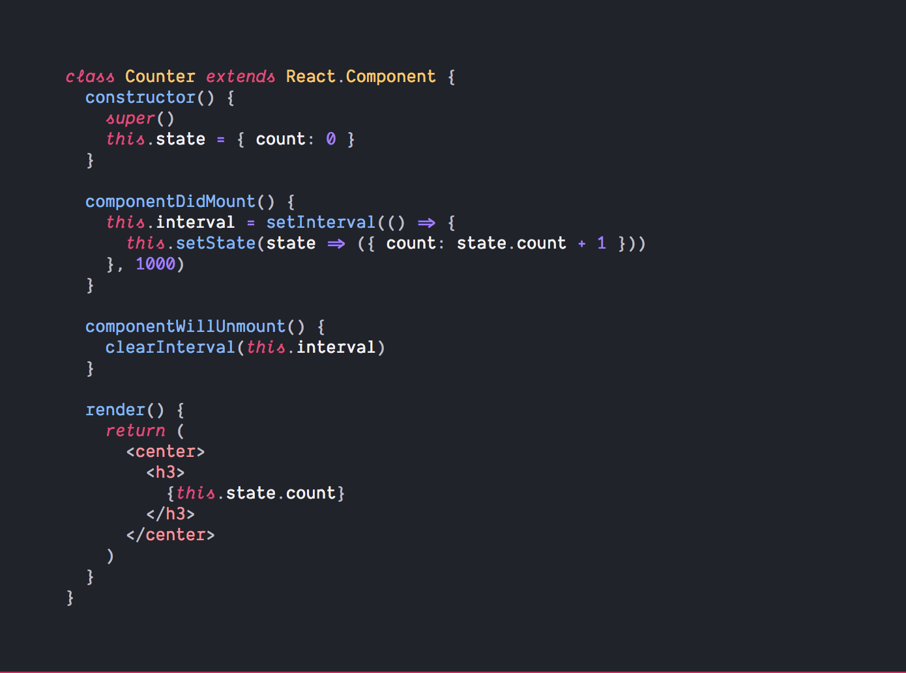
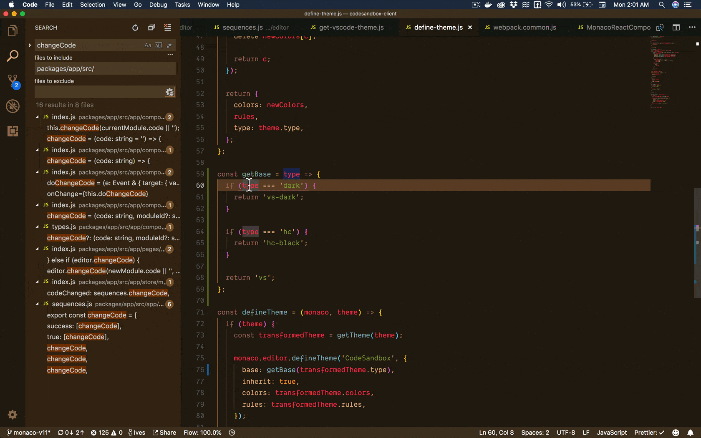

Personalizing color schemes is one of the most important things to have in an
application. It's not only used as a way of styling to personal preference, it's
also very important for accessibility.

[CodeSandbox](https://codesandbox.io) didn't have any way to personalize colors
in the editor since release, but I'm happy to announce that we do now. The best
part is that we were able to reuse a big chunk of logic from
[VS Code](https://github.com/Microsoft/vscode) directly and thus we support any
[VS Code theme](https://code.visualstudio.com/docs/getstarted/themes) natively
in CodeSandbox!

I will first highlight our pre-installed themes and fonts, then explain how to
install your custom VS Code theme and I will end with an explanation on how it
works (spoiler alert: [WebAssembly](https://webassembly.org)).

## Pre-installed Themes & Fonts

We have made a selection of VS Code themes that we think are important to have
'pre-installed'. In reality we still download them on-demand, but you can easily
make a selection between these themes without opening VS Code. If you have a
suggestion for a pre-installed theme don't hesitate to
[open an issue](https://github.com/codesandbox/codesandbox-client/issues/new/choose)!

#### CodeSandbox (new syntax highlighting)

#### [Night Owl](https://github.com/sdras/night-owl-vscode-theme) by [Sarah Drasner](https://twitter.com/sarah_edo)

#### [Atom One Dark](https://github.com/akamud/vscode-theme-onedark) by [Mahmoud Ali](https://twitter.com/akamud)

#### [Atom One Light](https://github.com/akamud/vscode-theme-onelight) by [Mahmoud Ali](https://twitter.com/akamud)

#### VS Code Light by [Microsoft](https://twitter.com/code)

#### [Dank Mono](https://dank.sh) (font) by [Phil Plückthun](https://twitter.com/_philpl)

We now also enable Dank Mono as pre-installed font by default. This is an
incredible font created by [Phil Plückthun](https://twitter.com/_philpl). It
supports italics and
[font ligatures](https://en.wikipedia.org/wiki/Typographic_ligature) (you can
enable those in preferences). He explains
[here](https://medium.com/@philpl/what-sets-dank-mono-apart-1bbdc1cc3cbd) what
the design choices behind Dank Mono are.

You can choose between the fonts 'Dank Mono', 'Menlo' and 'Source Code Pro'.
_You also have the option to install any font that you have locally installed._

## Installing a Custom Theme

There are a few simple steps to move your own VS Code theme to CodeSandbox
explained here:

1. Open VS Code
2. Press (CMD/CTRL) + Shift + P
3. Enter 'Developer: Generate Color Theme From Current Settings'
4. Copy the contents
5. Paste them in CodeSandbox Preferences

Here's a GIF of copying over a theme:

## How It Works

CodeSandbox has been using
[`monaco-editor`](https://github.com/Microsoft/monaco-editor) as its main code
editor for almost a year now. Monaco is the core editor part (the part where you
write code in) of VS Code, and the team behind VS Code was so awesome to make
this part work in the browser directly as well.

However, the syntax highlighting of VS Code uses `.tmLanguage` (from
[TextMate](https://macromates.com)) to
[tokenize](https://en.wikipedia.org/wiki/Lexical_analysis#Tokenization) all the
code. And parsing `.tmLanguage` requires a
[C](<https://en.wikipedia.org/wiki/C_(programming_language)>) library called
[Oniguruma](https://github.com/kkos/oniguruma) to parse and execute the regular
expressions, which has a specific syntax. That's why the VS Code team put in a
different tokenizer into the browser version called
[Monarch](https://microsoft.github.io/monaco-editor/monarch.html). This
tokenizer is not fully compatible with VS Code themes, which made it hard to
directly port them over.

However, a year passed by and WebAssembly is gaining a lot of traction. We found
out that a library called [Onigasm](https://github.com/NeekSandhu/onigasm) (get
it, OnigurumaASM?!) was released, this is a compiled WebAssembly version of
Oniguruma with 1:1 support. Quickly after that I found out that the same
author(!), [Neek Sandhu](https://twitter.com/neek_sandhu), also published
[`monaco-editor-textmate`](https://github.com/NeekSandhu/monaco-editor-textmate),
which allows you to tokenize `.tmLanguage` files for Monaco!

This was enough information to make VS Code themes be supported directly in the
CodeSandbox editor through the `.tmLanguage` tokenizer. The only thing we had to
add was a mapping of the rest of the UI to the VS Code colors. We are using
[`styled-components`](https://github.com/styled-components/styled-components)
for styling, so that was a matter of putting the VS Code styles in the
`ThemeProvider` and changing the style of all elements one by one.

## Other Features

We also updated `monaco-editor` to the latest version (we were on v8, which is a
year old). Because of that we now get proper keyboard support for iPads in the
editor. I also rewrote the logic in the editor itself, which now gives:

- More robust CodeSandbox Live, there should be less bugs
- More performance in the editor itself and when switching files (I used the
  trick described
  [here](https://twitter.com/CompuIves/status/1017535866909184005))
- Autocompletion for import statements (I learned about that
  [here](https://blog.expo.io/building-a-code-editor-with-monaco-f84b3a06deaf))
- Less bugs when switching files

## Thanks

I want to give a huge thanks to [Sara Vieira](https://twitter.com/NikkitaFTW),
she came with the idea to do this when we were on our way to Brighton and she
helped tremendously in building and debugging this functionality. 10 👍 for her!
