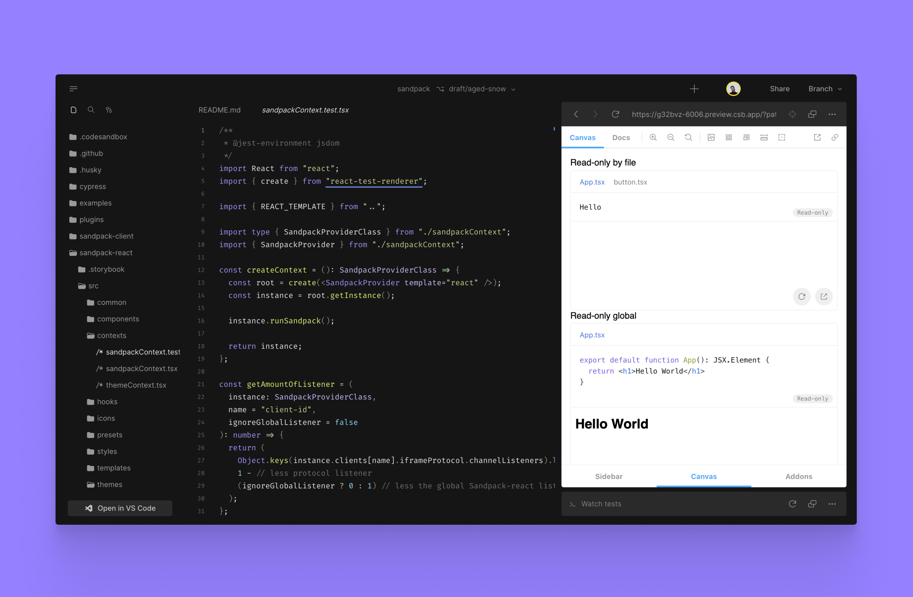
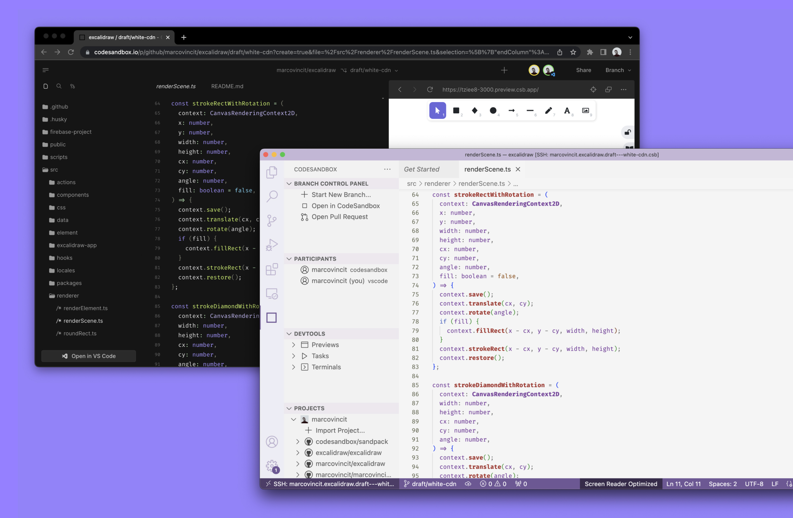

4 months ago, we announced the closed beta of CodeSandbox Projects, it’s an instant development environment that lets you start building projects of any size in seconds, fully integrated with your own existing tooling - including Visual Studio Code.

Today, we’re very happy to announce that CodeSandbox Project is available in public beta and you can try it out now! 🎉

First of all, we want to thank everyone who has tested CodeSandbox Projects in the past months. We received great feedback both from developers and non-developers, and we’re excited about how people have used CodeSandbox so far.

If you want to dive right into the editor, we have a couple example projects you can play with here:

- [Deno](https://codesandbox.io/p/github/codesandbox/codesandbox-template-deno-server/main?file=%2FREADME.md)
- [Vite & React](https://codesandbox.io/p/github/codesandbox/codesandbox-template-vite-react/main?file=%2FREADME.md)
- [Next.js](https://codesandbox.io/p/github/codesandbox/codesandbox-template-next.js/main)
- [Nuxt.js](https://codesandbox.io/p/github/codesandbox/codesandbox-template-nuxt/main)
- [Remix](https://codesandbox.io/p/github/codesandbox/codesandbox-template-remix)

We’ll share more templates and examples over the upcoming weeks.

So, what have we worked on in the meantime? A ton! In this post, we’ll share the highlights of what we’ve built for CodeSandbox Projects. Let’s get to it!

## Instant Forking & Always-On Branches

We haven’t been sitting still with infrastructure upgrades! We have fully deployed our Firecracker infrastructure for all projects. What does this mean? Forks will happen within 2 seconds, and you no longer have to worry about branches shutting down.

<video autoplay loop muted playsinline width="100%">
  <source src="./instant-forking-3.mp4" type="video/mp4">
</video>

### How does this work**?**

[Firecracker](https://firecracker-microvm.github.io/) enables us to save the memory of a running VM to disk, and we can start new VMs from that memory file. Those new VMs will continue where the last VM left off.

<video autoplay loop muted playsinline width="100%">
  <source src="./flow.mp4" type="video/mp4">
</video>

This means that every time you press “Fork” **you will get an *exact* copy of the development environment**, with running dev servers ready to respond to requests! This is great in case you want to experiment with some changes and don’t want to make changes to the existing environment.

This also means that when we hibernate a VM, the memory is saved to disk. When you come back later to the VM, we can resume it from that memory snapshot within a second. It will seem like the VM has always been running. This way, you will never have to wait for dev servers to start!

This fits the model of CodeSandbox perfectly. You can prepare the main branch by installing the dependencies, starting the dev servers and seeding the database. All forks from this branch will then have all of this readily available.

## Open Source Integration

Open source repositories are now directly integrated in CodeSandbox! You can now open any open source repository and you will get a running version of the repo. If you want to play with the code, you can press “Branch” and Projects will create a new branch for you.

To contribute you can make your change press “Open PR”. CodeSandbox will handle creating the fork, creating the branch, setting upstreams and creating the commit & PR. This way, it will be easier for you and others to contribute to open source repos.

**Here’s an example of Sandpack running on CodeSandbox Projects:**

[https://codesandbox.io/p/github/codesandbox/sandpack](https://codesandbox.io/p/github/codesandbox/sandpack/main?file=%2FREADME.md)

## Docker & Nix Support

Many people already have a development environment set up locally and in many cases this is set up with Docker or `docker-compose`, to make it easy to run these repos in CodeSandbox, we’ve added Docker and Nix support.

Here’s some documentation on how to set it up: [https://codesandbox.io/docs/projects/tutorial/getting-started-with-docker](https://codesandbox.io/docs/projects/tutorial/getting-started-with-docker). And here’s an example of a project running Docker & Nix: [https://codesandbox.io/p/github/codesandbox/codesandbox-example-docker/main](https://codesandbox.io/p/github/codesandbox/codesandbox-example-docker/main).

With Docker support you can run `docker` inside a VM to run any kind of container, this is great for extra services like a database or Redis.

We’ve also added Nix support which allows you to configure the installed tooling that comes with the development environment. You can configure this by adding a `csb.nix` to the root of your repo, we will automatically pick up these changes and install the right packages.

## GitHub App

One big advantage of having a development environment per branch is that you can use them to easily review PRs without disrupting your own environment! To make this easier we’ve created a GitHub App that adds a link to a running development environment for every PR.

<video autoplay loop muted playsinline width="100%">
  <source src="./create-pr.mp4" type="video/mp4">
</video>

Using this app allows you to review a PR with a running dev server by just clicking a link. It also allows you to quickly try out some changes in the PR itself, without having to check out the branch locally!

## VS Code Extension

It’s important for us that you can use the tooling that you’re used to. That’s why we have a VSCode extension that allows you to open any branch on CodeSandbox in VSCode, with your own extensions and keybindings.

We’ve made many improvements in VSCode, and it’s now possible to start tasks, previews and even follow team members from within VSCode directly. This way you can collaborate from VSCode with others in our mobile app or web client.

## Conclusion

We’re super excited to be able to share Projects with everyone now. We built Projects with the same goal we’ve always had; to make it easy to build and share running code with others.

Over time, Projects will be unified with sandboxes. This way, you can start with a sandbox and as it grows you can attach git to it and turn it into a project. Our vision is for you to have a seamless experience with sandboxes and projects, allowing CodeSandbox to help facilitate every step of your development journey.

### Thanks

Thanks to everyone who has tested CodeSandbox Projects so far, your feedback was tremendously useful and really helped us shape the product. Also a big thanks to the whole CodeSandbox team who worked hard on this release, it’s been a lot of hard work to get this off the ground.

We have a very full roadmap that we’re eager to share. We’re actively incorporating your feedback, so send us an email or [join our Discord community](https://discord.gg/C6vfhW3H6e) to help shape the roadmap!

As shared at the start of the blog post, here are some examples to check out, or you can [go to the dashboard](https://codesandbox.io/p/dashboard) to import an existing GitHub project!

- [Deno](https://codesandbox.io/p/github/codesandbox/codesandbox-template-deno-server/main?file=%2FREADME.md)
- [Vite & React](https://codesandbox.io/p/github/codesandbox/codesandbox-template-vite-react/main?file=%2FREADME.md)
- [Next.js](https://codesandbox.io/p/github/codesandbox/codesandbox-template-next.js/main)
- [Nuxt.js](https://codesandbox.io/p/github/codesandbox/codesandbox-template-nuxt/main)
- [Remix](https://codesandbox.io/p/github/codesandbox/codesandbox-template-remix)
