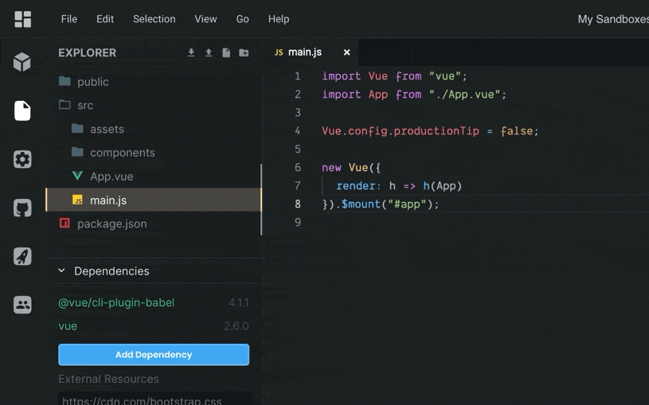

Collaborating on code can be hard. Historically, web development has been seen as a solo pursuit with tooling being built for individual developers writing code locally. In reality, we rarely code by ourselves. While we may often physically edit code alone, we create things collectively—working within teams and contributing to group projects. Now more than ever, we need to be able to collaborate on code. Current events have forced many to embrace remote work, but developers have been leading that charge for years. Flexible working arrangements and distributed or hybrid teams are now commonplace, forcing a fundamental change in how we all create together.

[CodeSandbox Live](https://codesandbox.io/post/introducing-codesandbox-live-real-time-code-collaboration-in-the-browser) made collaboration easier by giving you the ability to code in real-time with others. It's used for pair programming, at hackathons, during job interviews, and in classrooms, enabling two or more folks to work on code simultaneously. What's more, our [basic team support](https://codesandbox.io/dashboard/teams/new) has reduced friction in sharing ownership of sandboxes within a group.

Since releasing those features, though, we've learned a lot from discussions with members of the CodeSandbox community. We've heard that folks don't just want to be able to code together, but also communicate about code and creations more effectively. As well as communicate in real-time and asynchronously, and not only within development teams but with other stakeholders, like designers, product managers, QA, and clients too.

We're now applying this learning to evolve these individual features into a collaborative platform for rapid web development. A platform that will enable you to build together more efficiently by promoting discovery and re-use of code, encouraging iteration, and getting you more actionable feedback earlier in the development process.

## CodeSandbox Live 2.0

We're kicking this off today with a step-change in collaboration on CodeSandbox thanks to a massive upgrade to CodeSandbox Live. 

### Live by Default
All sandboxes are now live by default. Making collaboration seamless is key to its efficacy, so it's no longer a mode you enable but something that's on all the time. This means team members can come together and work on sandboxes with ease, and guests can be invited to view or edit outside of a specific session.

### New Access Controls
We've streamlined sharing sandboxes with a new access control panel. Not only can you use it to invite others and set permissions, but it opens up new, more flexible ways of working with private sandboxes. You could already share private sandboxes with a team, but now you can add specific individuals to private sandboxes too. This is especially useful to those organizing code challenges for hiring, and contractors who need to share sandboxes with clients.

Invites can be sent via email if they aren't already CodeSandbox users, or you can use usernames for those that are. Permissions can be adjusted later if needed, too.

### Presence
With Presence, you can see who else is working on the same sandbox as you. Avatars of team members and guests appear in the editor, so you know who is viewing or editing a project when you are.

### Follower Mode
You can also follow along as someone codes with the improved follower mode. Click on an avatar in the sandbox and follow their cursor around the sandbox as they edit code, scroll, and switch between files. It beats a slow, choppy screen share for code interviews, reviews, and demoing or teaching one or many others.

## Be Part of the Future of Code Collaboration
These updates provide new ways to use CodeSandbox with others, but they also lay the groundwork for what's to come. Sign up now to be one of the first to try our upcoming collaboration features, which will forever change how you work with others to create things with code. We'll be opening up beta access to one of many in just a few weeks.

  
 powered by <a href="https://admin.typeform.com/signup?utm_campaign=ktD2rd&utm_source=typeform.com-01DH8PS45JWZKYBJ6B37YX56NZ-pro&utm_medium=typeform&utm_content=typeform-embedded-poweredbytypeform&utm_term=EN" style="color: #999" target="_blank">Typeform</a> 

In the meantime, [create a team](https://codesandbox.io/dashboard/teams/new) and invite your friends and co-workers to try out the all-new CodeSandbox Live today.

## Thanks
Thanks go to [Christian Alfoni](https://twitter.com/christianalfoni) and
[Danny Ruchtie](https://twitter.com/druchtie) for their hard work delivering these improvements. Thanks also go to those who provided feedback as we've iterated on our live functionality. We can't wait to see what you're going to create together.
