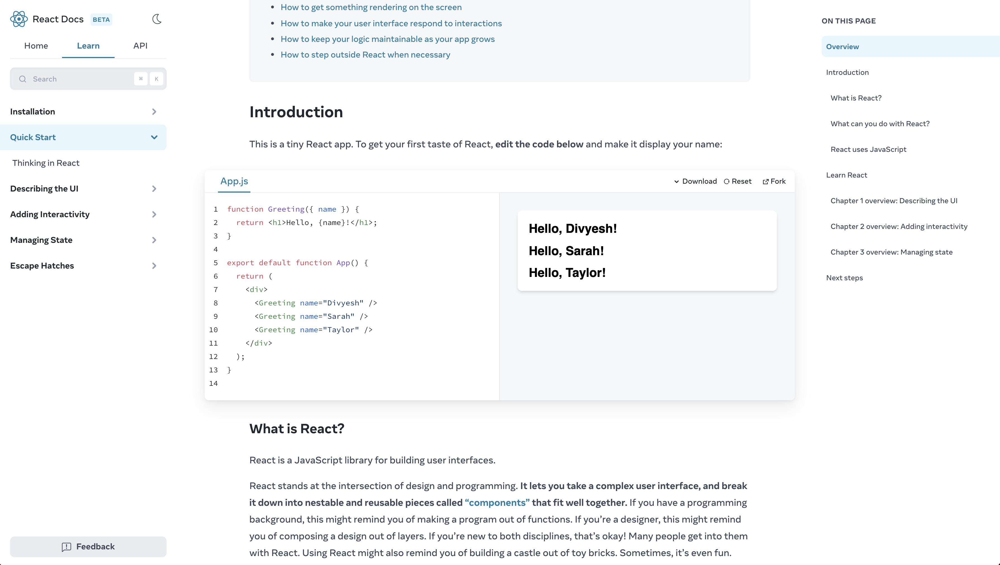
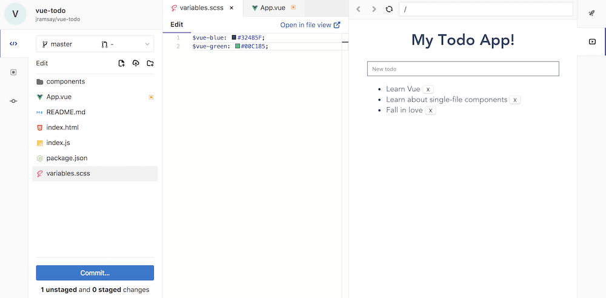
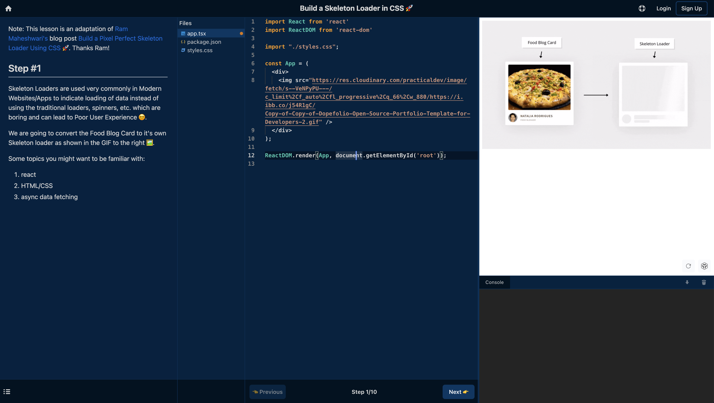
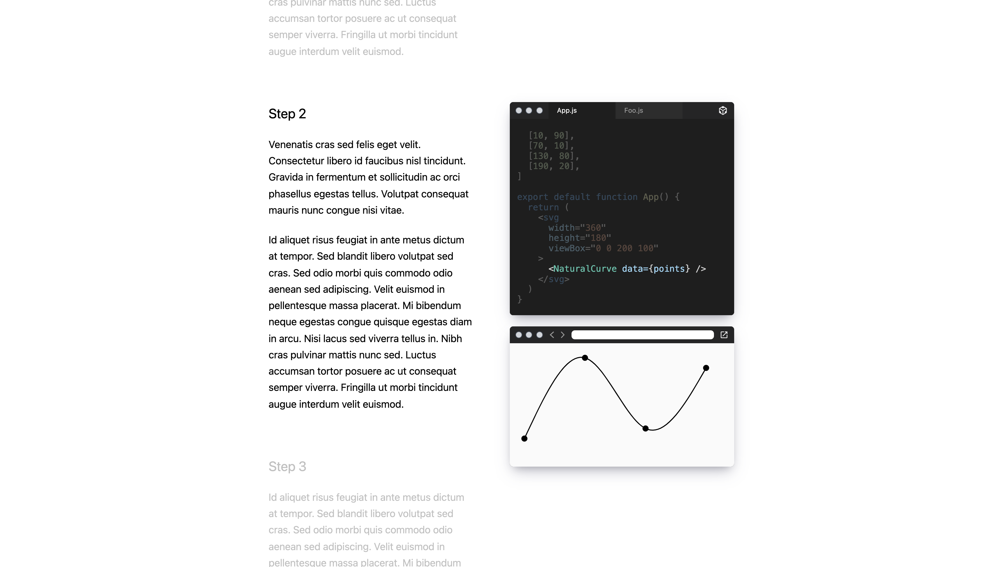

Today we’re very excited to announce Sandpack, the in-browser bundler that
powers CodeSandbox, has been open-sourced for everyone to use! With this
release, you can use Sandpack to power any live running code on your website.
Essentially, you can build your own CodeSandbox!

## What is Sandpack?

When CodeSandbox started, it ran all projects in the browser using a primitive
bundler that runs in an iframe. As projects on CodeSandbox became more advanced,
[we kept on working on this in-browser bundler to support more projects and new bundler features](https://codesandbox.io/post/creating-a-parallel-offline-extensible-browser-based-bundler-for-codesandbox).
We’re now at the point that the bundler supports npm dependencies, hot module
reloading, caching, and a whole lot more.

At the same time, more and more people wanted to use CodeSandbox for use-cases
that we hadn’t thought of before. Sometimes these use cases were so different
that we couldn’t make them work for CodeSandbox.

That’s why we decided to open source the bundler, named Sandpack. We’re giving
you the power to fully customize the experience behind the live-running code,
without depending on CodeSandbox. Want to build a student course with live
tests? That’s possible! Want to build a no-code editor with a live preview?
That’s possible too!

Our main goal behind Sandpack is to give you the full power of CodeSandbox, but
with the flexibility to use it for any project that you have in mind.

So, how do you use it? Let’s take a look!

## How to use Sandpack

With this release, we export two libraries: `@codesandbox/sandpack-client` and
`@codesandbox/sandpack-react`. `sandpack-client` is responsible for mounting
Sandpack and communicating with it. `sandpack-react` is a wrapper library around
`sandpack-client` that makes it possible to use Sandpack with React.

You can use `sandpack-client` in plain JS or make your own wrapper for Vue,
Svelte, or any other library, really!

Let's take a quick look at some of the examples from `sandpack-react`:

### Basic Editor

 
<sandpack1></sandpack1>
 
In this example, we render the default editor, and we specify some custom files to run, together with the `lodash` dependency. This allows you to quickly create live-running code examples. These examples don’t rely on CodeSandbox; if CodeSandbox goes down, Sandpack will keep running.

### Customized Editor

What if you want to make something custom? Well, we allow you to write any
component that is connected to Sandpack, and you can define the layout yourself.
Do you want to use a different code editor? That’s possible:

<sandpack2></sandpack2>   Here we have a custom code editor (it’s a
`textarea`), and a custom component that shows the compiled code of the current
file you’re looking at. As you can see, the preview is hidden here. If we’d like
to add it, just add the `<SandpackPreview />` component as well!

As you can see in the examples, you can use the base template of Sandpack to get
a running editor with a minimal amount of work. However, if you want to fully
customize the experience, that's possible too. You can build your own devtools
on top of Sandpack.

## Who’s using Sandpack?

The ability to use live-running code opens up a lot of possibilities. Every time
you could benefit from live-running code, you can use Sandpack! These are some
of the projects using Sandpack for their own purpose:

### React Docs

The new [React Docs](https://beta.reactjs.org/) is using Sandpack for its
examples and for the challenges. The React team wanted to fully style and
customize Sandpack for their new website, and with Sandpack they were able to
customize everything. From the editor to how errors are shown:

### GitLab Web Editor

GitLab has a web editor that allows you to write code in the browser and
directly commit to GitLab. Gitlab is using Sandpack to execute the code of
frontend projects so you can see the live results:

### Codeamigo

[Codeamigo](https://codeamigo.dev/) is a place where you can follow byte-sized
interactive coding tutorials. They use Sandpack together with their custom
editor for running the code:

### CodeHike

CodeHike is a library that allows you to create guided code walkthroughs. They
use Sandpack for showing the live running code. In this case, they only use the
preview of Sandpack, which is also a great use-case:

### Your project?

There's really no limit on what you can use Sandpack for. If you’re using
Sandpack, let us know and we’ll add you to our showcase!

## Conclusion

When we started CodeSandbox, people used it for many more things than we could
imagine. With Sandpack, we’re hoping to see the same thing. Give it a try, take
a look at our [new landing page](https://sandpack.codesandbox.io/) and
[docs](https://sandpack.codesandbox.io/docs) for it and we'd love to get your
feedback on [Discord](https://discord.gg/C6vfhW3H6e)! You can also find out more
about how it works on [GitHub](https://github.com/codesandbox/sandpack).

### Thanks

Many people have worked on building Sandpack and making it open source. Credits
go to [Adewale](https://twitter.com/ace_kyd),
[Alex](https://twitter.com/alexnmoldovan),
[Danilo](https://twitter.com/danilowoz),
[Danny](https://twitter.com/dannyruchtie),
[Jasper](https://twitter.com/JasperDeMoor),
[Marco](https://twitter.com/marcovincit),
[Maria](https://twitter.com/olarclara),
[Sanne,](https://twitter.com/sannekalkman)
[Tamas](https://twitter.com/metricbrew), and [Zeh](https://twitter.com/zehf) for
making this happen!
