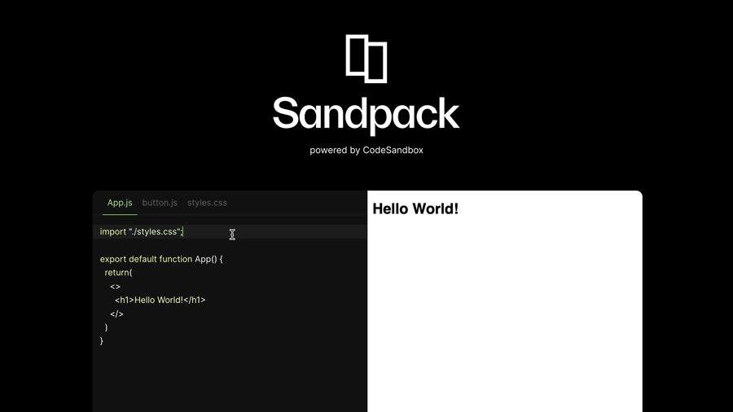
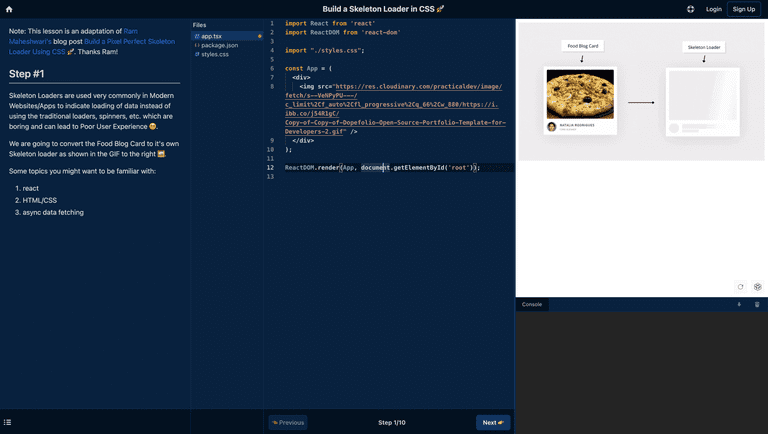
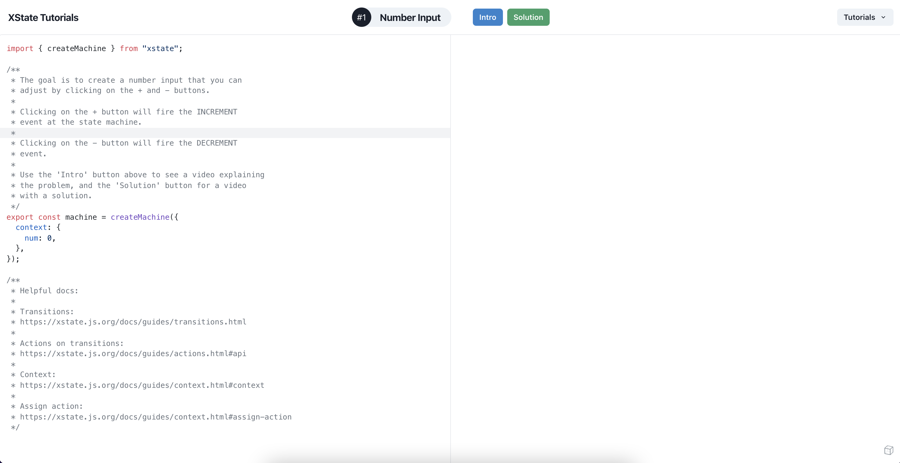
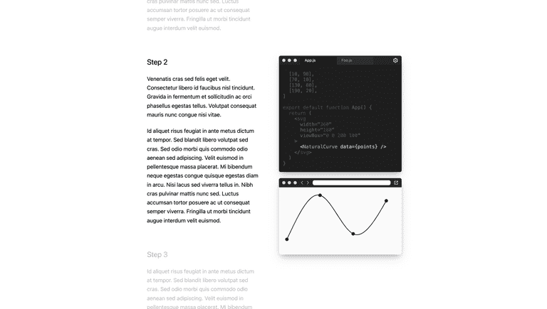
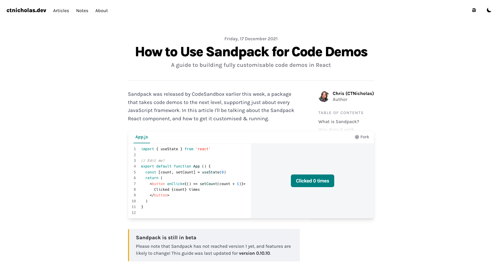
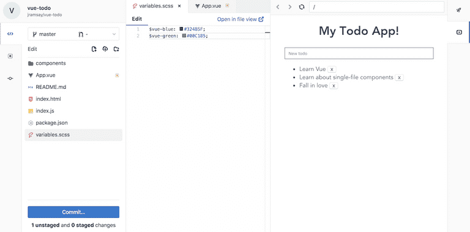

Sharing code snippets have always been a huge part of learning on the web.
Documentations, blogposts, tutorials and other learning platforms use code
snippets regularly to educate their audiences.

These snippets are usually either accompanied with a screenshot to show the
reader a preview or they have to copy it over to their machine and run to see
the results. With Sandpack however, we get both the editable code and a preview,
live in the browser. It’s amazing!

## What is Sandpack?

Sandpack is a component toolkit that makes it possible to have interactive,
live-running code editing experiences in the browser. It is the in-browser
bundler that powers CodeSandbox that is now open source. Check out the
[announcement article here](https://codesandbox.io/post/sandpack-announcement).

With Sandpack’s live coding environment, you get:

- A full editor experience with syntax highlighting.
- An advanced preview that takes advantage of npm dependency support, hot module
  reloading etc.
- One click away from opening your code snippets directly in CodeSandbox.

## Sandpack Showcase

The use cases for having this kind of experience is limitless and we are excited
to see different applications spring up using Sandpack. Here are a few we’ve
found exciting.

### Interactive Coding Tutorials

With Sandpack, you can power up your coding tutorials.
[CodeAmigo](https://codeamigo.dev/) has lessons that you can practice and follow
along. They use Sandpack together with their custom editor for running the code.

[XState Tutorials](https://xstate-tutorials.vercel.app/) uses Sandpack to teach
XState, a library that brings state machines to Javascript and Typescript,
through solving puzzles and instant feedback from the interactive UI.

### Guided Walkthroughs

Sandpack also comes in handy for walkthroughs - showing progress through a
project or step-by step-tutorials. [CodeHike](https://codehike.org/) is a
library that allows you to create guided code walkthroughs - they implemented
Sandpack using the
[sandpack-client](https://sandpack.codesandbox.io/docs/advanced-usage/client)
for showing the live running code in a preview.

### Technical Documentation

The new React Documentation uses Sandpack for its examples and challenges. They
were able to fully style and customize Sandpack for their needs including just
syntax highlighting in some cases. You can learn to do the same with Sandpack’s
[Custom UI options](https://sandpack.codesandbox.io/docs/getting-started/custom-ui#visual-options).

Chris, [@ctnicholasdev](https://twitter.com/ctnicholasdev) has Sandpack
implemented on his web technologies blog for interactive tutorials and demos. In
this article about using
[Sandpack for Code Demos](https://www.ctnicholas.dev/articles/how-to-use-sandpack-for-code-demos),
he’s able to show how Sandpack can change how we learn on the web.

### Web Editors

GitLab uses Sandpack to execute frontend projects so you can write code, and
make commits all while seeing the live results.

If you’re using Sandpack, we’d love to know and also add to our showcase! Go
ahead and share it with our [Discord community](https://discord.gg/C6vfhW3H6e).

If you're new to [Sandpack](https://github.com/codesandbox/sandpack), you can
get started with the [documentation](https://sandpack.codesandbox.io/docs) and
get support or start a conversation on our
[discord community](https://discord.gg/C6vfhW3H6e).

We are really excited about the possibilities for Sandpack and there's really no
limit on what you can use it for.
