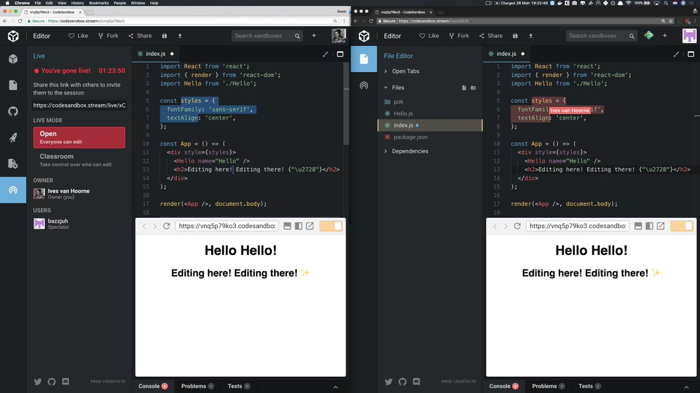
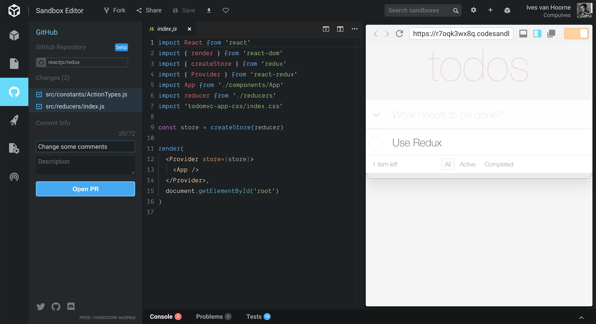
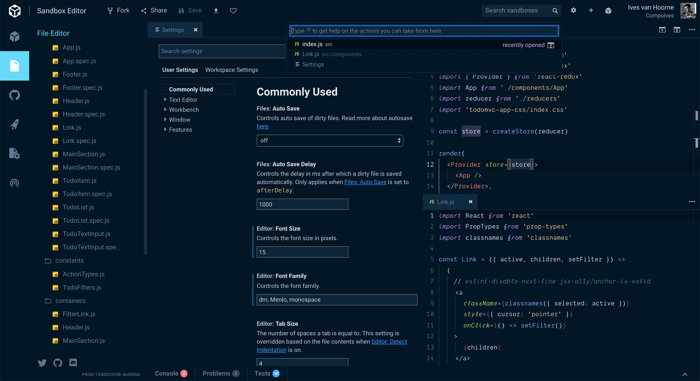
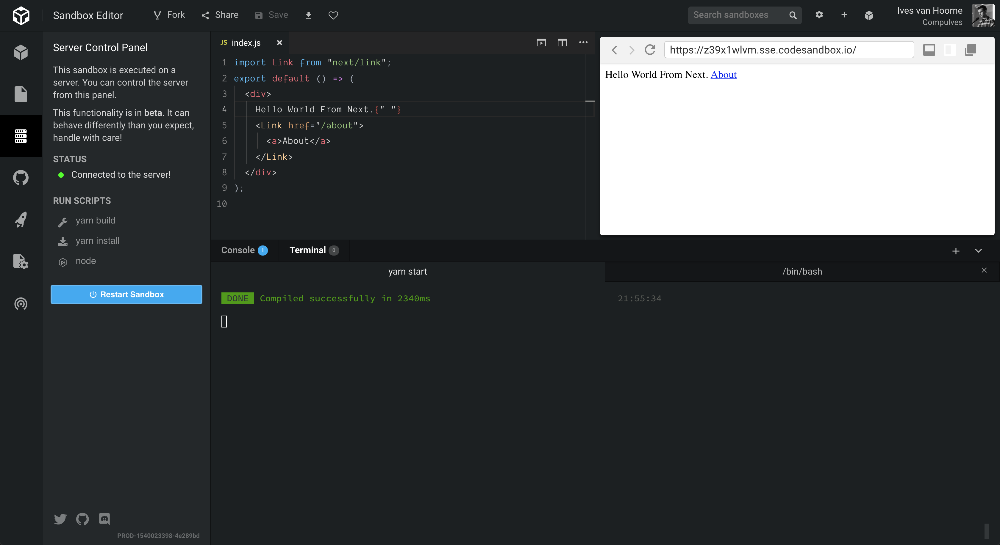
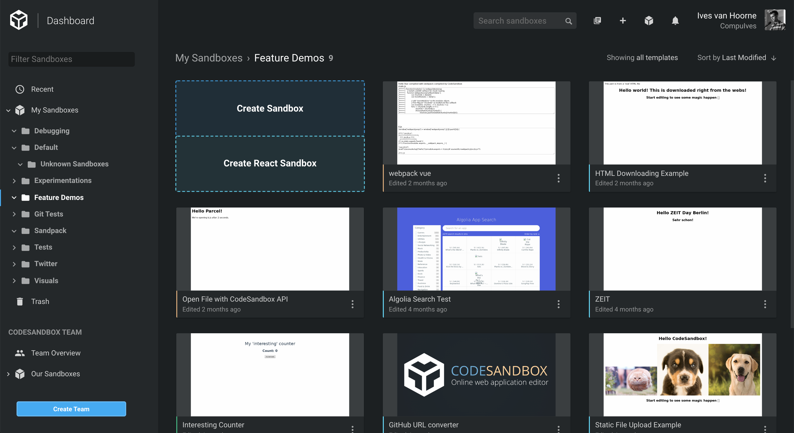
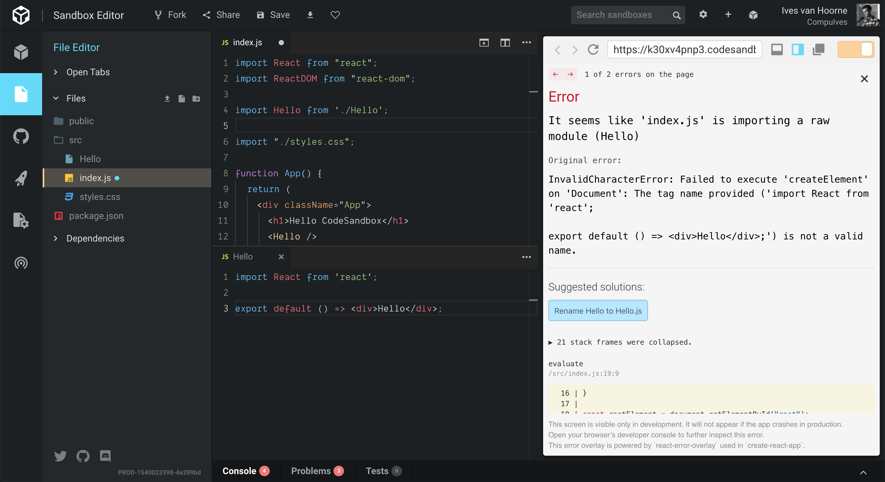
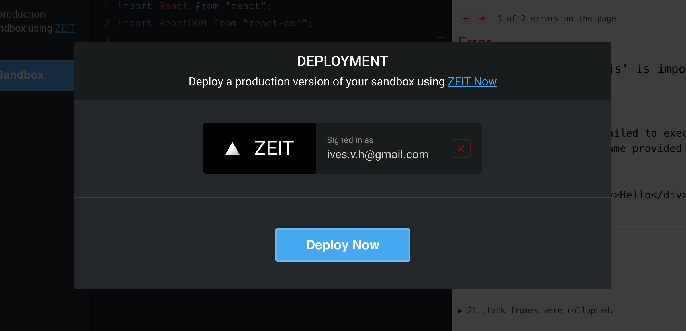

I often get asked: "What's the difference between
[CodeSandbox](https://codesandbox.io) and <another online editor>?". I don't
like getting these kinds of questions because:

1. I am extremely biased, any answer or comparison I could give would be unfair
   to some extent.
2. I like to work on unique things, comparing alternatives to what I build
   infers that what we're doing has already been done before. That demotivates
   me.

For the same reason I get demotivated when I hear people say that CodeSandbox is
like any other online
[IDE](https://en.wikipedia.org/wiki/Integrated_development_environment). Saying
something like that makes me feel that whatever we build wouldn't be noticed
anyway.

That's why I decided to write down everything that I think are the defining big
features of CodeSandbox, features that you cannot find in many other IDEs. This
way I can always link to this post when someone asks me the question, without
making a direct comparison.

## Live Collaboration

When working on a sandbox you can open up a 'Live Session'. This generates a
unique URL which you can give to others to join your sandbox and collaborate
live ([Google Docs](https://docs.google.com) style) together with you. As the
owner of the sandbox you can also enable 'Classroom Mode', this mode allows you
to specify who can edit the sandbox and who can only view. This is especially
useful for workshops or situations where more than 30 people connect at the same
time.

## GitHub Committing/Forking/PRing

Besides importing from and exporting to [GitHub](https://github.com) we also
allow you to work on a GitHub repo directly. When forking a sandbox that's
imported from GitHub you can make changes and either create a PR or a commit
with the changes when you're done. If you don't own the repository that's no
problem, we automatically fork it for you and create a PR.

## VS Code Integration

Since recently we have an experimental feature (you can enable it in settings)
called 'VS Code in the browser'. The name really says what it is, we have
created a fork of VS Code that works in the browser. Because of this we get
'Grid View', 'Keybindings', 'User Snippets', 'Breadcrumbs', 'VS Code Settings'
and more. You can copy your settings files directly from VS Code to CodeSandbox
and we should have the exact same keybindings, snippets and preferences.

I want to clear up that this isn't only
[`monaco-editor`](https://github.com/Microsoft/monaco-editor), but also parts of
VS Code (like the previously mentioned features) that weren't ported to the
browser yet.

## Container Sandboxes

Another recent addition is Container Sandboxes. Previously we would run a
sandbox in the browser. This works great for many sandboxes, but imposes a
limitation on what you can run. With Container Sandboxes we actually run the
code on a server, this makes it possible to eg. create a
[Node](https://github.com/nodejs/node)/[GraphQL](https://graphql.org) server on
CodeSandbox. It also opens up the possibility to create
[Next.js](https://github.com/zeit/next.js)/[Gatsby](/framework/gatsby)/[Nuxt.js](/framework/nuxt)
projects inside CodeSandbox. It runs anything that works locally.

## Dashboard & Teams

Everyone has a dashboard that they can organize their sandboxes in. In this
dashboard you can create directories (like Google Docs) to categorize your
sandboxes. You can also search, filter and sort the sandboxes whenever you need
to find a specific sandbox. We show a screenshot of every sandbox so you can
visually filter them.

Another feature of the dashboard is the option to create teams. As a team you
can share ownership of sandboxes and work on them together. There is no limit to
team sizes and whenever multiple people from a team open the same sandbox we
automatically create a live session.

## Beginner Friendly Tricks

We try to make CodeSandbox useful for people wanting to learn web development.
That's why we show error suggestions for some errors (like 'Add Missing
[npm](https://npmjs.com) Dependency' or 'Rename `App` to `App.js`'). For known
configuration files we show a UI and description.

We also have a [search page](https://codesandbox.io/search), on this page you
can search for sandboxes (850.000 at the time of writing) when you need to find
any examples. You can filter on dependency, on template and on tags to make it
easier. If you, for example, ever want to know how
[`redux`](https://github.com/reduxjs/redux) is used you can filter on that
dependency and shift through the examples sandboxes.

## Deploy Sandboxes

We have a deployment integration with [Vercel](https://vercel.com). When you
want to create a production version of your sandbox you can click 'Deploy with
Vercel'. This will deploy the sandbox, install the `node_modules` and start it
under a new URL. We then give this URL back which you can alias to any domain
that you like.

We are also adding support for other deployment providers in the near future!

## Smaller Factors

These are the features that I think are worth mentioning, but don't deserve a
header of their own.

#### Private/Unlisted Sandboxes

As a [Patron](https://codesandbox.io/patron) you can create sandboxes that are
either private (not viewable apart from you/your team) or unlisted (not viewable
from search) sandboxes.

#### Jest Support

We have support for running [Jest](https://github.com/facebook/jest) tests and
have a small dashboard for it where you can manage the tests and control them.

#### We're Open Source!

The frontend and the microservices of CodeSandbox are
[open source](https://github.com/codesandbox/codesandbox-client)! This is the
place where you can find out how CodeSandbox works. We currently have
[97 contributors](https://github.com/codesandbox/codesandbox-client/graphs/contributors)
and are always welcoming more!

## Conclusion

This is a list of things that you can do with CodeSandbox, but I don't think
this truly defines us. I think our values, our drive and our 'out of the
box'-thinking is what produced all these features, and will certainly define
what we'll be able to make in the coming years. I really can't wait to see what
the future holds and I'm looking forward to work on this online editor as long
as I can.

These features are not only built by myself, we now have a big group of people
working on CodeSandbox. I want to thank
[Bas Buursma](https://twitter.com/bazzjuh),
[Bogdan Luca](https://twitter.com/lucabogdan),
[Sara Vieira](https://twitter.com/NikkitaFTW),
[Christian Alfoni](https://twitter.com/christianalfoni) for their work, and also
a big thanks to the other
[93+ contributors](https://github.com/codesandbox/codesandbox-client/graphs/contributors)
who have added features, documentation and support! If you're interested in
helping us out,
[this is our repository](https://github.com/codesandbox/codesandbox-client) with
the most activity!
