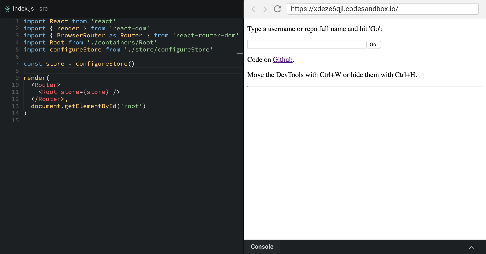

Zen Mode is a special editor layout that hides all distracting elements. It's
perfect for small screens, course videos and presentations. You can enable it by
pressing (CMD/Alt)+K+Z or by enabling it in the preferences.
