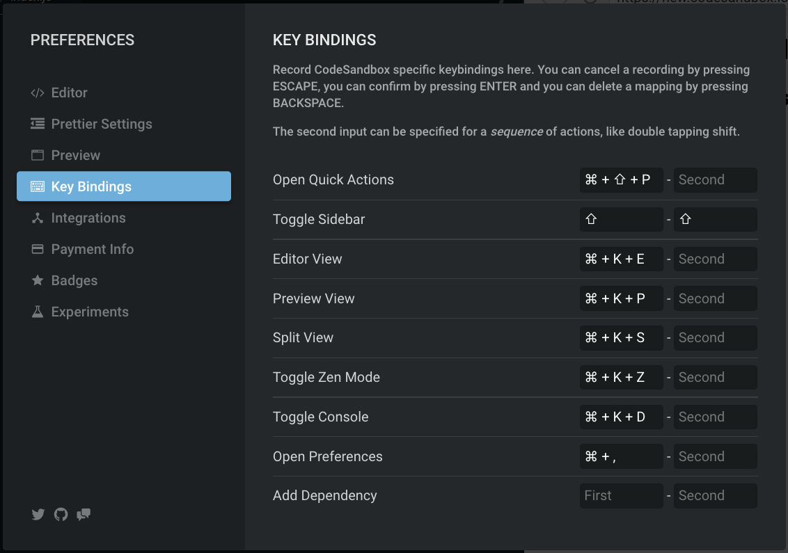

You can now specify custom key bindings in the preferences. You can add new key
binding actions
[here](https://github.com/CompuIves/codesandbox-client/blob/master/packages/app/src/app/store/preferences/keybindings.js).
