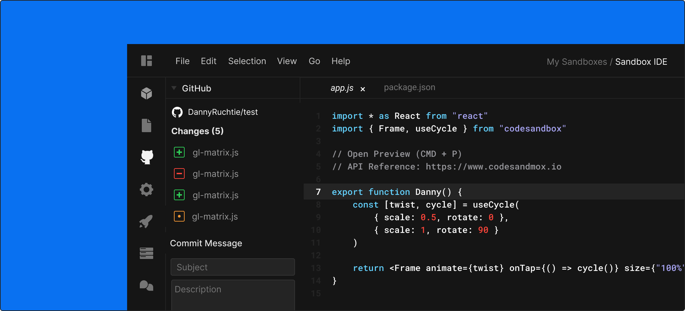
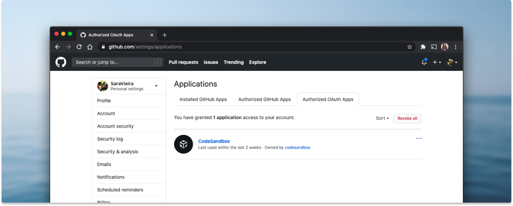
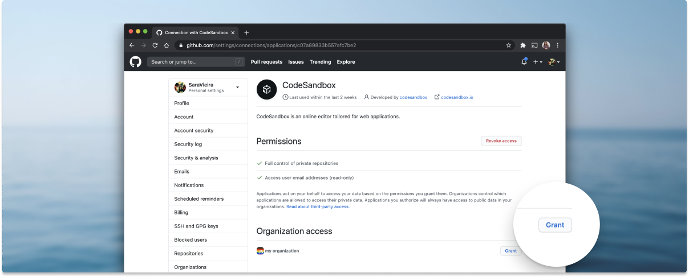

## Base Concept

With CodeSandbox you can import any GitHub repository as a sandbox (detailed
[here](/docs/importing#import-from-github)). An imported sandbox will
automatically stay in sync with the GitHub repository; if you make a commit to
GitHub it will reflect immediately in the sandbox.

For that reason we've made GitHub sandboxes immutable, this means that you
cannot make direct changes to the sandbox itself. They are treated as
[templates](/docs/templates), so you can fork from them. When you create a fork
of a GitHub sandbox we will still keep a reference to the original GitHub
repository. This allows you to create commits and open pull requests from the
forked sandboxes.

Anyone can import public GitHub repositories. You need a
[Pro subscription](https://codesandbox.io/pricing) to be able to import private
repos.

## Committing and Opening PRs

You can see a forked sandbox of a GitHub sandbox as a separate branch. We still
keep a reference to the original branch, and we also track the changes that
happen. When you create a fork of the GitHub sandbox you will see a new panel in
the sidebar that looks like this:

This panel will show all the files that have been changed compared to the GitHub
sandbox you forked from. When you fork a sandbox from your own repository you
will be able to create a commit or open a pull request. If you don't own the
repo you can only open a pull request.

## Creating a Repository

If you have a sandbox that you want to have on GitHub you can export it by
pressing the GitHub icon in the sidebar, entering your repository name, and
clicking 'Create Repository'. We will automatically open the sandbox that's
synced to the GitHub repository for you.

## Committing to organizations

When commiting to organizations you need to make sure that the CodeSandbox app
has the correct permissions to be able to change code in an organization.

You can do this by going to your application settings on
[Github](https://github.com/settings/installations) and click on the tab that
says "Authorized OAuth Apps":

Click on the CodeSandbox application and you will be taken to the settings.

In here you can check what organizations CodeSandbox has access to and grant it
access to the organization you want to deploy to.

After this you will be able to commit from CodeSandbox to that organization.
