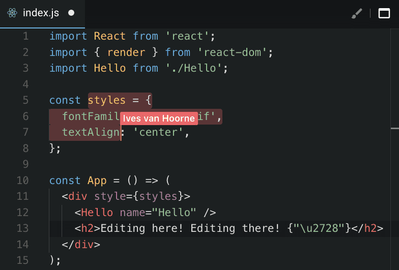
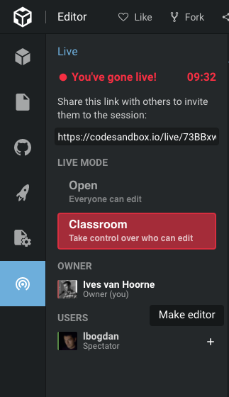
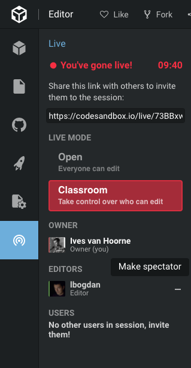

## What is Live

Live is a mode in CodeSandbox that allows you to share your sandbox with others for real time collaboration. You can simultaneously create, delete, edit and move files in real time. It's like Google Docs, but for your code! You can access Live under the Live tab in the sidebar:

## Demo

We recorded a demo to show what CodeSandbox Live exactly is, you can watch it here:

<iframe width="740" height="370" src="https://www.youtube.com/embed/DnnJ0sLn28s" frameborder="0" allow="autoplay; encrypted-media" allowfullscreen></iframe> 

We also made an announcement blog post, which you can read [here](https://medium.com/@compuives/introducing-codesandbox-live-real-time-code-collaboration-in-the-browser-6d508cfc70c9).

## Going Live

You can go live by simply pressing the 'Go Live' button in the sidebar. This will give you a URL that you can share with others to join the session. Others can only make edits to the sandbox while they are in the live session, they cannot do this when just viewing the sandbox.

Others will be able to simultaneously edit, create, rename and update files. They will also be able to add and remove dependencies, as those settings are also file based. You can also see which file other collaborators are watching and what their current selections are.

## Classroom Mode

With Classroom Mode you can define who can edit the sandbox. This is especially useful when working with large groups. You will only see the cursors of the users that are 'editor'.

You can make give someone editor rights by pressing the '+' icon next to their name.

And you can make someone a spectator by clicking the '-' icon next to their name.

