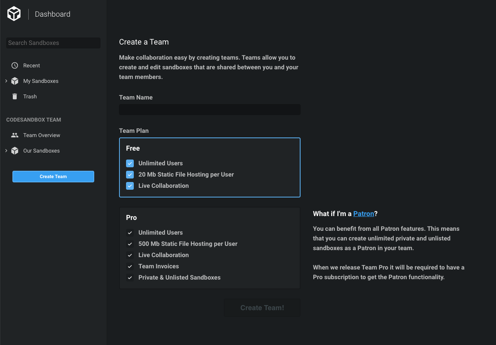
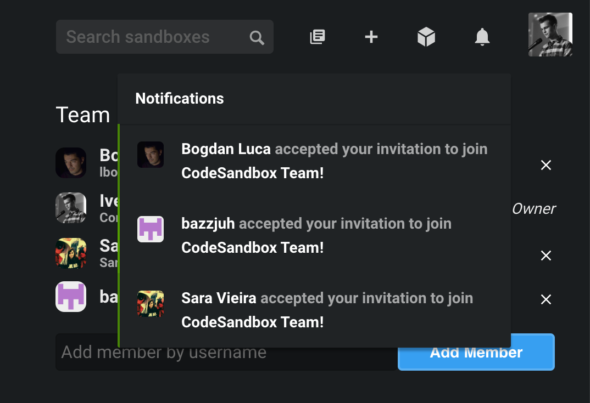
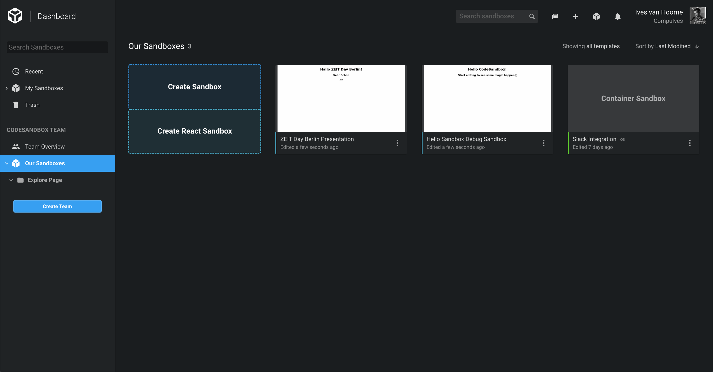
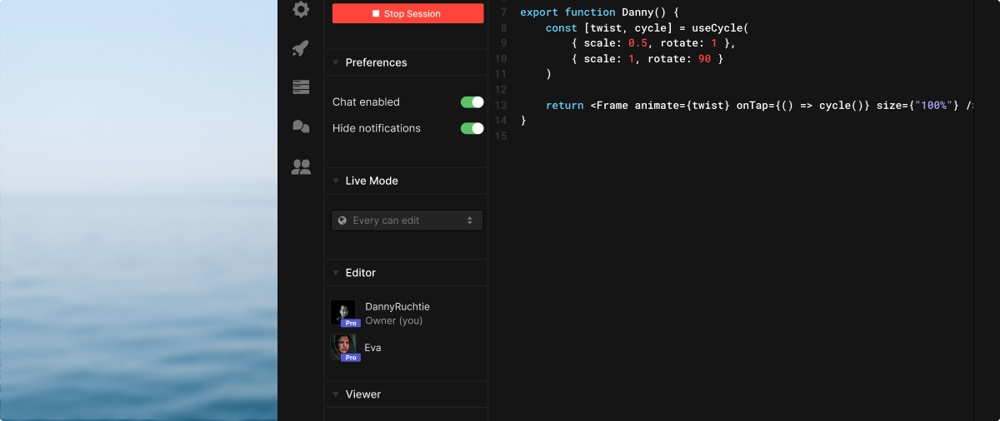

## Creating a Team

You can create and manage teams from the dashboard.

As soon as you've created a team you will be greeted with the team overview.

## Inviting Team Members

There's no limit on how many team members a team can have. You can invite others by entering their username in the bottom left corner. Others will get a notification (the bell icon in the header) when they are invited to a new team. From there they can accept or refuse the invitation.

## Sharing Sandboxes

As a team you have a sidebar item called "Our Sandboxes" with directories, just like your personal sandboxes. You can create new sandboxes directly from here, or you can drag your own sandboxes from 'My Sandboxes' to 'Our Sandboxes'. All sandboxes in a team can be seen and edited by all team member. We still keep track of who originally created the sandbox though, this means that only the original creator of the sandbox can actually delete it.

## Collaborating on Sandboxes

Whenever you open a team sandbox, you also automatically open a live session. Other team members will join this live session if they open the sandbox as well. You can still share the live session with others.

