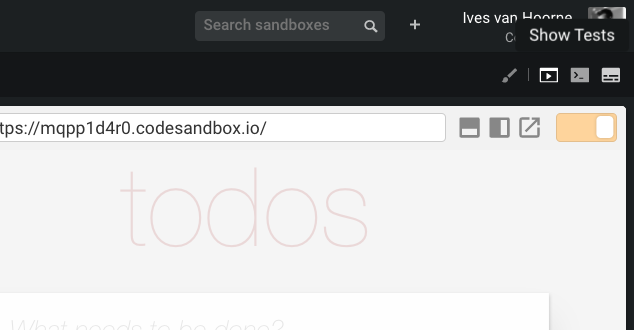
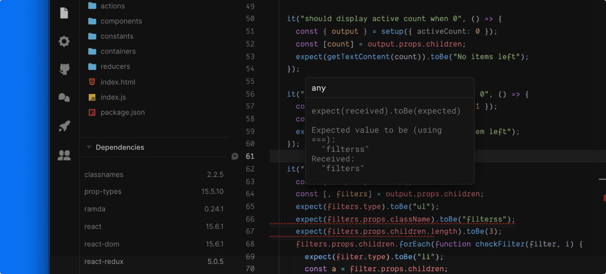

## What is Jest

Jest is a zero configuration test runner that allows you easily write JavaScript tests without setting anything up. For more info on Jest you can look [here](https://facebook.github.io/jest/).

## How to use Jest in CodeSandbox

You can run Jest tests by creating files that and with `.test.js`, `.spec.js`, `.test.ts(x)` and `.spec.js(x)`. We will automatically detect these test files and show the results in the bottom bar.

You can also open the test view instead of the browser preview by clicking on the 'Show Tests' icon in the top right.

The left side of the test view is an overview of all test files. The right side shows the details of a file when you select it.

You can decide to rerun tests manually by clicking on the Play icon. We automatically watch for file changes, you can disable this by clicking on the 'Refresh' icon on the left side.

## Test Failures

We show failed tests in two ways: in the test overview and in the code editor itself.

A failed test looks like this in the Test View:

And will also show squiggles in the editor:

## Test Example

Here's an example sandbox running Jest tests:

<iframe src="https://codesandbox.io/embed/n9m2w9q8x0?view=preview" style="width:100%; height:500px; border:0; border-radius: 4px; overflow:hidden;" sandbox="allow-modals allow-forms allow-popups allow-scripts allow-same-origin"></iframe>
