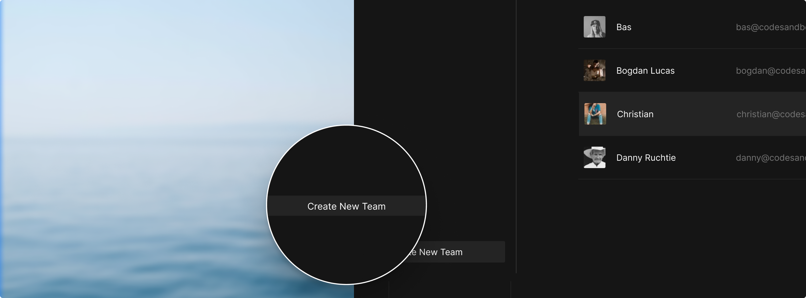
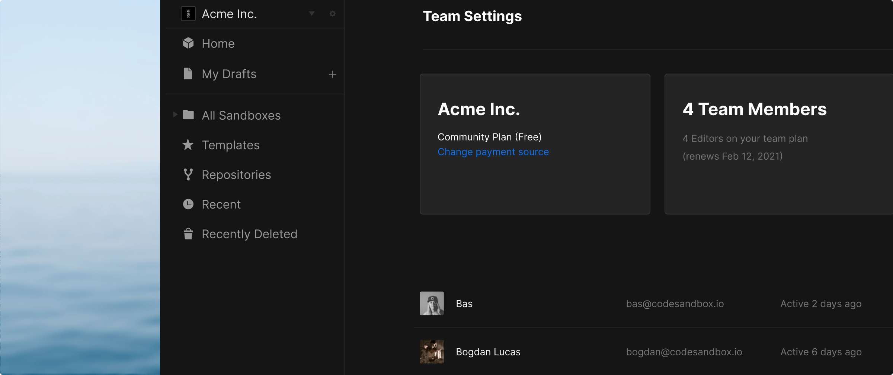

## Creating a Team

You can create and manage teams from the dashboard.

As soon as you've created a team, you will be shown the team overview.

## Inviting People to a Team

There's no limit on how many members a team can have. You can invite others by
entering their username or email address and selecting 'Add Member.' They will
get a notification (the bell icon in the header) in CodeSandbox and email when
invited to a new team. From there, they can accept or decline the invitation.

## Sharing Sandboxes

You can choose which team you're in from the team drop-down at the top-left on
the dashboard. You can create new sandboxes directly from here or from a
different team, select one or more sandboxes, right-click and select 'Move to
Folder', where you can choose the team and folder you want to move them into.
All sandboxes in a team can be seen or edited by other team members, depending
on their permission levels. We keep track of who created the sandbox, though,
and only the original creator of the sandbox can delete it.

## Collaborating on Sandboxes

You and other members can open a sandbox at the same time and see each other's
cursor to work together. You can still invite other people who aren't members of
the team to the sandbox or [live session](/docs/live).
