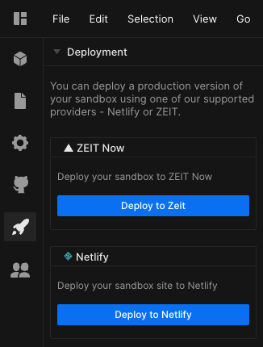

## Deployment Options

It's possible to deploy your app directly from CodeSandbox through one of our
integrated services. To deploy your app, you need to own the sandbox.

## Vercel

To deploy to [Vercel](https://vercel.com), access the Preferences menu and
select the Integrations tab, then log into your Vercel account.

### Deploying

Go to any of your sandboxes, click on the Deployment menu, which is the rocket
icon in left-hand activity bar in the editor. Select "Vercel". You'll need to
sign in to [Vercel](https://vercel.com) when you're deploying for the first
time. After you've signed in, you will be able to click "Deploy with Vercel". It
will deploy the sandbox and give you a URL.

### More Features

You can see an overview of all deployments you've made previously. Use this
overview to delete your previous deploys or to visit the website.

## Netlify

With [Netlify](https://netlify.com) you don't even need to connect to your
account. This means you can create deployments to share and use even if you
don't have a [Netlify](https://netlify.com) account.

Not all templates on CodeSandbox support [Netlify](https://netlify.com)
deployments. It's hidden as an option where it's not supported, but the
following templates do:

- React
- Vue
- Preact
- Nuxt
- Parcel
- Static
- CxJS
- Styleguidist
- Typescript Variants of React and Parcel
- Gatsby

### Deploying

Go to any of your sandboxes that are supported, click on the Deployment menu
(the rocket icon in the activity bar in the editor) and click on
"[Netlify](https://netlify.com)". Click the "Deploy" button to start a new
deploy. As the sandbox builds, you can view the logs of the build to see if
something went wrong. When the build finishes, you'll get a link to the deployed
site. You can also claim the site to add it to your Netlify dashboard.

### More Features

You don't need to sign in, so if you want to add a sandbox deployment to your
account you need to click the "Claim Site" button and the deployed sandbox will
be added to your Netlify account.
