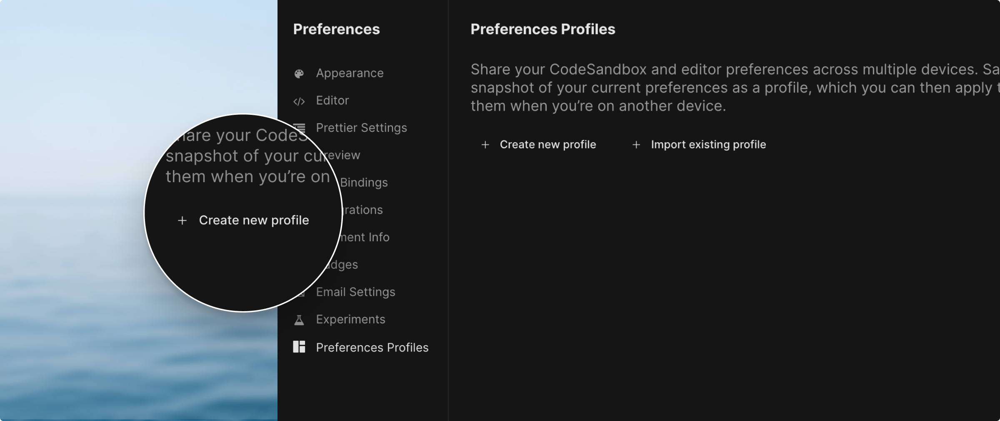
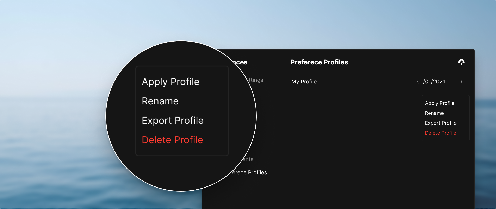
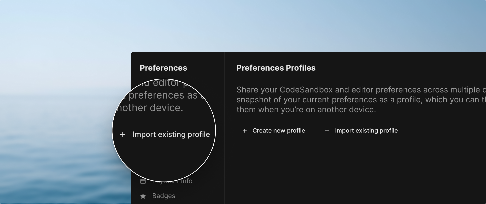

## Preferences Profiles

Preferences Profiles allow you to save a snapshot of your current preferences as
a profile, which you can then apply to re-use them when you’re on another
device.

## How to create a new Preference Profile?

To save a snapshot of your CodeSandbox preferences you can open your
`Preferences` located in the menu available in the upper most top right of your
screen.

In there navigate to `Preferences Profiles` and you can now see a button saying
`Create new profile`:

By clicking it we will save your preferences on the cloud so that they can be
retrieved later and applied in another computer.

## Applying your preferences in another device

After creating your first profile you will get an updated interface that will
have a list of your profiles.

In here you can apply all your preferences using the `Apply` button on the menu:

This will reload the page and apply all the preferences and ask you to reload
the page to see your new workspace.

## Can I download a profile to my computer?

Yes, if you do now wish to use our uploading service you can create a new
Profile and then download it immediately, this will give you a JSON file you can
then import in another computer using the `Import existing profile` button.

After this is done you are also welcome to remove this profile and it will still
be applied.

You can use this to have several CodeSandbox profiles.

## Can I have more than one Profile?

Right now we only have the possibility to create on profile on the cloud but
this will change in the future.
