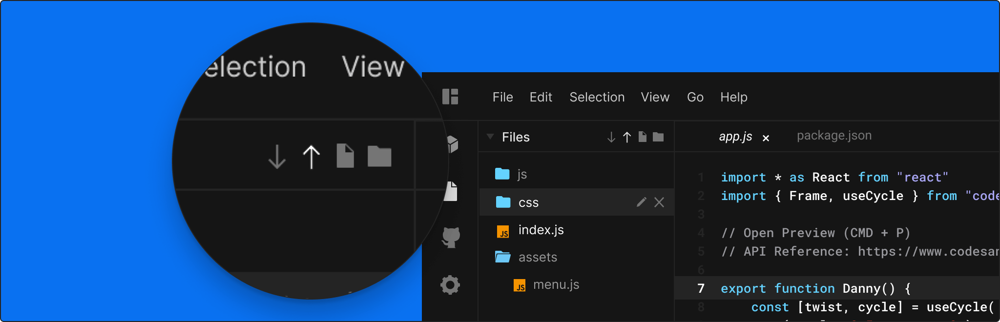
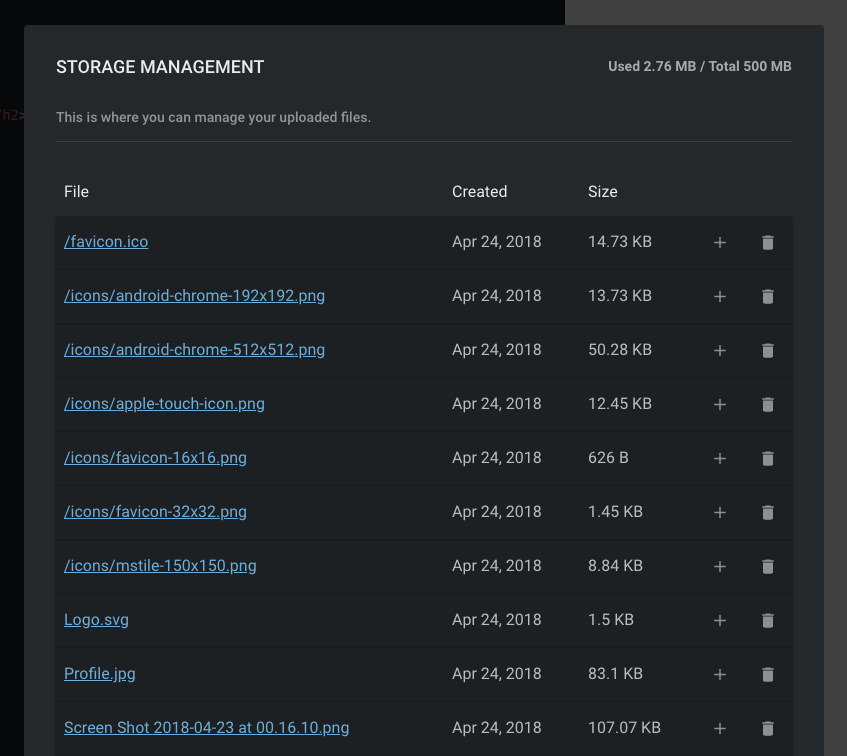

## Static File Uploading

It's sometimes desired to have either images or big files in a sandbox. We allow
you to upload these within CodeSandbox. As a
[patron](https://codesandbox.io/patron) you are allowed to upload a maximum of
500MB, otherwise you are able to upload 20MB. Remember that all uploaded files
are public, regardless of the privacy of the sandbox

## Ways to upload

There are two ways to upload files: by using a wizard or by drag and dropping
the files in a folder in CodeSandbox. The wizard can be opened by clicking on
the upload icon in the Files tab.

Dragging and dropping the files in the Files tab works as well.

## Storage Management

You can use an uploaded file in multiple sandboxes at the same time. For this
reason we have a separate 'Storage Management' that allows you to see which
files you have uploaded. You can find the manager in your user menu.

You are able to view your storage usage with the option to either open uploaded
files, add uploaded files to the opened sandbox or to delete an uploaded file.

## CLI Integration

When you deploy a sandbox using the CLI we automatically detect the binary files
and upload them to the CodeSandbox Storage Management after getting
confirmation.
