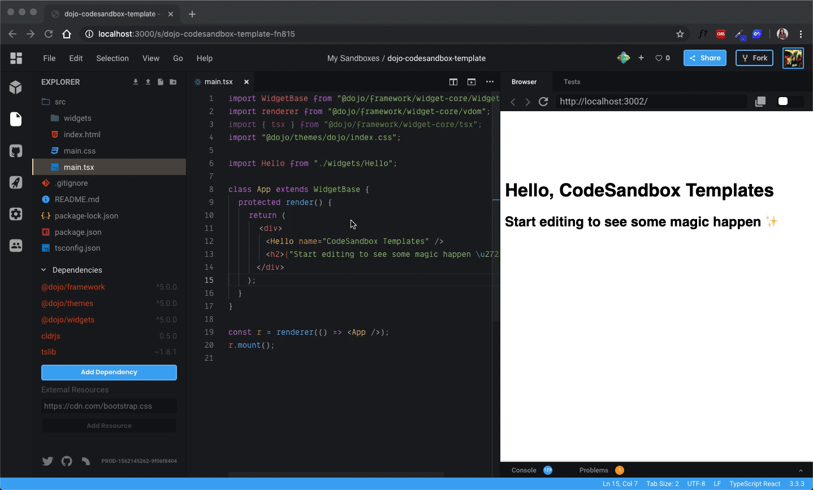
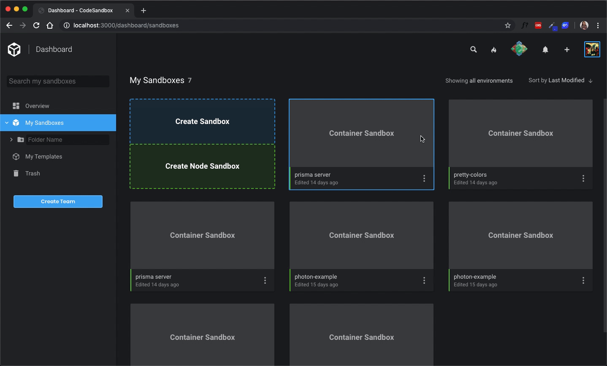
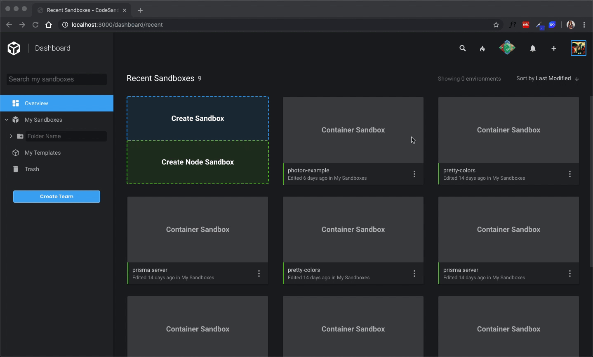
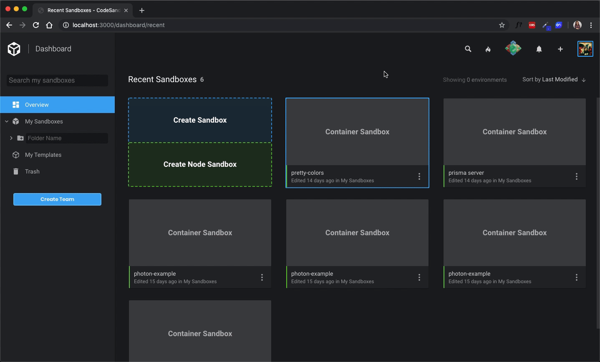
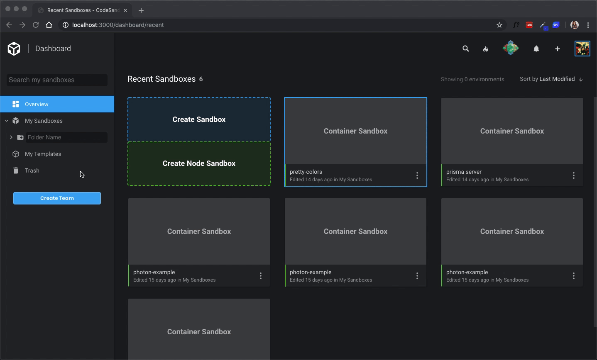
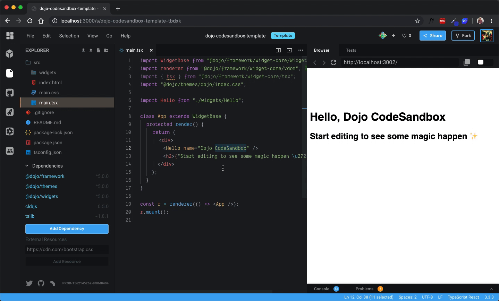
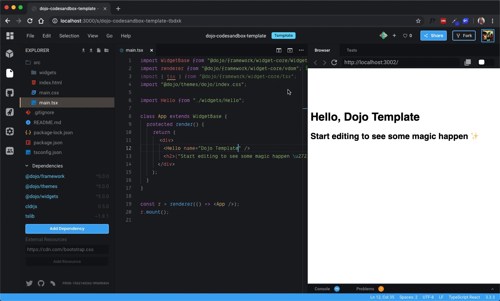
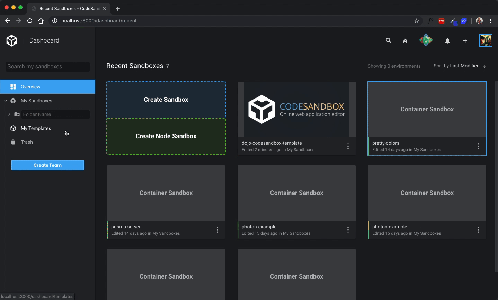

## What are Templates?

Templates are sandboxes that are easily accessible from your dashboard and the
"Create New Sandbox" modal. They are great starting points for new projects.
CodeSandbox has a number of official templates, such as React, Vue, Gatsby and
others which you can use to quickly bootstrap a new project.

Users can also create their own custom templates, whereby they can modify an
existing template with their own dependencies, files and folder structure, and
configuration. Once a custom template has been created, the user can then start
new projects from the "Create New Sandbox" modal using one of their templates.

## How to make a custom template

There are a few ways to make a template, but the primary way to do so is from
within the "Project Info" panel inside the editor. When viewing one of your
sandboxes, you'll see a button at the bottom of the "Project Info" panel that
says `Make Template`. Clicking on this will convert the sandbox to a template,
which will freeze it and make it available inside of the "Create New Sandbox"
modal.

Optionally, from the dashboard, you can either drag and drop a sandbox from
"Overview" or one of your folders under "My Sandboxes" to the new "My Templates"
folder. There is also an option within the sandbox options menu to
`Make Sandbox a Template`.

## Using Templates

After you've made your first template, there's a few places from which you can
access and use them. First, inside of the "Create New Sandbox" modal, you will
see a horizontal list of your templates inside of the `Overview` tab, and all of
your templates will appear under the `My Templates` tab. Clicking on one of
these will open the template inside the editor, where you will be prompted to
fork the sandbox as soon as you attempt to save changes.

You can also find all of your templates under the `My Templates` folder within
the Dashboard. Just as with the "Create New Sandbox" modal, clicking on any of
the templates shown inside this folder will open a new sandbox.

## Editing Templates

Templates are frozen upon creation, preventing users from accidentally making
changes to the template when they mean to use a template to create a new sandbox
instead. In order to make changes to a template, simply unfreeze if from the
"Project Info" panel. Any time you try to make a change to a frozen template, a
modal will prompt you whether or not you would like to fork the template or
unfreeze it for the current session.

Any changes you make to an unfrozen Template are saved immediately. There is no
need to explicitly freeze an unfrozen template, as it will automatically be
frozen again upon navigating away from the editor or the current sandbox session
ends.

## Deleting Templates

There are a few ways in which you can "delete" a template. From the "Project
Info" panel inside the editor, there is a `Delete Template` button at the bottom
when viewing an existing template. Clicking this will convert the template back
to a regular sandbox, removing it from the "Create New Sandbox" modal and moving
back to the "Overview" and "My Sandboxes" folders inside the dashboard.

Alternatively, you can use a template's options menu inside the "My Templates"
folder to select `Convert to Sandbox`.

