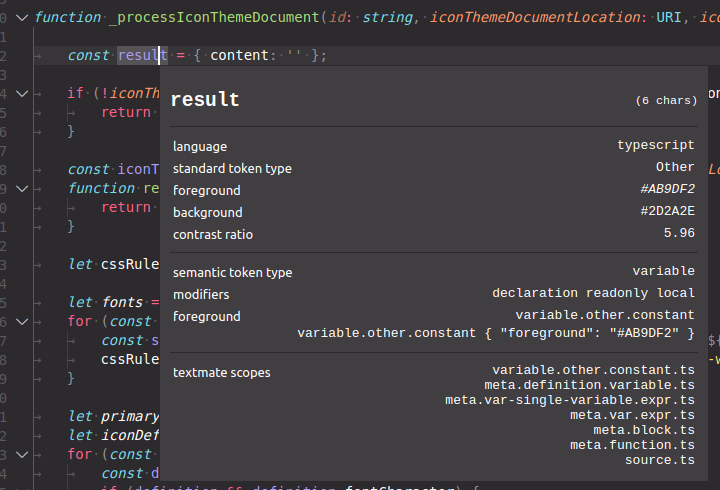

A [TypeScript plugin](https://github.com/Microsoft/TypeScript/wiki/Writing-a-Language-Service-Plugin) that replaces `getEncodedSemanticClassifications` and `getEncodedSyntacticClassifications` to provide more classifications to be used by the new [Semantic Highlighting APIs](https://github.com/microsoft/vscode/wiki/Semantic-Highlighting-Overview) in VS Code.

The purpose of this plugin is to test and enable the new VS Code semantic highlight capabilities. 

Once proven, the extended classifications will (hopefully) be adapted by the TypeScript language server and the plugin is no longer needed any more.

### New Classifications

The plugin uses new token classifications, consisting of a `TokenType` and with any number of `TokenModifier`s.

```
export const enum TokenType {
	class, enum, interface, namespace, typeParameter, type, parameter, variable, enumMember, property, function, member
}

export const enum TokenModifier {
	declaration, static, async, readonly, local, defaultLibrary
}
```

### Classification Encoding

The new classifications are retured in place of old the classifications. They are encoded as follows:
```
TSClassification = ((TokenType + 1) << 8) + TokenModifierSet;

```

All new classifications have a value >= 0x100 to not overlap with the old classifications. Old classifications are no longer emmitted once the plugin is active.

### Implemented Features

Examples for each feature can be seen in the [test cases](https://github.com/aeschli/typescript-vscode-sh-plugin/blob/master/src/test/semanticTokens.test.ts). To try them out in VSCode, copy the added snippet to a `TypeScript` editor and use the `Developer: Inspect Editor Tokens and Scopes` command to see the semantic token information ar the current cursor location.


- all token types listed above
  - classification for all declarations and references
  - modifier `declaration` when on the identifier of the declaration node
    ```
      class A { field: number; member(param: number) { let var= param + this.field; } }
    ```
  - modifier `defaultLibrary` when in an symbol that comes from the default libraries.
    ```
      Math.max(Number.Nan, parseInt('33'))
    ```
- variables, properties and parameters
  - modifier `readonly` when defined as `const` or `readonly`
    ```
      const var;
    ```
  - modifier `local` when not declared top-level
    ```
       function global(p: number) { const global; 
    ```
- functions and members
  - modifier `async` when defined as `async`
  - modifier `static` when defined as `static`
-variables & properties with constructor signatures
  - variables & properties that have a constructor type, are classified as `class`
    ```
       Number.isInteger(1);
    ```
- variables & properties with call signatures
  - variables, properties and parameters that have a function type (but no properties) are classified as `function` resp `member` ([#89337](https://github.com/microsoft/vscode/issues/89337))
    ```
       const callback = () => {};
    ```
  - if the variable/member/parameter type is callable but also has properties, it stays a variable/member/parameter, unless used in a callExpression
    ```
       var fs = require('fs); require.resolve('foo/bar');
    ```
- jsx 
  - no semantic highlighting for JSX element names (for now): [#88911](https://github.com/microsoft/vscode/issues/88911) [#89224](https://github.com/microsoft/vscode/issues/89224).


### Under discussion
- add `typeAlias` pas a new token type
- object literal keys are currently also classified as properties

### Try it out

#### In VS Code
- make sure semantic highlighting is enabled (on by default in insiders and since 1.43 in stable)
   `"editor.semanticHighlighting.enabled": true`
- open a TypeScript or JavaScript file in VSCode and wait for the language server to get active
- use the `Developer: Inspect Editor Tokens and Scopes` command to inspect the semantic information at a given cursor location.




#### Run the Tests

- `yarn && yarn test` in the folder of the cloned repo.
