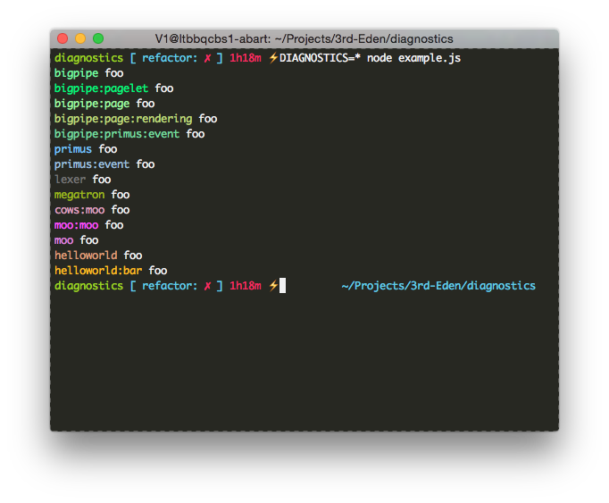

# Diagnostics

[](https://travis-ci.org/bigpipe/diagnostics)

Diagnostics is a small debugging library which allows you to output your debug
logs by setting an environment variable. The library works for server-side and
client-size applications so it's great for writing isomorphic JavaScript.

The debug output can be triggered using environment variables on the server and
using localStorage, hashtags and window.name on the browser. If the debug output
is not enabled this module will result in an empty function causing the
JavaScript compiler engines to remove it completely from your code so there is
absolutely no performance overhead or excuses left to not use logging in your
code!

## Installation

The module is released in the public npm registry and can easily be installed by
running.

```
npm install --save diagnostics
```

For client-side/front-end facing application we assume that you're using
`browserify` as your build tool as the client code is bundled as the
`browser.js` file in the root of this repository.

## Usage

When you require the module it returns a function that expect a name or prefix
for the debug messages. This prefix is what you use to enable specific debug
messages.

The exported function of the module accepts 2 arguments:

1. `name` The namespace of the debug logger.
2. `options` These options can only be applied to the server, not client code:
  - `colors`: Enable or disable colors. Defaults to true if your stdout is a tty.
  - `stream`: The stream instance we should write our logs to. We default to
    `process.stdout` (unless you change the default using the `.to` method).

```js
var debug = require('diagnostics')('foo');
debug('hello world %d', 12);
```

In the example above you can see that we've created a new diagnostics function
called debug. It's name is set to `foo`. So when we run this in Node.js using:

```
node index.js
```

We will see nothing in the console as the log messages are disabled by default.
But when set the `DEBUG` or `DIAGNOSTICS` environment variables to the name of
the debug function it will show up:

```
DIAGNOSTICS=foo node index.js

hello world 12
```

You can enable or disable specific diagnostic instances in the ENV variables by
separating them using a space or comma:

```
DEBUG=foo,-bar,primus:*
```

In the example above you also see an example of a wild card `*`. This ensures
that anything after it or before it will be allowed.

To make it easier to see where the log messages are coming from they are
colored automatically based on the namespace you provide them. The deeper the
namespace, the lighter name will be toned as seen in the following output.



## Browser

The usage for browser is exactly the same as for node. You require the
`diagnostics` method and supply it with a name argument. The big difference is
that no longer can use environment variables as these only work on the server.
So to go around that you can use:

- **hashtag** The hashtag will be parsed using query string decoding. So if you
  have an hash `#debug=foo` it will trigger all `foo` lines to be dumped to your
  browser console.
- **localStorage** We will search for a query string in either the `env` or
  `debug` key of `localStorage`. We again assume that the value has query string
  encode value which contains either `debug` or `diagnostics`.
  `localStorage.env = 'diagnostics=foo'`.
- **window.name** As `localStorage` is not available in all browsers, we provide
  a fallback to `window.name` which can contain the same values as the
  `localStorage`'s env/debug keys.

Unlike the server, the output of the browser is not colored. The reason for this
that it would take a considerable amount of code. Which is not worth the benefit
as you usually want your front-end code to be as small as possible.

#### Multiple streams

> Please note that this feature is server-side only as in the browser we can only
> output to the console

The beauty of this logger is that it allows a custom stream where you can write
the data to. So you can just log it all to a separate server, database and what
not. But we don't just allow one stream we allow multiple streams so you might
want to log to disk AND just output it in your terminal. The only thing you need
to do is either use:

```js
require('diagnostics').to([
  stream1,
  stream2
]);
```

To set multiple streams as the default streams or supply an array for the logger
it self:

```js
var debug = require('diagnostics')('example', { stream: [
  stream1,
  stream2
]});

debug('foo');
```

## License

[MIT](LICENSE.md)
